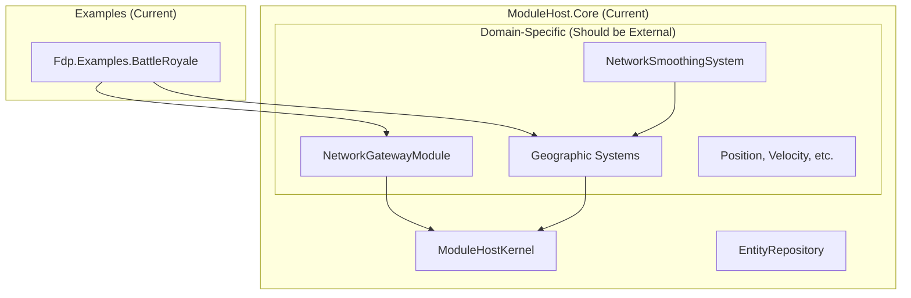
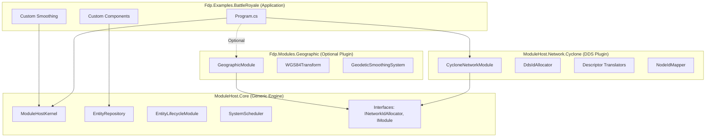

# ModuleHost.Core Extraction - Detailed Design

**Document Version:** 1.0  
**Date:** 2026-01-30  
**Status:** Design Approval Phase

---

## Table of Contents

1. [Executive Summary](#executive-summary)
2. [Current Architecture](#current-architecture)
3. [Target Architecture](#target-architecture)
4. [Core Principles](#core-principles)
5. [Component Extraction Strategy](#component-extraction-strategy)
6. [Module Extraction Strategy](#module-extraction-strategy)
7. [Interface Definitions](#interface-definitions)
8. [Dependency Injection Pattern](#dependency-injection-pattern)
9. [Example Application Integration](#example-application-integration)
10. [Migration Impact Analysis](#migration-impact-analysis)

---

## Executive Summary

### Vision

Transform **ModuleHost.Core** from a domain-specific framework into a **pure game engine kernel** - a reusable orchestration layer that knows nothing about:
- DDS networking protocols
- Geographic coordinate systems
- Specific smoothing algorithms
- Concrete component types (Position, Velocity, etc.)

### Goals

1. **Reusability**: ModuleHost.Core becomes usable across different simulation projects with different data models
2. **Flexibility**: Projects can plug in custom networking, smoothing, and component systems
3. **Clarity**: Clear separation between engine infrastructure and application-specific logic
4. **Maintainability**: Changes to DDS bindings don't require Core updates

### What Stays in Core vs. What Moves Out

| **Stays in ModuleHost.Core** | **Moves to Project/Plugins** |
|------------------------------|------------------------------|
| ✅ `ModuleHostKernel` | ❌ `NetworkGatewayModule` |
| ✅ `EntityRepository` (ECS) | ❌ `NetworkSmoothingSystem` |
| ✅ `EntityLifecycleModule` | ❌ `GeographicTransformModule` |
| ✅ `SystemScheduler` | ❌ `NetworkSpawnerSystem` |
| ✅ `IModule`, `IModuleSystem` interfaces | ❌ `NetworkSpawnRequest` component |
| ✅ `INetworkIdAllocator` interface | ❌ `INetworkTopology` interface |
| ✅ Time controllers | ❌ `Position`, `Velocity` components |
| ✅ Generic `int TypeId` | ❌ `DISEntityType` (domain-specific) |
| ✅ Uses opaque integers for types/owners | ❌ DDS Descriptors & `DdsIdAllocator` |
| - | ❌ `WGS84Transform` |

---

## Current Architecture

### Current Layering (Tightly Coupled)



**Problem**: Core contains geographic transforms, network-specific modules, and concrete components.

---

## Target Architecture

### Target Layering (Clean Separation)



**Benefits**:
- Core is agnostic to DDS, geography, and specific component types
- DDS implementation is swappable
- Different projects can use different components and smoothing algorithms

---

## Core Principles

### 1. Inversion of Dependencies

**Before (Bad)**:
```csharp
// ModuleHost.Core directly depends on concrete types
public class NetworkGatewayModule {
    private DdsIdAllocator _allocator; // ❌ Concrete implementation
}
```

**After (Good)**:
```csharp
// ModuleHost.Core depends on interfaces
public class NetworkGatewayModule {
    private INetworkIdAllocator _allocator; // ✅ Interface
}
```

### 2. Zero Knowledge of Wire Format

**Core Internal Representation** (Simple, Fast):
```csharp
public struct NetworkOwnership {
    public int OwnerNodeId;  // Simple integer
    public bool IsLocallyOwned;
}
```

**Network Layer Responsibility** (Complex, Project-Specific):
```csharp
// In ModuleHost.Network.Cyclone
[DdsStruct]
public partial struct NetworkAppId {
    [DdsId(0)] public int AppDomainId;
    [DdsId(1)] public int AppInstanceId;
}

// Mapper translates between Core's 'int' and DDS's 'NetworkAppId'
public class NodeIdMapper {
    public int GetOrRegisterInternalId(NetworkAppId externalId);
    public NetworkAppId GetExternalId(int internalId);
}
```

### 3. No Hardcoded Component Types

**Before (Bad)**:
```csharp
// Core knows about Position component
public class NetworkSmoothingSystem : IModuleSystem {
    public void Execute(ISimulationView view, float dt) {
        var query = view.Query().With<Position>().Build(); // ❌
    }
}
```

**After (Good)**:
```csharp
// Project defines its own smoothing system
// ModuleHost.Examples.MyGame/MySmoothingSystem.cs
public class MySmoothingSystem : IModuleSystem {
    public void Execute(ISimulationView view, float dt) {
        var query = view.Query().With<DoublePosition>().Build(); // ✅
    }
}
```

---

## Component Extraction Strategy

### Components to Remove from Core

All concrete component types move out:

#### From `ModuleHost.Core/Network/NetworkComponents.cs`

**Extract to Sample Projects**:
- `Position` → `Fdp.Examples.BattleRoyale/Components/Position.cs`
- `Velocity` → `Fdp.Examples.BattleRoyale/Components/Velocity.cs`
- `EntityStateDescriptor` → `ModuleHost.Network.Cyclone/Topics/EntityStateTopic.cs`
- `WeaponState`, `WeaponStates` → Project-specific

**Keep in Core** (Infrastructure):
- `NetworkOwnership` - Simplified to just `int OwnerNodeId`
- ~~`DescriptorOwnership`~~ → Move to `ModuleHost.Network.Cyclone`

#### From `ModuleHost.Core/Geographic/GeographicComponents.cs`

**Extract to New Module**:
- All components → `Fdp.Modules.Geographic/Components/`
  - `PositionGeodetic`
  - `LatitudeLongitude`
  - etc.

### Simplified Core NetworkOwnership

**New Definition** (`ModuleHost.Core/Network/NetworkOwnership.cs`):
```csharp
namespace ModuleHost.Core.Network
{
    /// <summary>
    /// Simple ownership component.
    /// OwnerNodeId is an opaque integer - the network layer maps it to/from
    /// complex external identifiers (e.g., DDS AppDomain/Instance pairs).
    /// </summary>
    public struct NetworkOwnership
    {
        public int OwnerNodeId;  // Mapped by network layer
        public bool IsLocallyOwned;  // Optimization flag
    }
}
```

---

## Module Extraction Strategy

### Modules to Remove from Core

#### 1. NetworkGatewayModule

**Current Location**: `ModuleHost.Core/Network/NetworkGatewayModule.cs`  
**Target Location**: `ModuleHost.Network.Cyclone/Modules/NetworkGatewayModule.cs`

**Rationale**: 
- Uses `INetworkIdAllocator` (interface stays in Core)
- Implementation-specific to DDS lifecycle protocol
- Different projects may not need network-based entity lifecycle handshakes

**Dependencies to Inject**:
```csharp
public NetworkGatewayModule(
    INetworkIdAllocator idAllocator,  // Interface from Core
    INetworkTopology topology,        // Interface from Core
    EntityLifecycleModule elm)        // From Core
```

#### 2. Geographic Systems

**Current Location**: `ModuleHost.Core/Geographic/`  
**Target Location**: `Fdp.Modules.Geographic/`

**Files to Move**:
- `NetworkSmoothingSystem.cs` → `GeodeticSmoothingSystem.cs`
- `CoordinateTransformSystem.cs`
- `GeographicTransformModule.cs`
- `WGS84Transform.cs`
- `IGeographicTransform.cs`

**Rationale**:
- GIS logic is highly domain-specific (military/flight simulations)
- Space games don't need it
- Racing games use local coordinates

---

## Type System Abstraction (CRITICAL)

### The DISEntityType Leak Prevention

**Problem**: `DISEntityType` (Distributed Interactive Simulation) is a military standard. If Core uses it, the engine is coupled to DIS.

**Solution**: Core uses **opaque integer Type IDs**. The network layer maps between domain-specific types and Core's generic integers.

### Core Type System

**File**: `ModuleHost.Core/ELM/ConstructionOrder.cs`

```csharp
namespace ModuleHost.Core.ELM
{
    /// <summary>
    /// Event published by ELM when entity construction should begin.
    /// Uses generic int TypeId - Core doesn't know what it means.
    /// </summary>
    public struct ConstructionOrder
    {
        public Entity Entity;
        public int TypeId;  // Opaque integer mapped by TKB
        public bool RequiresNetworkAck;
    }
}
```

### Network Layer Type Mapping

**File**: `ModuleHost.Network.Cyclone/Services/TypeIdMapper.cs`

```csharp
public class TypeIdMapper
{
    // DDS uses ulong DISEntityType (64-bit)
    // Core uses int TypeId (32-bit)
    
    private readonly Dictionary<ulong, int> _disToCore = new();
    private readonly Dictionary<int, ulong> _coreToDis = new();
    
    public int GetCoreTypeId(ulong disType)
    {
        if (!_disToCore.TryGetValue(disType, out int id))
        {
            id = _disToCore.Count + 1;
            _disToCore[disType] = id;
            _coreToDis[id] = disType;
        }
        return id;
    }
    
    public ulong GetDISType(int coreTypeId)
    {
        return _coreToDis[coreTypeId];
    }
}
```

### Usage in Translator

```csharp
public class EntityMasterTranslator : IDescriptorTranslator
{
    private readonly TypeIdMapper _typeMapper;
    
    public void PollIngress(IDataReader reader, ...)
    {
        foreach (var sample in reader.TakeSamples())
        {
            if (sample.Data is EntityMasterTopic desc)
            {
                // Convert DIS type → Core type
                int coreTypeId = _typeMapper.GetCoreTypeId(desc.DisTypeValue);
                
                // Core only sees the int
                cmd.AddComponent(entity, new NetworkSpawnRequest {
                    TypeId = coreTypeId,  // Generic int
                    // ...
                });
            }
        }
    }
}
```

### Result

- **Core**: Uses `int TypeId` - could represent DIS types, Unity prefabs, Unreal blueprints, or anything
- **TKB (Type Kit Bag)**: Maps `int TypeId` → Component Archetypes
- **Network Layer**: Maps domain types (DIS, custom enums, GUIDs) → `int TypeId`

---

## Interface Definitions

### Interfaces That Stay in Core

#### 1. INetworkIdAllocator

**Purpose**: Abstract ID allocation for distributed entity creation  
**Location**: `ModuleHost.Core/Network/Interfaces/INetworkIdAllocator.cs`

```csharp
namespace ModuleHost.Core.Network.Interfaces
{
    /// <summary>
    /// Abstract provider for unique network entity IDs.
    /// Implementations may use DDS-based protocols, database sequences, 
    /// snowflake algorithms, or local counters.
    /// </summary>
    public interface INetworkIdAllocator : IDisposable
    {
        /// <summary>
        /// Returns the next available unique ID.
        /// Should be non-blocking (uses buffering internally).
        /// </summary>
        /// <exception cref="InvalidOperationException">If pool is empty</exception>
        long AllocateId();

        /// <summary>
        /// Reset pool state (e.g., on simulation restart).
        /// </summary>
        void Reset(long startId = 0);
    }
}
```

#### 2. INetworkTopology

**Purpose**: Determine expected peer nodes for lifecycle coordination  
**Location**: ~~`ModuleHost.Core/Network/Interfaces/INetworkTopology.cs`~~ → **MOVED to `ModuleHost.Network.Cyclone/Abstractions/INetworkTopology.cs`**

**Rationale**: Since `NetworkGatewayModule` (which uses topology) moved to the Cyclone plugin, this interface should move too. `EntityLifecycleModule` in Core doesn't use topology directly - it just knows "I am waiting for Module ID X to ACK", not why.

```csharp
namespace ModuleHost.Network.Cyclone.Abstractions
{
    public enum ReliableInitType
    {
        None,           // No peer coordination needed
        PhysicsServer,  // Wait for physics server confirmation
        AllPeers        // Wait for all peers
    }

    public interface INetworkTopology
    {
        /// <summary>
        /// Returns node IDs expected to confirm entity initialization.
        /// </summary>
        IEnumerable<int> GetExpectedPeers(ReliableInitType type);
    }
}
```

#### 3. IDescriptorTranslator

**Purpose**: Bridge between DDS and ECS  
**Location**: `ModuleHost.Core/Network/Interfaces/IDescriptorTranslator.cs`

**Current Definition** (Keep Mostly As-Is):
```csharp
public interface IDescriptorTranslator
{
    string TopicName { get; }
    
    void PollIngress(IDataReader reader, IEntityCommandBuffer cmd, ISimulationView view);
    void ScanAndPublish(ISimulationView view, IDataWriter writer);
}
```

**Stays in Core because**:
- It's an abstraction pattern (generic contract)
- Implementations live in `ModuleHost.Network.Cyclone`

---

## Dependency Injection Pattern

### Application Bootstrap Example

**File**: `Fdp.Examples.BattleRoyale/Program.cs`

```csharp
using ModuleHost.Core;
using ModuleHost.Core.Abstractions;
using ModuleHost.Network.Cyclone;
using Fdp.Modules.Geographic;
using Fdp.Examples.BattleRoyale.Components;
using Fdp.Examples.BattleRoyale.Systems;

class Program
{
    static void Main()
    {
        // 1. Create ECS Core
        var world = new EntityRepository();
        RegisterComponents(world);

        // 2. Create Kernel
        var kernel = new ModuleHostKernel(world);

        // 3. Setup Network Layer (DDS-Specific)
        var participant = new DdsParticipant(domainId: 0);
        var nodeMapper = new NodeIdMapper(appDomain: 1, appInstance: 100);
        var idAllocator = new DdsIdAllocator(participant, "Client_100");
        var topology = new StaticNetworkTopology(localNodeId: 1);

        // 4. Register Network Module (Pluggable)
        var networkModule = new CycloneNetworkModule(
            participant,
            nodeMapper,
            idAllocator,
            topology,
            kernel.GetEntityLifecycleModule()
        );
        kernel.RegisterModule(networkModule);

        // 5. OPTIONAL: Register Geographic Module
        var geoModule = new GeographicModule(
            new WGS84Transform(originLat: 52.0, originLon: 13.0)
        );
        kernel.RegisterModule(geoModule);

        // 6. Register Application-Specific Smoothing
        kernel.RegisterGlobalSystem(new SimpleSmoothingSystem());

        // 7. Initialize and Run
        kernel.Initialize();
        
        while (running)
        {
            kernel.Update();
            world.Tick();
        }
    }

    static void RegisterComponents(EntityRepository world)
    {
        // Project-specific components
        world.RegisterComponent<Position>();
        world.RegisterComponent<Velocity>();
        world.RegisterComponent<Health>();
        // ... etc
    }
}
```

### Alternative Bootstrap (No Geographic, Custom Smoothing)

```csharp
// Space Shooter Game - No Geographic Module Needed
class SpaceGameProgram
{
    static void Main()
    {
        var world = new EntityRepository();
        var kernel = new ModuleHostKernel(world);

        // Network Layer
        var networkModule = new CycloneNetworkModule(...);
        kernel.RegisterModule(networkModule);

        // Custom Smoothing (Predictive, Not Geographic)
        kernel.RegisterGlobalSystem(new PredictiveExtrapolationSystem());

        // No GeographicModule registered - not needed for space!

        kernel.Initialize();
        // ...
    }
}
```

---

## Example Application Integration

### Project Structure

```
D:\Work\FDP-ModuleHost-Samples\
├── ModuleHost\
│   └── ModuleHost.Core\                    # Generic engine kernel
│       ├── Abstractions\
│       ├── ELM\                            # EntityLifecycleModule stays
│       ├── Network\
│       │   └── Interfaces\                 # INetworkIdAllocator, INetworkTopology
│       ├── Scheduling\
│       └── Time\
│
├── ModuleHost.Network.Cyclone\             # NEW: DDS-specific plugin
│   ├── Modules\
│   │   ├── CycloneNetworkModule.cs
│   │   └── NetworkGatewayModule.cs         # Moved from Core
│   ├── Services\
│   │   ├── DdsIdAllocator.cs               # Implements INetworkIdAllocator
│   │   └── NodeIdMapper.cs
│   ├── Topics\
│   │   ├── EntityMasterTopic.cs            # DDS schema
│   │   ├── EntityStateTopic.cs
│   │   └── CommonTypes.cs
│   └── Translators\
│       ├── EntityMasterTranslator.cs
│       └── EntityStateTranslator.cs
│
├── Fdp.Modules.Geographic\                 # NEW: Optional GIS plugin
│   ├── Components\
│   │   └── PositionGeodetic.cs
│   ├── Systems\
│   │   ├── GeodeticSmoothingSystem.cs
│   │   └── CoordinateTransformSystem.cs
│   ├── GeographicModule.cs
│   └── WGS84Transform.cs
│
└── Fdp.Examples.BattleRoyale\              # Application Layer
    ├── Components\
    │   ├── Position.cs                     # Moved from Core
    │   ├── Velocity.cs
    │   └── Health.cs
    ├── Systems\
    │   └── SimpleSmoothingSystem.cs        # Project-specific
    └── Program.cs                          # Wires everything together
```

---

## Migration Impact Analysis

### Breaking Changes

#### For ModuleHost.Core Users

**Before**:
```csharp
using ModuleHost.Core.Network;
using ModuleHost.Core.Geographic;

var kernel = new ModuleHostKernel(world);
// NetworkGatewayModule automatically available
```

**After**:
```csharp
using ModuleHost.Core;
using ModuleHost.Network.Cyclone;        // NEW
using Fdp.Modules.Geographic;            // NEW

var kernel = new ModuleHostKernel(world);
var networkModule = new CycloneNetworkModule(...);
kernel.RegisterModule(networkModule);     // REQUIRED
```

### Non-Breaking Changes

- `EntityLifecycleModule` stays in Core (fundamental to engine)
- `IModule`, `IModuleSystem` interfaces unchanged
- `SystemScheduler` unchanged
- `EntityRepository` unchanged

### Migration Path

1. **Phase 1**: Create new projects (`ModuleHost.Network.Cyclone`, `Fdp.Modules.Geographic`)
2. **Phase 2**: Copy files to new locations
3. **Phase 3**: Update namespaces
4. **Phase 4**: Simplify Core types (e.g., `NetworkOwnership`)
5. **Phase 5**: Update example applications
6. **Phase 6**: Delete old files from Core

---

## Success Criteria

### Definition of Done

1. ✅ ModuleHost.Core compiles without references to:
   - CycloneDDS
   - FastCycloneDdsCsharpBindings
   - Any concrete component types (Position, Velocity, etc.)
   - Geographic transforms

2. ✅ `ModuleHost.Network.Cyclone` project created and compiles

3. ✅ `Fdp.Modules.Geographic` project created and compiles

4. ✅ All existing tests pass (after namespace updates)

5. ✅ Example applications run with minimal changes (just bootstrapping)

6. ✅ Documentation updated

### Quality Gates

- **No regression in performance** (ECS hot paths unchanged)
- **No breaking changes to `IModule` / `IModuleSystem`** contracts
- **All unit tests pass**
- **Code coverage maintained**

---

## Appendix A: Interface Directory

### ModuleHost.Core

| Interface | Purpose | Implementers |
|-----------|---------|--------------|
| `INetworkIdAllocator` | Abstract ID allocation | `DdsIdAllocator`, `LocalCounter` |
| `INetworkTopology` | Peer discovery | `StaticNetworkTopology`, `DdsDiscovery` |
| `IDescriptorTranslator` | DDS ↔ ECS bridge | `EntityMasterTranslator`, etc. |
| `IModule` | Module pattern | All modules |
| `IModuleSystem` | System execution | All systems |

