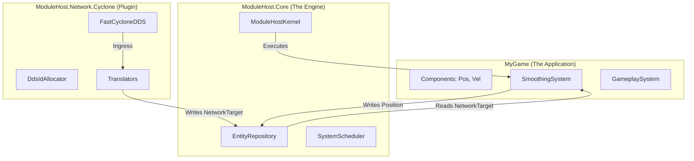

Yes, the source code (`ModuleHost.Core`) contains a complete, production-grade abstraction layer for Network Ingress/Egress designed specifically for **DDS (Data Distribution Service)** or similar pub/sub architectures.

The architecture uses a **Translator Pattern** to bridge the high-speed ECS (FDP) and the Network Protocol (DDS).

Here is the breakdown of how it works based on the provided sources:

### 1. The Abstraction Layer (DDS Binding)
The system does not call DDS directly. Instead, it defines interfaces in `ModuleHost.Core.Network`:

*   **`IDataWriter`**: Represents a DDS Writer. Has `Write(object sample)` and `Dispose(long id)`.
*   **`IDataReader`**: Represents a DDS Reader. Has `TakeSamples()`.
*   **`IDescriptorTranslator`**: The bridge interface. It forces implementation of:
    *   `PollIngress(...)`: Reading network packets -> updating ECS components.
    *   `ScanAndPublish(...)`: Reading ECS components -> writing network packets.

### 2. Egress: Publishing Entity State (Sending)
Egress is handled by the **`NetworkEgressSystem`**, which runs in the **Export** phase (end of frame).

**The Flow:**
1.  **Iterate Translators:** The system loops through all registered translators (e.g., `EntityStateTranslator`, `WeaponStateTranslator`).
2.  **Query ECS:** Inside `EntityStateTranslator.ScanAndPublish`:
    *   It queries the ECS for entities with `Position`, `Velocity`, and `NetworkOwnership`.
3.  **Authority Check:** It checks `view.OwnsDescriptor(...)`.
    *   It only publishes if `LocalNodeId == PrimaryOwnerId`.
    *   This prevents "echoes" (re-publishing data you received from someone else).
4.  **Serialization:** It maps the raw ECS components into a C# Class (`EntityStateDescriptor`).
    *   *Note:* In a real DDS implementation, this class corresponds to the IDL-generated type.
5.  **Write:** It calls `writer.Write(descriptor)`.

**Code Evidence (`EntityStateTranslator.cs`):**
```csharp
public void ScanAndPublish(ISimulationView view, IDataWriter writer)
{
    var query = view.Query().With<Position>().With<NetworkOwnership>().Build();

    foreach (var entity in query)
    {
        // 1. Authority Check
        if (!view.OwnsDescriptor(entity, ENTITY_STATE_DESCRIPTOR_ID)) continue;

        // 2. Data Extraction
        var pos = view.GetComponentRO<Position>(entity);
        var vel = view.GetComponentRO<Velocity>(entity);
        long networkId = ...;

        // 3. Create Descriptor (DDS Message)
        var descriptor = new EntityStateDescriptor
        {
            EntityId = networkId,
            Location = pos.Value,
            Velocity = vel.Value,
            Timestamp = ...
        };

        // 4. Push to Network
        writer.Write(descriptor);
    }
}
```

### 3. Ingress: Receiving Entity State (Receiving)
Ingress is handled usually in the **Input** phase.

**The Flow:**
1.  **Take Samples:** The `EntityStateTranslator.PollIngress` calls `reader.TakeSamples()`.
2.  **Lookup:** It uses a dictionary (`_networkIdToEntity`) to map the incoming `EntityID` (Long) to the local ECS `Entity` (Int).
3.  **Ghost Creation:**
    *   If the ID is new, it calls `repo.CreateEntity()`.
    *   It marks the entity as a **Ghost** (`EntityLifecycle.Ghost`). This is crucial. It means "I see this entity on the network, but I don't own it, and it might not be fully initialized yet."
4.  **Update Components:**
    *   It updates `NetworkTarget` (not `Position` directly).
    *   This allows the `NetworkSmoothingSystem` (Dead Reckoning) to interpolate the `Position` smoothly towards the `NetworkTarget` over the next few frames, preventing jitter.

**Code Evidence (`EntityStateTranslator.cs`):**
```csharp
public void PollIngress(...)
{
    foreach (var sample in reader.TakeSamples())
    {
        var desc = (EntityStateDescriptor)sample.Data;
        
        // 1. Lookup or Create
        Entity entity = FindEntityByNetworkId(desc.EntityId);
        if (entity == Entity.Null)
        {
            entity = CreateEntityFromDescriptor(desc, ...); // Creates as Ghost
        }

        // 2. Update Target (For Dead Reckoning)
        cmd.SetComponent(entity, new NetworkTarget 
        { 
            Value = desc.Location, 
            Timestamp = desc.Timestamp 
        });
        
        // Velocity is usually set directly for extrapolation
        cmd.SetComponent(entity, new Velocity { Value = desc.Velocity });
    }
}
```

### 4. Distributed Authority
The source code supports sophisticated **Partial Ownership**.

*   **`NetworkOwnership` Component:** Unmanaged struct holding the `PrimaryOwnerId`.
*   **`DescriptorOwnership` Component:** Managed class (Dictionary) holding overrides.
    *   This allows **Node A** to own the `EntityState` (Movement) while **Node B** owns the `WeaponState` (Turret).
*   **`OwnershipUpdateTranslator`:** Listens for `OwnershipUpdate` messages on the network. When received, it updates the local ownership components and triggers a `ForceNetworkPublish` to ensure the new owner immediately broadcasts their state.

### Summary
The networking stack is **decoupled, authority-aware, and smoothing-ready**.

1.  **DDS Ready:** It speaks "Descriptors" (Poco classes) that map 1:1 to DDS IDL structs.
2.  **ECS Native:** It uses Systems and Queries to drive IO, ensuring thread safety via the Command Buffer.
3.  **Interpolated:** It separates `NetworkTarget` (Raw Network Data) from `Position` (Visual/Physics Data) to allow for Dead Reckoning (`NetworkSmoothingSystem`).
---
How the entity creation and deletion management works? How it relates to the network?
---
Based on the source code, FDP uses a **Distributed, State-Machine-Driven Lifecycle** system. It separates the concept of "Data Existence" (Network) from "Simulation Readiness" (Local Logic).

This is handled primarily by the **ELM (Entity Lifecycle Module)** and the **Network Gateway**.

### 1. The Entity State Machine
Every entity in FDP has a `LifecycleState` in its header. This prevents the simulation (Physics/AI) from processing entities that are half-loaded.

1.  **Ghost:** The entity exists in memory because the Network said so, but it has no local logic components yet. It is invisible to queries.
2.  **Constructing:** The entity is being hydrated. Templates (TKB) are applied. Modules are initializing their internal state (e.g., loading assets, registering physics bodies).
3.  **Active:** The entity is fully simulated.
4.  **TearDown:** The entity is dying. Modules are cleaning up resources.

---

### 2. Creation Flow (Inbound from Network)

When a remote node creates an entity, the local node goes through a rigorous process to ensure it doesn't crash the simulation with partial data.

#### Step A: Network Ingress (`EntityMasterTranslator`)
1.  The network receives an `EntityMasterDescriptor` (DDS Topic).
2.  **Translator** checks: Do I know this ID?
3.  **Create:** If new, it calls `repo.CreateEntity()`.
4.  **Tag:** It immediately marks it as **Ghost**.
5.  **Request:** It attaches a `NetworkSpawnRequest` component containing the DIS Type (e.g., "M1A2 Tank") and Owner ID.

#### Step B: Spawning Logic (`NetworkSpawnerSystem`)
1.  This system runs in the `Input` phase. It queries for `NetworkSpawnRequest`.
2.  **Template Application:** It asks the **TKB (Type Kit Bag)**: *"What components does an M1A2 Tank need?"*
3.  **Hydration:** It adds those components (`Position`, `Turret`, `Engine`) to the entity.
4.  **Promotion:** It moves the state from **Ghost** -> **Constructing**.
5.  **ELM Trigger:** It tells the **ELM**: *"Start construction for Entity X."*

#### Step C: Local Consensus (`EntityLifecycleModule`)
1.  The ELM publishes a `ConstructionOrder` event.
2.  **Modules Respond:** Local modules (Physics, AI, UI) subscribe to this.
    *   Physics module creates the RigidBody.
    *   UI module creates the health bar.
3.  **ACK:** When a module is done, it sends a `ConstructionAck` event.
4.  **Wait:** The ELM waits until **all** registered modules have ACKed.

#### Step D: Network Consensus (`NetworkGatewayModule`)
*If `ReliableInitialization` is flagged:*
1.  The ELM waits for the `NetworkGatewayModule`.
2.  The Gateway waits for **Peer Nodes** to confirm they have also created the entity.
3.  Once peers confirm (via `EntityLifecycleStatus` message), the Gateway ACKs the ELM.

#### Step E: Activation
Once ELM receives all ACKs, it sets the entity state to **Active**. The entity now appears in standard queries (`Query().With<Position>()`) and begins moving.

---

### 3. Deletion Flow

Deletion is graceful, preventing "Dangling Pointer" crashes where the Physics engine tries to move a deleted entity.

1.  **Trigger:** Network receives a "Disposed" flag on the `EntityMaster` topic.
2.  **Order:** `EntityMasterTranslator` detects this but **does not** destroy the entity immediately. It issues a `DestructionOrder`.
3.  **TearDown:** The ELM moves the entity to **TearDown** state. It is removed from the simulation loop but memory is still valid.
4.  **Cleanup:** Modules see the order:
    *   Physics removes the body from the scene.
    *   Audio stops the engine loop.
5.  **Final Death:** Once all modules send `DestructionAck`, the ELM calls `repo.DestroyEntity()`, freeing the ID and memory chunks.

---

### 4. Summary of Network Relations

| Concept | Description | Source File |
| :--- | :--- | :--- |
| **EntityMaster** | The "God" topic. Defines ID, Owner, and Type. Its existence = Entity Life. | `EntityMasterTranslator.cs` |
| **TKB** | Maps Network Type (Int) -> Local Components (Structs). Decouples network schema from ECS schema. | `NetworkSpawnerSystem.cs` |
| **Reliable Init** | Ensures an entity doesn't become Active until key peers (e.g., the Physics Server) agree it exists. | `NetworkGatewayModule.cs` |
| **Ghosting** | Prevents "Update before Create" issues. If `EntityState` (Position) arrives before `EntityMaster`, the entity is created as a Ghost to store the data, but logic doesn't run yet. | `EntityStateTranslator.cs` |

### Why this complexity?
If you simply did `repo.CreateEntity()` when a packet arrived:
1.  **Race Condition:** You might receive a "Damage" event for an entity that hasn't initialized its "Health" component yet. Crash.
2.  **Visual Popping:** The entity might spawn at (0,0,0) for one frame before the Position packet arrives.
3.  **Asset Lag:** Loading the 3D model takes 200ms. You don't want invisible tanks driving around running physics. The **Constructing** state handles this wait.
---
I have a Cyclone DDS wrapper library I would like to use it as the network implementation. I would like to use the csharp DSL for defining the necessary topics and data structures. Pls suggest how to integrate, how the topeic definition might look like, how to implement reading and writing using this wrapper etc., including sending & processing the entity lifecycle management and other necessary commands.
---
This is a great fit. `FastCycloneDDS` is designed for exactly this kind of high-performance, zero-allocation scenario (`Fdp.Kernel` philosophy), while `ModuleHost` provides the architectural abstraction (`IDataReader`/`IDataWriter`) to plug it in easily.

Here is the complete integration guide.

### 1. Define the Topics (C# DSL)

Replace your existing POCO Descriptors with **FastCycloneDDS Schema definitions**. We use `partial struct` for zero-allocation performance and attributes to define keys and QoS.

**File: `ModuleHost.Network.Cyclone/Topics.cs`**

```csharp
using System.Numerics;
using CycloneDDS.Schema;
using ModuleHost.Core.Network; // For enums like DISEntityType

namespace ModuleHost.Network.Cyclone.Topics
{
    // --- 1. Entity Master (Lifecycle) ---
    // Reliable + TransientLocal: Late joiners must receive all active Entity Masters.
    [DdsTopic("SST_EntityMaster")]
    [DdsQos(
        Reliability = DdsReliability.Reliable,
        Durability = DdsDurability.TransientLocal,
        HistoryKind = DdsHistoryKind.KeepLast,
        HistoryDepth = 100 // Buffer size for bursts
    )]
    public partial struct EntityMasterTopic
    {
        [DdsKey, DdsId(0)]
        public long EntityId;

        [DdsId(1)]
        public int OwnerId;

        // Flatten nested structs for DDS if they are simple, 
        // or use [DdsStruct] on DISEntityType in FDP if you can modify it.
        // Assuming we map manually or DISEntityType is blittable.
        [DdsId(2)]
        public ulong DisTypeValue; 

        // Use FixedString to avoid GC
        [DdsId(3)]
        public FixedString64 Name;

        [DdsId(4)]
        public int Flags;
    }

    // --- 2. Entity State (Position/Physics) ---
    // BestEffort + Volatile: High frequency, dropped packets are obsolete anyway.
    [DdsTopic("SST_EntityState")]
    [DdsQos(
        Reliability = DdsReliability.BestEffort,
        Durability = DdsDurability.Volatile,
        HistoryKind = DdsHistoryKind.KeepLast,
        HistoryDepth = 1
    )]
    public partial struct EntityStateTopic
    {
        [DdsKey, DdsId(0)]
        public long EntityId;

        [DdsId(1)]
        public int OwnerId;

        [DdsId(2)]
        public Vector3 Location;

        [DdsId(3)]
        public Vector3 Velocity;

        [DdsId(4)]
        public long Timestamp;
    }

    // --- 3. Lifecycle Status (Reliable Handshake) ---
    [DdsTopic("SST_LifecycleStatus")]
    [DdsQos(
        Reliability = DdsReliability.Reliable,
        Durability = DdsDurability.TransientLocal
    )]
    public partial struct LifecycleStatusTopic
    {
        // Composite Key: A node reports status for an entity
        [DdsKey, DdsId(0)]
        public long EntityId;

        [DdsKey, DdsId(1)]
        public int NodeId;

        [DdsId(2)]
        public byte State; // Map to EntityLifecycle enum

        [DdsId(3)]
        public long Timestamp;
    }
}
```

---

### 2. Implement the Bridge (Adapters)

We need to adapt `DdsReader<T>` to `IDataReader` and `DdsWriter<T>` to `IDataWriter`.

**File: `ModuleHost.Network.Cyclone/Adapters/CycloneAdapters.cs`**

```csharp
using System;
using System.Collections.Generic;
using CycloneDDS.Runtime;
using ModuleHost.Core.Network;

namespace ModuleHost.Network.Cyclone.Adapters
{
    /// <summary>
    /// Generic adapter for writing DDS topics.
    /// </summary>
    public class CycloneDataWriter<T> : IDataWriter where T : struct
    {
        private readonly DdsWriter<T> _writer;
        
        public string TopicName { get; }

        public CycloneDataWriter(DdsParticipant participant, string topicName)
        {
            TopicName = topicName;
            // DdsWriter automatically reads [DdsQos] from T
            _writer = new DdsWriter<T>(participant, topicName);
        }

        public void Write(object sample)
        {
            // Direct cast (unboxing). Fast.
            _writer.Write((T)sample);
        }

        public void Dispose(long networkEntityId)
        {
            // To dispose an instance, we create a dummy sample with the Key populated.
            // FastCycloneDDS only looks at [DdsKey] fields for DisposeInstance.
            
            // NOTE: This assumes T has a field named 'EntityId' that is the key.
            // We use a factory/mapper or interface if T is generic. 
            // For simplicity, let's assume we pass the T with ID set via object initializer logic 
            // or reflection (cached) if strictly generic.
            
            // Optimization: Since we know our specific topics (Master, State), 
            // we can make this class abstract or use a creator func.
            
            // Hack for generic constraint demo:
            // In production, use specific implementations per topic or a KeySetter delegate.
            T keySample = default;
            
            // Dirty reflection for demo (cache this in production):
            var field = typeof(T).GetField("EntityId");
            if (field != null)
            {
                object boxed = keySample;
                field.SetValue(boxed, networkEntityId);
                keySample = (T)boxed;
                _writer.DisposeInstance(keySample);
            }
        }

        public void Dispose()
        {
            _writer.Dispose();
        }
    }

    /// <summary>
    /// Generic adapter for reading DDS topics.
    /// </summary>
    public class CycloneDataReader<T> : IDataReader where T : struct
    {
        private readonly DdsReader<T, T> _reader;
        
        public string TopicName { get; }

        public CycloneDataReader(DdsParticipant participant, string topicName)
        {
            TopicName = topicName;
            // T, T means the View is the same as the data struct (simple structs)
            _reader = new DdsReader<T, T>(participant, topicName);
        }

        public IEnumerable<IDataSample> TakeSamples()
        {
            // 1. Take loan from DDS (Zero copy)
            using var scope = _reader.Take(maxSamples: 64);

            for (int i = 0; i < scope.Count; i++)
            {
                var info = scope.Infos[i];
                
                // Map DDS state to ModuleHost state
                DdsInstanceState state = DdsInstanceState.Alive;
                if ((info.InstanceState & CycloneDDS.Runtime.DdsInstanceState.NotAliveDisposed) != 0)
                    state = DdsInstanceState.NotAliveDisposed;
                else if ((info.InstanceState & CycloneDDS.Runtime.DdsInstanceState.NotAliveNoWriters) != 0)
                    state = DdsInstanceState.NotAliveNoWriters;

                // Create sample wrapper
                // Note: scope[i] performs lazy deserialization here.
                var data = scope[i];

                yield return new DataSample
                {
                    Data = data,
                    InstanceState = state,
                    // Assuming EntityId is the key. 
                    // Again, in production use a specific adapter or interface.
                    EntityId = GetIdFromData(data) 
                };
            }
        }

        // Helper to extract ID generically (optimize with compiled expressions)
        private long GetIdFromData(T data)
        {
            // Fast/dirty way. In prod, use interface IKeyed { long EntityId { get; } }
            dynamic d = data; 
            try { return d.EntityId; } catch { return 0; }
        }

        public void Dispose()
        {
            _reader.Dispose();
        }
    }
}
```

---

### 3. Implement Translators (Wiring Logic)

You need to update your translators to accept the new Struct types instead of the old Class descriptors.

**Example: Updated `EntityStateTranslator`**

```csharp
public class CycloneEntityStateTranslator : IDescriptorTranslator
{
    public string TopicName => "SST_EntityState";
    // ... fields ...

    public void PollIngress(IDataReader reader, IEntityCommandBuffer cmd, ISimulationView view)
    {
        // 1. Read Raw Samples (Structs)
        foreach (var sample in reader.TakeSamples())
        {
            // 2. Handle Disposal
            if (sample.InstanceState == DdsInstanceState.NotAliveDisposed)
            {
                // HandleDescriptorDisposal...
                continue;
            }

            // 3. Cast to specific Struct (Zero Alloc if generic properly)
            if (sample.Data is EntityStateTopic desc)
            {
                // 4. Logic matches original, but uses struct fields
                Entity entity = FindEntityByNetworkId(desc.EntityId, view);
                
                if (entity == Entity.Null)
                {
                    // Create Ghost
                    // Map struct fields -> Components
                    var pos = desc.Location;
                    var vel = desc.Velocity;
                    // ... create logic ...
                }
                else
                {
                    // Update Components
                    cmd.SetComponent(entity, new NetworkTarget 
                    { 
                        Value = desc.Location, // Vector3 matches
                        Timestamp = desc.Timestamp 
                    });
                    
                    cmd.SetComponent(entity, new Velocity { Value = desc.Velocity });
                }
            }
        }
    }

    public void ScanAndPublish(ISimulationView view, IDataWriter writer)
    {
        // ... Query Setup ...
        foreach (var entity in query)
        {
            // ... Authority Check ...

            // Create Struct (Stack allocated)
            var topicData = new EntityStateTopic
            {
                EntityId = networkId,
                OwnerId = ownerId,
                Location = pos.Value,
                Velocity = vel.Value,
                Timestamp = now
            };

            // Write (Zero Alloc inside writer adapter)
            writer.Write(topicData);
        }
    }
}
```

---

### 4. Integration Bootstrap

Finally, wire it all up in your application entry point.

```csharp
public class NetworkBootstrap
{
    private DdsParticipant _participant;
    private List<IDataWriter> _writers = new();
    private List<IDescriptorTranslator> _translators = new();

    public (NetworkEgressSystem, List<IDescriptorTranslator>) Initialize(int domainId)
    {
        // 1. Create Participant
        _participant = new DdsParticipant((uint)domainId);

        // 2. Setup Entity Master (Lifecycle)
        var masterWriter = new CycloneDataWriter<EntityMasterTopic>(_participant, "SST_EntityMaster");
        var masterReader = new CycloneDataReader<EntityMasterTopic>(_participant, "SST_EntityMaster");
        var masterTrans  = new CycloneEntityMasterTranslator(...);
        
        // Wire Translator to Reader
        // Note: The generic Ingress system typically iterates translators and gives them their reader.
        // Or you store them as pairs.
        
        // 3. Setup Entity State (Physics)
        var stateWriter = new CycloneDataWriter<EntityStateTopic>(_participant, "SST_EntityState");
        var stateTrans  = new CycloneEntityStateTranslator(...);

        // 4. Collect for Egress System
        var translators = new IDescriptorTranslator[] { masterTrans, stateTrans };
        var writers = new IDataWriter[] { masterWriter, stateWriter };

        var egressSystem = new NetworkEgressSystem(translators, writers);

        return (egressSystem, new List<IDescriptorTranslator>(translators));
    }
}
```

### 5. Managing Lifecycle (Creation/Deletion)

**Creation:**
1.  `NetworkSpawnerSystem` decides to spawn an entity.
2.  It creates the entity locally.
3.  The `CycloneEntityMasterTranslator.ScanAndPublish` sees the new entity.
4.  It constructs an `EntityMasterTopic` struct:
    ```csharp
    var master = new EntityMasterTopic {
        EntityId = 100,
        DisTypeValue = 12345,
        Name = new FixedString64("Tank_01") // Zero alloc string
    };
    ```
5.  Calls `writer.Write(master)`.

**Deletion:**
1.  `ELM` (Entity Lifecycle Module) decides to destroy an entity.
2.  It removes the entity from FDP (or marks it for destruction).
3.  You need a specific **System hook** or logic in `ScanAndPublish` to detect destruction.
    *   *Option A (Explicit):* When `ELM` finalizes destruction, call `writer.Dispose(entityId)`.
    *   *Option B (System):* `NetworkEgressSystem` can detect removed `NetworkIdentity` components if tracking state, but explicit is better for networking.
    *   Ideally, call `writer.Dispose(networkId)` inside `EntityStateTranslator.OnEntityDestroyed` (which you implemented in your tests).

**Code for explicit dispose in Adapter:**
```csharp
// Inside adapter
public void Dispose(long id)
{
    // FastCycloneDDS creates a key-only instance to dispose
    var key = new EntityMasterTopic { EntityId = id };
    _writer.DisposeInstance(key); 
}
```

This sends a `NOT_ALIVE_DISPOSED` sample to all readers. Your `PollIngress` in `EntityMasterTranslator` handles this by destroying the ghost/proxy entity.
---
Pls move the "FixedString64 Name;" out from the EntityMasterTopic to keep it basic and generic also for large amounts of future unnamed entities. And create a new optional EntityInfoTopic containing not just the entity id and name, but also the OrbatParentId (long) allowing to have the entities logically grouped in an ORBAT tree structure. And also an enumeration of the affliation (red forces, blue forces, neutral). so that we can render an ORBAT tree later in the UI.

in LifecycleStatusTopic the State should be true enum, not just a byte.

alno note that the OwnerId is not a single int, but a structure containing AppDomainId and AppTypeId (as used in the sender tracking feature of the cyclone dds bindings)
---
Here is the updated schema definition and integration strategy.

### 1. Common Types (Enums & Structs)

First, we define the shared structures. We move the ownership concept into a `NetworkAppId` struct to handle the Domain/Instance pair, and define strict Enums for Affiliation and Lifecycle.

**File: `ModuleHost.Network.Cyclone/Topics/CommonTypes.cs`**

```csharp
using CycloneDDS.Schema;

namespace ModuleHost.Network.Cyclone.Topics
{
    /// <summary>
    /// Uniquely identifies an application instance (Owner/Node).
    /// Matches the SenderIdentity concept in FastCycloneDDS.
    /// </summary>
    [DdsStruct]
    public partial struct NetworkAppId : IEquatable<NetworkAppId>
    {
        [DdsId(0)] public int AppDomainId;    // e.g. 1 = Simulation, 2 = AI
        [DdsId(1)] public int AppInstanceId;  // e.g. Process ID or Configured ID

        // Equality for easy comparison in Translators
        public bool Equals(NetworkAppId other) => 
            AppDomainId == other.AppDomainId && AppInstanceId == other.AppInstanceId;
    }

    /// <summary>
    /// Logical grouping for ORBAT / UI rendering.
    /// </summary>
    public enum NetworkAffiliation : int
    {
        Neutral = 0,
        Friend_Blue = 1, // Blue Forces
        Hostile_Red = 2, // Red Forces
        Unknown = 3
    }

    /// <summary>
    /// Maps to Fdp.Kernel.EntityLifecycle
    /// </summary>
    public enum NetworkLifecycleState : int
    {
        Ghost = 0,        // Exists on network, not locally instantiated
        Constructing = 1, // Hydrating / Loading
        Active = 2,       // Fully simulated
        TearDown = 3      // Destruction pending
    }
}
```

### 2. Topic Definitions

We split the logic into **EntityMaster** (Minimal, Lifecycle) and **EntityInfo** (Rich Metadata, Optional).

**File: `ModuleHost.Network.Cyclone/Topics/Topics.cs`**

```csharp
using System.Numerics;
using CycloneDDS.Schema;

namespace ModuleHost.Network.Cyclone.Topics
{
    // --- 1. Entity Master (Streamlined) ---
    // Minimal data required to instantiate the entity ID.
    [DdsTopic("SST_EntityMaster")]
    [DdsQos(
        Reliability = DdsReliability.Reliable,
        Durability = DdsDurability.TransientLocal,
        HistoryKind = DdsHistoryKind.KeepLast,
        HistoryDepth = 100
    )]
    public partial struct EntityMasterTopic
    {
        [DdsKey, DdsId(0)]
        public long EntityId;

        // Complex Owner Structure
        [DdsId(1)]
        public NetworkAppId OwnerId;

        [DdsId(2)]
        public ulong DisTypeValue; 

        [DdsId(3)]
        public int Flags;
    }

    // --- 2. Entity Info (New - Optional Metadata) ---
    // Contains UI/ORBAT specific data. Separating this saves bandwidth
    // if the name/orbat doesn't change, or for "dumb" projectiles.
    [DdsTopic("SST_EntityInfo")]
    [DdsQos(
        Reliability = DdsReliability.Reliable,
        Durability = DdsDurability.TransientLocal, // Late joiners need names
        HistoryKind = DdsHistoryKind.KeepLast,
        HistoryDepth = 1
    )]
    public partial struct EntityInfoTopic
    {
        [DdsKey, DdsId(0)]
        public long EntityId;

        // Hierarchy support
        [DdsId(1)]
        public long OrbatParentId; // 0 if root

        [DdsId(2)]
        public NetworkAffiliation Affiliation;

        // Name moved here
        [DdsId(3)]
        public FixedString64 Name;
    }

    // --- 3. Entity State (Updated Owner) ---
    [DdsTopic("SST_EntityState")]
    [DdsQos(
        Reliability = DdsReliability.BestEffort,
        Durability = DdsDurability.Volatile,
        HistoryKind = DdsHistoryKind.KeepLast,
        HistoryDepth = 1
    )]
    public partial struct EntityStateTopic
    {
        [DdsKey, DdsId(0)]
        public long EntityId;

        // Updated to use Struct
        [DdsId(1)]
        public NetworkAppId OwnerId;

        [DdsId(2)]
        public Vector3 Location;

        [DdsId(3)]
        public Vector3 Velocity;

        [DdsId(4)]
        public long Timestamp;
    }

    // --- 4. Lifecycle Status (Updated) ---
    [DdsTopic("SST_LifecycleStatus")]
    [DdsQos(
        Reliability = DdsReliability.Reliable,
        Durability = DdsDurability.TransientLocal
    )]
    public partial struct LifecycleStatusTopic
    {
        [DdsKey, DdsId(0)]
        public long EntityId;

        // The node reporting the status (Updated to struct)
        [DdsKey, DdsId(1)]
        public NetworkAppId NodeId;

        // True Enum
        [DdsId(2)]
        public NetworkLifecycleState State;

        [DdsId(3)]
        public long Timestamp;
    }
}
```

### 3. FDP Component Updates

You need to update the internal FDP component `NetworkOwnership` to support the new ID structure, or the Translators won't be able to map it.

**Update `ModuleHost.Core/Network/NetworkComponents.cs`:**

```csharp
public struct NetworkOwnership
{
    // Replaced 'int' with a packed long or a custom struct
    // Option A: Use the same struct as Network (requires reference)
    // Option B: Flat primitive (mapped)
    
    // Using struct for clarity:
    public NetworkAppId PrimaryOwner; 
    public NetworkAppId LocalNodeId;
    
    public bool IsLocallyOwned => PrimaryOwner.Equals(LocalNodeId);
}

// New Component for Info
[DataPolicy(DataPolicy.SnapshotViaClone)] // Strings need Managed/Clone policy usually
public class EntityMetadata
{
    public string Name; // Converted from FixedString64
    public long OrbatParentId;
    public NetworkAffiliation Affiliation;
}
```

### 4. Implementation: Entity Info Translator

Here is how you implement the translator for the new topic.

```csharp
public class CycloneEntityInfoTranslator : IDescriptorTranslator
{
    public string TopicName => "SST_EntityInfo";
    private readonly Dictionary<long, Entity> _networkIdToEntity;

    public CycloneEntityInfoTranslator(Dictionary<long, Entity> networkIdToEntity)
    {
        _networkIdToEntity = networkIdToEntity;
    }

    public void PollIngress(IDataReader reader, IEntityCommandBuffer cmd, ISimulationView view)
    {
        foreach (var sample in reader.TakeSamples())
        {
            if (sample.InstanceState != DdsInstanceState.Alive) continue;
            
            if (sample.Data is EntityInfoTopic info)
            {
                // 1. Find the entity (Master should have created it already as Ghost)
                if (_networkIdToEntity.TryGetValue(info.EntityId, out var entity) && view.IsAlive(entity))
                {
                    // 2. Update/Create Metadata Component
                    // Since EntityMetadata is a class (Managed), we construct it.
                    var meta = new EntityMetadata
                    {
                        Name = info.Name.ToString(),
                        OrbatParentId = info.OrbatParentId,
                        Affiliation = info.Affiliation
                    };

                    cmd.SetManagedComponent(entity, meta);
                }
                // Note: If Master hasn't arrived yet, we could buffer this or ignore.
                // Since QoS is TransientLocal, we will get it again if we restart or late join.
            }
        }
    }

    public void ScanAndPublish(ISimulationView view, IDataWriter writer)
    {
        // Query entities that have Metadata and are Locally Owned
        var query = view.Query()
            .WithManaged<EntityMetadata>()
            .With<NetworkOwnership>()
            .Build();

        foreach (var entity in query)
        {
            var ownership = view.GetComponentRO<NetworkOwnership>(entity);
            if (!ownership.IsLocallyOwned) continue;

            // Optional: Only publish if changed (requires change tracking or hash)
            // For simplicity, we publish periodically or use a Dirty Component flag.

            var meta = view.GetManagedComponentRO<EntityMetadata>(entity);
            var netId = view.GetComponentRO<NetworkIdentity>(entity).Value;

            var topicData = new EntityInfoTopic
            {
                EntityId = netId,
                Name = new FixedString64(meta.Name),
                OrbatParentId = meta.OrbatParentId,
                Affiliation = meta.Affiliation
            };

            writer.Write(topicData);
        }
    }
}
```

### 5. Implementation: Updated Lifecycle Status

Handling the Enum and Struct ID in the existing lifecycle logic.

```csharp
public void PollIngress(...)
{
    foreach (var sample in reader.TakeSamples())
    {
        if (sample.Data is LifecycleStatusTopic status)
        {
            // Map Network Enum -> Kernel Enum
            EntityLifecycle kernelState = status.State switch
            {
                NetworkLifecycleState.Active => EntityLifecycle.Active,
                NetworkLifecycleState.Constructing => EntityLifecycle.Constructing,
                NetworkLifecycleState.TearDown => EntityLifecycle.TearDown,
                _ => EntityLifecycle.Ghost
            };

            // Map Struct ID to whatever ELM expects
            // ELM might need updating to track (Domain, Instance) instead of just Int.
            // Or hash it:
            int nodeIdHash = HashCode.Combine(status.NodeId.AppDomainId, status.NodeId.AppInstanceId);

            _gateway.ReceiveLifecycleStatus(..., nodeIdHash, kernelState, ...);
        }
    }
}
```
---
I would like to keep the module host core stuff as much reusable and separate as possible, basically being a game engine which can be used in different projects that need slightly different DDS data representation (conceptually similar but not identical, for example using extra or different fields in the entity master and and entity info descriptors etc. The project might  use completely different components (one project needs float positions, other need double positions etc.) I.e. Also i need a generic interface for  DDS entity id allocations compatible with the dds-based protocol described in IdAlloc.md. So the core logic component might stay in the ModuleHost (using internal format of internal event messages and internal datas structures like "int for owner id" but the specific implementation parts like the  network translation layer, id allocator implementation, smoothing system, component definitions must be living outside of hte MOduleHOst, pluggable from outside, not being a core part.
---
This refactoring separates **ModuleHost.Core** (The Engine) from **ModuleHost.Network.Cyclone** (The Implementation) and **MyGame** (The Concrete Project).

Here is how to structure the ID Allocation and the Generic Component architecture.

### Part 1: Core Abstractions (`ModuleHost.Core`)

We remove all hard dependencies on specific DDS types or specific components like `Position` from the Core.

**File: `ModuleHost.Core/Network/Interfaces/INetworkIdAllocator.cs`**
```csharp
namespace ModuleHost.Core.Network.Interfaces
{
    /// <summary>
    /// Abstract provider for unique network entity IDs.
    /// Decouples the Core from the specific allocation protocol (IdAlloc.md).
    /// </summary>
    public interface INetworkIdAllocator : IDisposable
    {
        /// <summary>
        /// Returns the next available unique ID.
        /// Should handle buffering internally to ensure this is non-blocking and fast.
        /// </summary>
        /// <exception cref="InvalidOperationException">If pool is empty/exhausted.</exception>
        long AllocateId();

        /// <summary>
        /// Call when the simulation resets/restarts to invalidate local pools.
        /// </summary>
        void Reset(long startId = 0);
    }
}
```

---

### Part 2: The ID Allocation Implementation (`ModuleHost.Network.Cyclone`)

We implement the protocol defined in `IdAlloc.md` using the FastCycloneDDS C# DSL.

#### 2.1 The Schema (C# DSL)

**File: `ModuleHost.Network.Cyclone/Topics/IdAllocTopics.cs`**
```csharp
using CycloneDDS.Schema;

namespace ModuleHost.Network.Cyclone.Topics
{
    public enum EIdRequestType : int
    {
        Alloc = 0,
        Reset = 1,
        GetStatus = 2
    }

    public enum EIdResponseType : int
    {
        Alloc = 0,
        Reset = 1
    }

    [DdsTopic("IdRequest")]
    [DdsQos(Reliability = DdsReliability.Reliable, Durability = DdsDurability.Volatile, HistoryKind = DdsHistoryKind.KeepAll)]
    public partial struct IdRequestTopic
    {
        [DdsKey, DdsId(0)]
        public string ClientId; // Unique client identification

        [DdsId(1)]
        public long ReqNo;

        [DdsId(2)]
        public EIdRequestType Type;

        [DdsId(3)]
        public ulong Start;

        [DdsId(4)]
        public ulong Count;
    }

    [DdsTopic("IdResponse")]
    [DdsQos(Reliability = DdsReliability.Reliable, Durability = DdsDurability.Volatile, HistoryKind = DdsHistoryKind.KeepAll)]
    public partial struct IdResponseTopic
    {
        [DdsKey, DdsId(0)]
        public string ClientId; 

        [DdsId(1)]
        public long ReqNo;

        [DdsId(2)]
        public EIdResponseType Type;

        [DdsId(3)]
        public ulong Start;

        [DdsId(4)]
        public ulong Count;
    }

    [DdsTopic("IdStatus")]
    [DdsQos(Reliability = DdsReliability.Reliable, Durability = DdsDurability.TransientLocal, HistoryDepth = 1)]
    public partial struct IdStatusTopic
    {
        [DdsId(0)]
        public ulong HighestIdAllocated;
    }
}
```

#### 2.2 The Allocator Logic

This class manages the handshake, buffers IDs, and implements the Core interface.

**File: `ModuleHost.Network.Cyclone/Services/DdsIdAllocator.cs`**
```csharp
using System.Collections.Concurrent;
using CycloneDDS.Runtime;
using ModuleHost.Core.Network.Interfaces;
using ModuleHost.Network.Cyclone.Topics;

namespace ModuleHost.Network.Cyclone.Services
{
    public class DdsIdAllocator : INetworkIdAllocator
    {
        private readonly DdsWriter<IdRequestTopic> _writer;
        private readonly DdsReader<IdResponseTopic, IdResponseTopic> _reader;
        private readonly DdsReader<IdStatusTopic, IdStatusTopic> _statusReader;
        
        private readonly string _clientId;
        private long _reqSequence = 0;
        
        // The ID Pool
        private readonly Queue<long> _availableIds = new();
        private readonly object _lock = new();
        
        // Configuration
        private const int CHUNK_SIZE = 100;
        private const int REFILL_THRESHOLD = 20;
        private bool _isRequestPending = false;

        public DdsIdAllocator(DdsParticipant participant, string uniqueClientId)
        {
            _clientId = uniqueClientId;

            // Initialize DDS Entities
            _writer = new DdsWriter<IdRequestTopic>(participant, "IdRequest");
            _reader = new DdsReader<IdResponseTopic, IdResponseTopic>(participant, "IdResponse");
            _statusReader = new DdsReader<IdStatusTopic, IdStatusTopic>(participant, "IdStatus");

            // Setup Filter: Only listen to responses for MY ClientId
            // Note: FastCycloneDDS filters run on ref structs (zero alloc)
            _reader.SetFilter(view => view.ClientId == _clientId);

            // Initial Request
            RequestChunk();
        }

        public long AllocateId()
        {
            // Pump Network (Poll responses)
            // In a real engine, this Poll() might be called by a system Update()
            ProcessResponses();

            lock (_lock)
            {
                if (_availableIds.Count == 0)
                {
                    // Emergency synchronous wait? Or throw?
                    // Ideally we should have prefetched.
                    // For now, trigger request and throw/wait.
                    if (!_isRequestPending) RequestChunk();
                    throw new InvalidOperationException("ID Pool exhausted. Waiting for server.");
                }

                long id = _availableIds.Dequeue();

                // Check Refill
                if (_availableIds.Count < REFILL_THRESHOLD && !_isRequestPending)
                {
                    RequestChunk();
                }

                return id;
            }
        }

        private void RequestChunk()
        {
            lock (_lock)
            {
                _isRequestPending = true;
                _reqSequence++;

                var req = new IdRequestTopic
                {
                    ClientId = _clientId,
                    ReqNo = _reqSequence,
                    Type = EIdRequestType.Alloc,
                    Count = CHUNK_SIZE,
                    Start = 0
                };

                _writer.Write(req);
            }
        }

        private void ProcessResponses()
        {
            // 1. Check for RESET commands (Priority)
            // (Implementation of Reset logic from IdResponseType.Reset)

            // 2. Check Alloc Responses
            using var samples = _reader.Take(10);
            foreach (var sample in samples)
            {
                if (sample.Type == EIdResponseType.Reset)
                {
                    Reset(0); // Server ordered reset
                    continue;
                }

                if (sample.Type == EIdResponseType.Alloc)
                {
                    lock (_lock)
                    {
                        for (ulong i = 0; i < sample.Count; i++)
                        {
                            _availableIds.Enqueue((long)(sample.Start + i));
                        }
                        _isRequestPending = false;
                    }
                }
            }
        }

        public void Reset(long startId)
        {
            lock (_lock)
            {
                _availableIds.Clear();
                _isRequestPending = false;
                // Re-ask if needed, or wait for next Allocate call
            }
        }

        public void Dispose()
        {
            // Optional: Send Dispose message to server as per protocol
            _writer?.Dispose();
            _reader?.Dispose();
            _statusReader?.Dispose();
        }
    }
}
```

---

### Part 3: Decoupling Components (Generic Engine)

To make `ModuleHost.Core` a true reusable engine, it must operate on **Abstract Concepts**, not concrete `Vector3` components.

#### Strategy: The "Bridge" Pattern

1.  **Core:** Defines `NetworkSmoothingSystem` as a **Generic Class**.
2.  **Core:** Defines an interface `IPositionTraits<T>` to handle math on unknown types.
3.  **Project:** Implements the Traits for its specific `DoublePosition` struct.

**File: `ModuleHost.Core/Traits/IPositionTraits.cs`**
```csharp
using System.Numerics;

namespace ModuleHost.Core.Traits
{
    /// <summary>
    /// Teaches the Core how to interpolate specific component types.
    /// </summary>
    /// <typeparam name="T">The component type (e.g., Position)</typeparam>
    public interface IInterpolationTraits<T> where T : unmanaged
    {
        T Lerp(T a, T b, float t);
        T Extrapolate(T pos, T vel, float dt);
        Vector3 ToVector3(T pos); // For generic visualization/debug
    }
}
```

**File: `ModuleHost.Core/Systems/GenericNetworkSmoothingSystem.cs`**
```csharp
namespace ModuleHost.Core.Systems
{
    /// <summary>
    /// A generic smoothing system that works on ANY position/velocity type.
    /// </summary>
    public class GenericNetworkSmoothingSystem<TPos, TVel> : IModuleSystem
        where TPos : unmanaged
        where TVel : unmanaged
    {
        private readonly IInterpolationTraits<TPos> _traits;

        public GenericNetworkSmoothingSystem(IInterpolationTraits<TPos> traits)
        {
            _traits = traits;
        }

        public void Execute(ISimulationView view, float dt)
        {
            // Query using Generics!
            var query = view.Query()
                .With<TPos>()
                .With<TVel>()
                .With<NetworkTarget>() 
                .Build();

            foreach (var e in query)
            {
                // ... Logic using _traits.Lerp() ...
            }
        }
    }
}
```

---

### Part 4: Wiring It All Up (The Application Layer)

In your specific project (`MyGame`), you glue the Generic Core, the Cyclone Network Layer, and your Custom Components together.

**File: `MyGame/Program.cs`**

```csharp
// 1. Define Project-Specific Components
[DdsStruct] // Optional: if mapping to DDS
public struct DoublePosition { public double X, Y, Z; }

// 2. Define Traits
public class DoublePosTraits : IInterpolationTraits<DoublePosition>
{
    public DoublePosition Lerp(DoublePosition a, DoublePosition b, float t) { ... }
    // ...
}

// 3. Define Specific Translator (External to Core)
public class MyGameTranslator : IDescriptorTranslator
{
    // Maps CycloneDDS 'EntityStateTopic' (which might have doubles)
    // to FDP 'DoublePosition' components.
    public void PollIngress(...) { ... } 
}

// 4. Bootstrap
void Main()
{
    // A. Setup Network Layer
    var participant = new DdsParticipant();
    var idAllocator = new DdsIdAllocator(participant, "Client_A");

    // B. Setup Kernel
    var kernel = new ModuleHostKernel();
    
    // C. Inject Specific Systems into the Generic Engine
    kernel.RegisterGlobalSystem(new GenericNetworkSmoothingSystem<DoublePosition, DoubleVelocity>(new DoublePosTraits()));
    
    // D. Register Specific Modules
    var gateway = new NetworkGatewayModule(..., idAllocator); // Inject Allocator
    kernel.RegisterModule(gateway);
}
```

### Summary of Separation

| Layer | Responsibility | Knowledge |
| :--- | :--- | :--- |
| **ModuleHost.Core** | Orchestration, Lifecycle, Scheduling. | Knows `INetworkIdAllocator`, `Entity`, `GlobalTime`. Knows **nothing** about DDS or `DoublePosition`. |
| **ModuleHost.Network** | DDS Implementation, IDL Schemas. | Knows `FastCycloneDDS`, `IdRequestTopic`, `IdResponseTopic`. Implements `INetworkIdAllocator`. |
| **MyGame** | Components, Gameplay Logic. | Knows `DoublePosition`, `TankComponent`. Glues Core + Network together. |
---
wait, the ModuleHost.Core/Systems/GenericNetworkSmoothingSystem.cs suggests the smoothing system is still part of the core, which is exactly what i do not want. Different project might need different kind of smoothing. It needs to be an external system. The difference is not just in vector3 beign float/double. It might be complete different implementation and the only thing they have in common is that they do some kind of smoothing (or the smoothing system is missing completely and the network translation layer is writing directly to final component or something like that) - the system must be flexible, meaning it need to have as little of the core parts as possible and as many stuff as pluggable systems/modules. 
---
You are absolutely correct. If the goal is a truly flexible "Game Engine" kernel where even the *concept* of smoothing is pluggable, then `GenericNetworkSmoothingSystem` should **not** exist in `ModuleHost.Core`.

Here is the refined architecture for maximum decoupling.

### 1. What Remains in `ModuleHost.Core` (The Bare Minimum)

The Core should only define the **contract** for how systems interact with the simulation, not what those systems do.

It retains:
1.  **Interfaces:** `ISimulationView`, `IModule`, `IModuleSystem`, `INetworkIdAllocator`.
2.  **Infrastructure:** `ModuleHostKernel`, `SystemScheduler`, `EntityRepository` (the ECS mechanism).
3.  **Lifecycle Logic:** `EntityLifecycleModule` (because "Entity Lifetime" is a core concept of the engine, though even this could arguably be moved if you want a radical kernel).

Everything related to *physics, movement, smoothing, or specific component logic* is moved out.

---

### 2. How to "Plug In" Smoothing (The Strategy)

Instead of the Kernel knowing about smoothing, the **Application** configures the Kernel with a specific "Smoothing Module" or "Smoothing System".

#### Option A: Smoothing as a Module
If smoothing is complex (needs its own frequency, config, or runs async), wrap it in an `IModule`.

**File: `MyGame.Modules/SimpleSmoothingModule.cs`** (Project-Specific Code)
```csharp
public class SimpleSmoothingModule : IModule
{
    public string Name => "SimpleSmoothing";
    public ExecutionPolicy Policy => ExecutionPolicy.Synchronous(); // Runs every frame

    public void RegisterSystems(ISystemRegistry registry)
    {
        // This specific implementation uses Linear Interpolation on Vector3
        registry.RegisterSystem(new LinearVector3SmoothingSystem());
    }
    
    public void Tick(...) { }
}
```

#### Option B: Smoothing as a System (Injected at Startup)
If smoothing is tightly coupled to the main simulation loop, register it as a Global System.

**File: `MyGame/Bootstrap.cs`**
```csharp
var kernel = new ModuleHostKernel();

// 1. Core Lifecycle (Required)
kernel.RegisterModule(new EntityLifecycleModule(...));

// 2. Project-Specific Networking
// Maps DDS -> FDP Components (NetworkTarget)
kernel.RegisterModule(new CycloneNetworkModule(...)); 

// 3. Project-Specific Smoothing
// Reads NetworkTarget -> Writes Position
// This class lives in 'MyGame', not 'ModuleHost.Core'
kernel.RegisterGlobalSystem(new PredictiveSmoothingSystem()); 

kernel.Initialize();
```

---

### 3. The Network Translation Layer (Decoupled)

The Translator (Ingress) should not assume *how* the data will be used. It should just dump the raw network data into a **"Target"** component.

**File: `ModuleHost.Network.Cyclone/Translators/EntityStateTranslator.cs`**
```csharp
public void PollIngress(...)
{
    // ...
    // Does NOT write to 'Position'. 
    // Writes to 'NetworkTarget<T>' (or similar raw component).
    // This leaves the decision of "Snap vs Smooth" to the next system in the chain.
    cmd.SetComponent(entity, new NetworkTarget<Vector3> 
    { 
        Value = desc.Location,
        Timestamp = desc.Timestamp 
    });
}
```

### 4. Example: Two Different Projects

#### Project A: First Person Shooter (Fast, Predictive)
*   **Components:** `Vector3 Position`, `Vector3 Velocity`.
*   **Network:** Sends compressed updates.
*   **Smoothing System:** `ClientSidePredictionSystem` (complex, uses inputs).
    *   *Logic:* Ignores `NetworkTarget` if local input exists, otherwise snaps.

#### Project B: Strategy Game (Slow, Interpolated)
*   **Components:** `DoublePosition` (64-bit coordinates).
*   **Network:** Sends `EntityStateTopic`.
*   **Smoothing System:** `HistoryBufferInterpolationSystem` (simple, delayed).
    *   *Logic:* Keeps a buffer of the last 3 `NetworkTarget` values and lerps `DoublePosition` between them.

### 5. Architectural Diagram



### 6. Conclusion for the Refactoring

1.  **Delete** `NetworkSmoothingSystem` from `ModuleHost.Core`.
2.  **Delete** specific component references (`Position`, `Velocity`) from `ModuleHost.Core` if they exist in method signatures (use Generics or `IComponentTable`).
3.  **Define** `NetworkTarget` (or equivalent) in your **Project** code, or a shared "Standard Components" library, but not the deep Core.
4.  **Configure** the pipeline by registering systems in the `Main()` bootstrapper.

This ensures `ModuleHost.Core` remains a pure orchestrator of Data and Time, indifferent to whether you are simulating tanks (Double/GIS) or particles (Float/Local).
---
in this way, i no longer need the OwnerId to be a structure with 2 ints as i mentioned above. The modulehost core stuff can keep it as a single OwnerId integer. And network translation layer will translate the network (dds sample defined) 2-int owner sample into single-long (64bit) internal modulehosts's ownerid.

I would also like to extract the Geographic transform system out of the core.

---
This provides the clean separation you are looking for. `ModuleHost.Core` becomes a generic orchestration kernel, while the complexity of DDS mapping and GIS math moves to the periphery.

Here is the refactored architecture.

### 1. Changes to `ModuleHost.Core` (The Engine)

We simplify the core components. The concept of "Owner" becomes an opaque integer handle.

**File: `ModuleHost.Core/Network/NetworkComponents.cs`**

```csharp
namespace ModuleHost.Core.Network
{
    /// <summary>
    /// Core ownership component.
    /// Uses a simple integer to represent a node.
    /// The Network Layer is responsible for mapping this int to/from complex network IDs.
    /// </summary>
    public struct NetworkOwnership
    {
        public int OwnerNodeId; // Simple Int (Mapped internally)
        public bool IsLocallyOwned; 
    }

    // REMOVED: NetworkAppId struct (moved to Network Layer)
    // REMOVED: Geographic components (moved to External Module)
}
```

**Deleted Files from Core:**
*   `Geographic/*` (Entire folder removed)
*   `Systems/GenericNetworkSmoothingSystem.cs` (Removed)

---

### 2. The Network Layer (`ModuleHost.Network.Cyclone`)

This layer now has the responsibility of mapping the "DDS World" (Complex Structs) to the "Core World" (Simple Ints).

#### 2.1 The Node Mapper Service

This service translates between the DDS `(AppDomain, AppInstance)` pair and the Core `int NodeId`.

**File: `ModuleHost.Network.Cyclone/Services/NodeIdMapper.cs`**

```csharp
using System.Collections.Concurrent;
using ModuleHost.Network.Cyclone.Topics; // Where NetworkAppId struct lives

namespace ModuleHost.Network.Cyclone.Services
{
    public class NodeIdMapper
    {
        // Bi-directional mapping
        private readonly ConcurrentDictionary<NetworkAppId, int> _externalToInternal = new();
        private readonly ConcurrentDictionary<int, NetworkAppId> _internalToExternal = new();
        
        private int _nextId = 1; // 0 is reserved/null
        private readonly object _lock = new();

        public NodeIdMapper(int localDomain, int localInstance)
        {
            // Reserve ID 1 for Local Node
            var local = new NetworkAppId { AppDomainId = localDomain, AppInstanceId = localInstance };
            RegisterMapping(local, 1);
        }

        public int GetOrRegisterInternalId(NetworkAppId externalId)
        {
            if (_externalToInternal.TryGetValue(externalId, out int id))
                return id;

            lock (_lock)
            {
                if (_externalToInternal.TryGetValue(externalId, out id))
                    return id;

                id = ++_nextId;
                RegisterMapping(externalId, id);
                return id;
            }
        }

        public NetworkAppId GetExternalId(int internalId)
        {
            if (_internalToExternal.TryGetValue(internalId, out var ext))
                return ext;
            
            return default; // Or throw
        }

        private void RegisterMapping(NetworkAppId ext, int intern)
        {
            _externalToInternal[ext] = intern;
            _internalToExternal[intern] = ext;
        }
    }
}
```

#### 2.2 The Translator (Doing the conversion)

The translator uses the Mapper to convert the incoming DDS sample before it touches the ECS command buffer.

**File: `ModuleHost.Network.Cyclone/Translators/EntityMasterTranslator.cs`**

```csharp
public class EntityMasterTranslator : IDescriptorTranslator
{
    private readonly NodeIdMapper _nodeMapper;
    private readonly int _localInternalId;

    public void PollIngress(IDataReader reader, IEntityCommandBuffer cmd, ISimulationView view)
    {
        foreach (var sample in reader.TakeSamples())
        {
            if (sample.Data is EntityMasterTopic desc)
            {
                // 1. Translate Network ID (Complex) -> Core ID (Int)
                // 'desc.OwnerId' is the NetworkAppId struct from the DDS sample
                int coreOwnerId = _nodeMapper.GetOrRegisterInternalId(desc.OwnerId);

                // 2. Create Entity in Core
                Entity entity = ...;

                // 3. Set Component using Simple Int
                cmd.AddComponent(entity, new NetworkOwnership 
                { 
                    OwnerNodeId = coreOwnerId,
                    IsLocallyOwned = (coreOwnerId == _localInternalId)
                });
            }
        }
    }

    public void ScanAndPublish(ISimulationView view, IDataWriter writer)
    {
        // Egress Logic: Int -> Struct
        // ... Query ECS ...
        
        var coreOwnership = view.GetComponentRO<NetworkOwnership>(entity);
        
        // Translate back to DDS format
        NetworkAppId ddsOwner = _nodeMapper.GetExternalId(coreOwnership.OwnerNodeId);

        var topic = new EntityMasterTopic 
        {
            OwnerId = ddsOwner, // Struct
            // ...
        };
        writer.Write(topic);
    }
}
```

---

### 3. The External Geographic Module

Since GIS logic is no longer in Core, you define it in a separate assembly (e.g., `MyGame.Geographic` or `Fdp.Modules.GIS`).

**File: `Fdp.Modules.GIS/GeographicModule.cs`**

```csharp
using ModuleHost.Core.Abstractions;
// Note: Depends on Core, but Core does not depend on it.

public class GeographicModule : IModule
{
    public string Name => "GeographicServices";
    public ExecutionPolicy Policy => ExecutionPolicy.Synchronous();

    private readonly IGeographicTransform _transform;

    public GeographicModule(IGeographicTransform implementation)
    {
        _transform = implementation;
    }

    public void RegisterSystems(ISystemRegistry registry)
    {
        // 1. Ingress Smoothing (Lat/Lon -> Local XYZ)
        // This system reads the NetworkTarget (raw data) and updates Position
        registry.RegisterSystem(new GeodeticSmoothingSystem(_transform));

        // 2. Egress Conversion (Local XYZ -> Lat/Lon)
        // This system reads Position and updates a Managed Geodetic Component
        registry.RegisterSystem(new CartesianToGeodeticSystem(_transform));
    }

    public void Tick(ISimulationView view, float dt) { }
}
```

### 4. Final Assembly (The Application)

This is where you plug the specific implementations into the generic core.

**File: `MyGame/Program.cs`**

```csharp
void Main()
{
    // 1. Setup Network Infrastructure
    var nodeMapper = new NodeIdMapper(appDomain: 1, appInstance: 500);
    var participant = new DdsParticipant();
    
    // 2. Setup ID Allocation (DDS Implementation)
    var idAllocator = new DdsIdAllocator(participant, "Client_500");

    // 3. Setup Kernel
    var kernel = new ModuleHostKernel(new EntityRepository(), ...);

    // 4. Register Network Module (With Mapper injected)
    // The translators inside here will use nodeMapper
    kernel.RegisterModule(new CycloneNetworkModule(participant, nodeMapper, idAllocator));

    // 5. Register Geographic Module (With WGS84 implementation)
    kernel.RegisterModule(new GeographicModule(new WGS84Transform(originLat: 52.0, originLon: 13.0)));

    // 6. Initialize & Run
    kernel.Initialize();
}
```

### Summary of the New Architecture

1.  **Core is Lightweight:** `NetworkOwnership` uses a simple `int`. It has no idea that "Owners" are actually `(Domain, Instance)` tuples on the wire.
2.  **Network Layer adapts:** The `NodeIdMapper` handles the translation transparently at Ingress/Egress points.
3.  **GIS is optional:** If you build a space game later, you simply don't register the `GeographicModule`. The Core doesn't care.
4.  **Flexible Smoothing:** The `GeodeticSmoothingSystem` is just one implementation. You can swap it for `PredictiveSmoothingSystem` without touching the Core.
