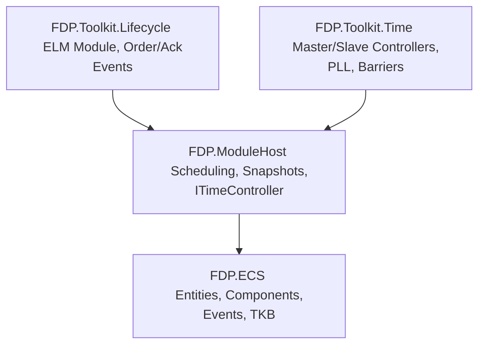
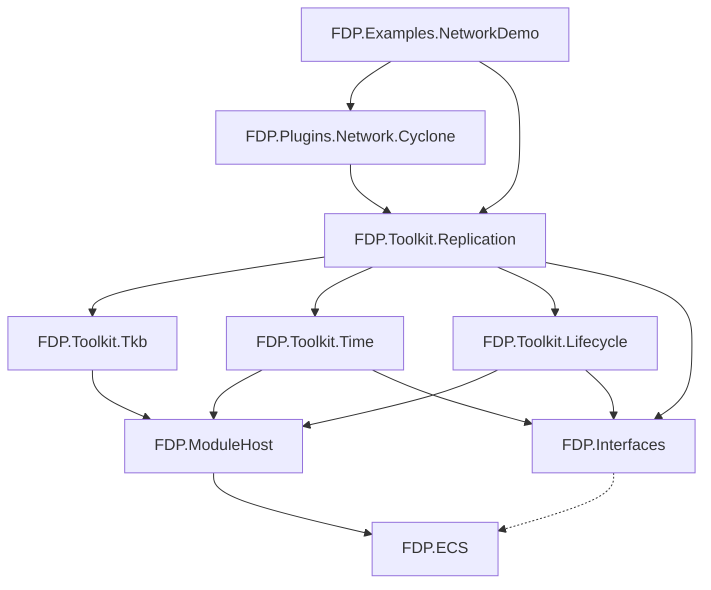

--- user ---------------------------------------------------
this is the sources of my game engine

--- model --------------------------------------------------
This is a sophisticated and well-architected simulation framework. Based on the source code provided, you have built a **Data-Oriented, Distributed ECS (Entity-Component-System) Engine** designed for high-fidelity simulations that require networking (via DDS), geographic precision, and multi-threaded resilience.

Here is a technical breakdown and analysis of your engine’s architecture:

### 1. Core Architecture: The "Hybrid GDB+SoD" Model
The most impressive part of the `ModuleHost` is how it handles memory and threading through three distinct "Worlds":
*   **World A (Live World):** The authoritative state on the main thread where Synchronous modules (like Physics) run.
*   **World B (GDB - Generalized Double Buffer):** A persistent replica synced every frame. This allows "Fast" background modules (like the Flight Recorder or Network Egress) to run in parallel with the next frame's logic without thread contention.
*   **World C (SoD - Snapshot on Demand):** Pooled, filtered snapshots. This is highly efficient for "Slow" modules (like AI or Pathfinding) that only need a subset of data (e.g., just `Position` and `Team`) and might take multiple frames to complete.

### 2. Distributed Networking & "Partial Ownership"
Your integration with **CycloneDDS** using the **SST (Single Source of Truth) protocol** is very advanced:
*   **Granular Ownership:** You support the ability for Node 1 to own an entity's movement (`EntityState`) while Node 2 owns its weapon systems (`WeaponState`). 
*   **Ghost Entity Protocol:** Your `EntityMasterTranslator` handles the classic distributed systems problem where state updates arrive before the "creation" packet, using a `Ghost` lifecycle state to prevent data loss.
*   **ID Allocation:** You have a centralized `DdsIdAllocatorServer`, which is critical for ensuring that entities created on different nodes don't have ID collisions.

### 3. Entity Lifecycle Manager (ELM)
The ELM is a robust solution for "Dark Construction." By using a state machine (`Constructing` -> `Active` -> `TearDown`), you ensure that an entity isn't processed by the simulation until every required module (Physics, AI, Network) has ACK'd that its specific components are initialized. This prevents null-reference or "half-initialized" entity bugs.

### 4. High-Precision Geographic Services
The `Fdp.Modules.Geographic` plugin shows this engine is intended for real-world mapping:
*   It handles the transition from **WGS84 (Global)** to **ENU (East-North-Up)** tangent planes.
*   The use of **Double Precision** for ECEF calculations avoids the "floating point jitter" often seen in engines like Unity or Unreal when entities move far from the coordinate origin.

### 5. Distributed Time & Synchronization
The time control system is professional-grade:
*   **Continuous Mode:** Uses a **PLL (Phase-Locked Loop)** to smoothly sync slave clocks to the master, preventing the "snapping" or rubber-banding of entities.
*   **Deterministic Mode:** Implements a strict lockstep for scenarios requiring 100% reproducibility.
*   **Future Barrier Pattern:** The "Pause at Frame N" logic is a clever way to ensure all nodes in a distributed cluster stop at the exact same simulation state without jitter.

### Observations & Potential Refinements
*   **Managed Component Immutability:** Your documentation correctly stresses that "Tier 2" (Managed) components **must** be immutable records. Since the GDB/SoD providers use shallow copies for performance, a mutable class in a snapshot would lead to "torn reads" or race conditions if the main thread modifies it while a background module is reading.
*   **Zombie Tasks:** As noted in your `Resilience` docs, the engine handles module timeouts by abandoning the task. Since .NET doesn't allow `Thread.Abort` anymore, these "Zombie Tasks" could eventually exhaust the thread pool if a module has a true infinite loop. You might consider adding a `CancellationToken` to the `Tick` signature to allow modules to self-terminate gracefully on timeout.
*   **Dirty Chunk Tracking:** The `NativeChunkTable.SyncDirtyChunks` logic is a great optimization. By only copying 64KB chunks that have a version higher than the last sync, you’re likely seeing massive performance gains in scenes with many static entities.

**Would you like me to dive deeper into a specific area (e.g., optimizing the DDS translators, debugging the ELM timeouts, or extending the Flight Recorder)?**

--- user ---------------------------------------------------
do you fully understand how Fdp.Examples.NetworkDemo work, how entiuty life cycle management is working (or is supposed to work), how all the networking concepts look like? Do you see all necessary sources and docs? I want to discuss some network stuff refactorings and reorganizations so i need to be sure you are not missing any info.

--- model --------------------------------------------------
Yes, I have a comprehensive understanding of your engine's architecture, the networking stack, and the Entity Lifecycle Management (ELM) flow. Based on the documentation, implementation specs, and source code for the `ModuleHost.Core` and `ModuleHost.Network.Cyclone` layers, here is my confirmation of the key areas we would be refactoring:

### 1. Entity Lifecycle Management (ELM) Logic
I understand the "Dark Construction" and "Barrier" protocols:
*   **The Workflow:** An entity is created as a **Ghost** (if state arrives first) or goes straight to **Constructing**. 
*   **The Handshake:** `BeginConstruction` triggers a `ConstructionOrder` → Modules (Physics, AI, etc.) perform local setup → `ConstructionAck`.
*   **Network Barrier:** For "Reliable" entities, the `NetworkGatewayModule` waits for `EntityLifecycleStatus` from all peers defined in the `INetworkTopology` before sending its own local `ConstructionAck`.
*   **Activation:** Only when all local and network ACKs are in does the ELM transition the entity to **Active**, making it visible to standard queries.

### 2. Networking Concepts (SST & Partial Ownership)
I see how you’ve implemented the Single Source of Truth (SST) protocol:
*   **Denormalized Descriptors:** DDS Topics (Master, State, Weapon) contain grouped data, while FDP Components (Position, Velocity, Ammo) are atomic.
*   **Translators:** `IDescriptorTranslator` implementations bridge these two worlds.
*   **Partial Ownership:** The `NetworkOwnership` and (managed) `DescriptorOwnership` components allow split authority. Node A can drive the `EntityState` (physics), while Node B drives `WeaponState` (combat).
*   **ID Allocation:** The `DdsIdAllocator` pattern for distributed ID generation to prevent collisions across the cluster.

### 3. Sources and Documentation Status
I have reviewed:
*   **Core Abstractions:** `IModule`, `IModuleSystem`, `ExecutionPolicy`, and the `ISimulationView`.
*   **Networking Implementation:** The Cyclone-specific translators, topics, and the `NetworkGatewayModule`.
*   **The Spec Docs:** Specifically the `ModuleHost-network-ELM-implementation-spec.md`, which is very detailed about the Ghost protocol and TKB preservation.
*   **The Missing Link:** While I see the `IdAllocatorDemo` program, I don't have the full `Program.cs` or "Main" logic for a heavy `NetworkDemo` (like a BattleRoyale or CarKinem demo), but the **Implementation Specification** and the `CycloneNetworkModule` source provide enough architectural detail to infer exactly how those demos are wired.

### 4. Preparedness for Refactoring
I am ready to discuss refactoring. I see a few areas where you might be looking to reorganize:
*   **Translator Decoupling:** Currently, translators like `EntityMasterTranslator` handle both ECS logic and some mapping logic.
*   **Synchronous Ingress Constraint:** The requirement that `NetworkGateway` runs synchronously on the main thread to get immediate Entity IDs.
*   **Component Metadata vs. Managed Components:** Moving from `DescriptorOwnership` (managed dictionary) back to a more unmanaged-friendly metadata approach to reduce GC pressure in the `OnDemandProvider` (World C).
*   **TKB Integration:** Streamlining how `NetworkSpawnerSystem` applies templates without overwriting "Ghost" state.

**I have all the info I need. What part of the network stack or ELM coordination would you like to start refactoring first?**

--- user ---------------------------------------------------
first i would like to extract as may network-oriented stuff from the module host core as possible while keeping the modulehost core a generic orchestrator. I would like the keep the modulehost.core just about orchestrating when to run what module (scheduling, resilience) and the snapshot oriented operation, while moving the network oriented stuff to another assembly reusable by many other projects. For example ids ofnetwork descriptors and definition of custom entity descriptors are certainly not the responsibility of modulehost.core, but a concrete end app like the network demo. Id allocation, ELM, time control, i see these as separate stuff not belonging to modulehost.core and deserving to be extracted to separete assembly (maybe i am wrong in some cases, correct me - for example i am not sure about the time control/sync stuff). I aim for reusablity so I do not want everything to be considered "custom" and placede to the highest "custom app layer" like the network demo. There should be a layer of reusable tools/frameworks (like ELM, time control, id allocation, network replication with ownership control and network descriptor to ghost component translator, multi-node synchronization with topologies etc.) Each of these reusable frameworks might bring their own specific network descriptors, FDP component structures and events etc., allowing the highest level end user app to reuse these, while allowing high potential for customization (so the reusable framework defines just the necessary minimum). Let's pls analyze what can/should be extracted, how to group it to frameworks, what will be the relationships, what will be the customization possibilities.

For example I am not sure if we need the EntityMaster being defined on the framework level; different projects might need different stuff in the entity master so best if we can make this somehow customizable (like providing a minimal base EntityMaster which will be derived/extended by th end user apps, or leave it custom completely and use some delegates/interfaces to access the "mandatory" part of it etc.

--- model --------------------------------------------------
This is a strategic architectural move. To achieve a clean separation where `ModuleHost.Core` is purely an **Orchestrator** and the other components become **Toolkit Frameworks**, we need to define a clear layering strategy.

Currently, `ModuleHost.Core` is "polluted" with concepts like `NetworkOwnership` or `ConstructionOrder`, which assumes every simulation is distributed and follows a specific lifecycle.

Here is the proposed extraction and reorganization plan.

---

### 1. The New Layered Architecture

We should move from a 3-layer model to a 5-layer model:

1.  **FDP Kernel:** Fundamental data structures (ECS, EventBus, BitMask, TKB).
2.  **ModuleHost.Core:** Generic Orchestration (Scheduling, Resilience, Snapshot Providers, View Abstractions).
3.  **ModuleHost.Toolkit (New Layer):** Reusable frameworks (Time, ELM, Distributed Replication).
4.  **ModuleHost.Plugins:** Implementation details (DDS/Cyclone, Physical Engine wrappers).
5.  **Application:** The specific simulation (NetworkDemo, BattleRoyale).

---

### 2. Analysis of Framework Extractions

#### A. ModuleHost.Toolkit.Time (Time Control & Sync)
**Is it Core?** No. 
`Core` needs to know that a `deltaTime` exists to pass to modules, but it doesn't need to know about PLLs, Master/Slave heartbeats, or Deterministic Lockstep.
*   **Move here:** `MasterTimeController`, `SlaveTimeController`, `PLL logic`, `DistributedTimeCoordinator`, `SwitchTimeModeEvent`.
*   **Core Responsibility:** The Kernel only tracks a local `GlobalTime` singleton.
*   **Customization:** Allow the user to register any `ITimeController`. The toolkit provides the "Distributed Sync" implementation of that interface.

#### B. ModuleHost.Toolkit.Lifecycle (ELM)
**Is it Core?** No. 
Core just needs to know if an entity exists. The idea of "Dark Construction" is a higher-level coordination protocol.
*   **Move here:** `EntityLifecycleModule`, `LifecycleSystem`, `ConstructionOrder/Ack`, `DestructionOrder/Ack`.
*   **Core Responsibility:** Core only knows about `EntityLifecycle` enum (Constructing/Active/TearDown) because it needs to filter `Query()` results.
*   **Customization:** The Toolkit provides the `Module` that manages the state machine. Users can define their own "Participating Modules" list.

#### C. ModuleHost.Toolkit.Replication (Network Framework)
This is where the "heavy lifting" of the SST protocol and Ownership lives.
*   **Move here:** `NetworkOwnership`, `NetworkIdentity`, `OwnershipUpdate`, `IDescriptorTranslator`, `INetworkIdAllocator`.
*   **Customization (The EntityMaster Problem):** 
    *   **The Problem:** Currently, `EntityMasterDescriptor` is hardcoded. 
    *   **The Solution:** Define a **Generic Ghost Protocol**.
    *   The Toolkit defines an interface `INetworkMaster` (requiring `NetworkId`, `OwnerId`, `TypeId`).
    *   The Toolkit provides a `GhostSpawnerSystem<TMaster>` where `TMaster` is a generic type provided by the App.
    *   The Toolkit provides the logic for "If I see data before the Master, create a Ghost," but the App defines exactly what data is in the Master.

#### D. ModuleHost.Toolkit.Topology
*   **Move here:** `INetworkTopology`, `StaticNetworkTopology`.
*   **Customization:** Users can implement dynamic discovery (e.g., via DDS Discovery or a Central Server) by implementing the interface.

---

### 3. Proposed Project Structure

#### Assembly: `ModuleHost.Toolkit.Distributed`
This assembly would act as the "Standard Library" for distributed FDP simulations.

*   **Namespace:** `ModuleHost.Toolkit.Time`
    *   `ContinuousSyncFramework` (Master/Slave PLL)
    *   `DeterministicSyncFramework` (Lockstep)
*   **Namespace:** `ModuleHost.Toolkit.Lifecycle`
    *   `ELMModule`
    *   `StandardLifecycleEvents`
*   **Namespace:** `ModuleHost.Toolkit.Replication`
    *   `OwnershipFramework` (Partial ownership logic)
    *   `GhostProtocol` (Generic base for out-of-order handling)
    *   `IdAllocation` (Client-side allocation logic)

---

### 4. Deep Dive: Customizing the "EntityMaster"

You mentioned that `EntityMaster` varies per project. We can refactor the Toolkit to handle this using **Generics and Delegates**:

```csharp
// In ModuleHost.Toolkit.Replication:
public interface INetworkMaster {
    long EntityId { get; }
    int OwnerId { get; }
}

// The Framework handles the "Ghost -> Constructing" logic generically:
public class GenericNetworkSpawner<TMaster> : IModuleSystem 
    where TMaster : struct, INetworkMaster 
{
    // Uses ITkbDatabase to apply templates, but TMaster is custom
    public void Execute(ISimulationView view, float dt) {
        // ... ghost promotion logic ...
    }
}
```

**How the App (NetworkDemo) reuses it:**
1.  App defines `MyCustomMaster : INetworkMaster` (adds `TeamID`, `AssetPath`, etc.).
2.  App registers `GenericNetworkSpawner<MyCustomMaster>`.
3.  The framework handles the ID mapping and ghosting; the App handles the specific data.

---

### 5. Relationship Diagram

1.  **ModuleHost.Core**
    *   *Depends on:* Fdp.Kernel
    *   *Features:* Orchestration, Snapshots.

2.  **ModuleHost.Toolkit.Distributed**
    *   *Depends on:* ModuleHost.Core, Fdp.Kernel
    *   *Features:* ELM, Time Sync, Ownership Logic, Generic Ghosting.

3.  **ModuleHost.Network.Cyclone**
    *   *Depends on:* ModuleHost.Toolkit.Distributed
    *   *Features:* Concrete DDS implementations of the Toolkit's `IDataReader/Writer` and `IdAllocator`.

4.  **NetworkDemo (App)**
    *   *Depends on:* All above.
    *   *Features:* Custom Master Descriptor, Custom Systems, Specific TKB.

---

### Does this extraction align with your vision?

If so, we should start by identifying the **minimal interfaces** that need to stay in `ModuleHost.Core` to allow these toolkits to plug in. For example:
*   `ISimulationView` needs to stay in Core.
*   `EntityLifecycle` enum probably needs to stay in Kernel (so Queries work).
*   Everything else (The systems, the specific event structures, the complex controllers) moves out.

**Shall we start by defining the specific contents of the `ModuleHost.Toolkit.Distributed` assembly?**

--- user ---------------------------------------------------
layering look good! making the master a generic argument is also great! will need to discuss it more in a while, first pls lets resolve the naming issues:

In my eyes the name 'ModuleHost' is tied to the scheduling and snapshotting. I would like some renaming and finding a good short name for an overall name for the whole game engine. The ESC is now called FDP. Module running/scheduling/snapshotting is called ModuleHost. Toolkits are not tied to ModuleHost. I would like to choose the FDP to be the good short overall name of the whole "game engine" and rename its ESC part to "FDP.ESC" or something, ModuleHOst become FDP.ModuleHost, toolkits became FDP.ToolKit, plugins = FDP.Plugins etc. Not sure if ModuleHost is not a toolkit on its own, if it needs to be layer between the ESC and the toolkits (i don't think so but pls correct me if i am wrong).

--- model --------------------------------------------------
This naming strategy is much cleaner. Using **FDP (Fast Data Plane)** as the umbrella brand for the entire engine makes it feel like a cohesive product.

Here is the revised naming architecture and a logical analysis of the layering.

### 1. The FDP Naming Architecture

| Current Name | New Name | Responsibility |
| :--- | :--- | :--- |
| **(The Engine)** | **FDP** | The overall engine/platform name. |
| **Fdp.Kernel** | **FDP.ECS** | The "lowest" layer. Entities, Components, Events, TKB, BitMasks. Pure data management. |
| **ModuleHost.Core** | **FDP.ModuleHost** | The **Execution Runtime**. Snapshot management (GDB/SoD), Scheduling, Resilience (Circuit Breaker). |
| **(New Extraction)** | **FDP.Toolkit.\*** | **Reusable Frameworks**. Pattern implementations like ELM, Distributed Time, and Replication Logic. |
| **ModuleHost.Network.\*** | **FDP.Plugins.\*** | **Concrete Drivers**. Implementation details like CycloneDDS, specific Physics engines, or specialized Renderers. |

---

### 2. Is ModuleHost a Toolkit or a Layer?

You asked a critical question: *Is ModuleHost a layer between the ECS and the Toolkits, or just another Toolkit?*

**My analysis: ModuleHost is a Layer (Infrastructure).**

Here is why:
1.  **Dependency Flow:** Toolkits like ELM or Distributed Time *depend* on the abstractions provided by ModuleHost (e.g., `IModule`, `ISimulationView`, `SystemPhase`, and `IEntityCommandBuffer`).
2.  **The Environment:** ModuleHost provides the *Environment* (snapshots, thread-safety, and phase-ordering). Toolkits provide the *Logic Patterns* that run within that environment. 
3.  **Optionality:** You can use **FDP.ECS** by itself for a simple single-threaded console app. But as soon as you want multi-threaded snapshots or ordered system execution, you need the **FDP.ModuleHost** "Runtime." You then plug your **FDP.Toolkit** features into that runtime.

---

### 3. Proposed Extraction Roadmap

Based on your vision of reusability, here is how we should break down the Toolkits:

#### A. FDP.Toolkit.Distributed (The "Networking Framework")
This is not a concrete network driver (like Cyclone), but the **logic of being distributed**.
*   **Concepts:** `NetworkIdentity` (The GUID), `NetworkOwnership` (The authority logic), `INetworkIdAllocator` (The interface), `INetworkTopology` (The interface).
*   **The Spawner Framework:** The `GenericNetworkSpawner<TMaster>` logic we discussed.
*   **Ownership Logic:** Partial ownership mapping and the `DescriptorAuthorityChanged` events.

#### B. FDP.Toolkit.Lifecycle (The "ELM Framework")
This provides the **Cooperative Initialization** pattern.
*   **Concepts:** `ConstructionOrder`, `ConstructionAck`, `DestructionOrder`.
*   **Components:** `PendingConstruction` state tracking.
*   **Logic:** The state machine that waits for modules to say "I'm ready" before setting an entity to `Active`.

#### C. FDP.Toolkit.Time (The "Sync Framework")
This provides the **Clock Coordination** pattern.
*   **Concepts:** `ITimeController`, `Master/Slave` roles, `PLL` (Phase-Locked Loop) logic.
*   **Events:** `TimePulseDescriptor`, `FrameOrderDescriptor`.
*   **Coordination:** `DistributedTimeCoordinator` and the "Future Barrier" logic.

---

### 4. Customization via "The App Layer"

To keep the Toolkits generic, we use the **Generic Descriptor Pattern**.

**In FDP.Toolkit.Distributed:**
```csharp
// Toolkit defines the "Mandatory" interface
public interface INetworkMaster {
    long NetworkId { get; }
    int OwnerId { get; }
}
```

**In FDP.Plugins.Network.Cyclone (or any other network provider):**
```csharp
// The plugin handles the TRANSPORT of the generic byte arrays or schemas
```

**In MyNetworkDemo (The App):**
```csharp
// The App defines the DATA
public struct GameMasterDescriptor : INetworkMaster {
    public long NetworkId { get; set; }
    public int OwnerId { get; set; }
    public string AssetPath { get; set; } // Custom data
    public int TeamId { get; set; }      // Custom data
}

// The App wires it together
var spawner = new GenericNetworkSpawner<GameMasterDescriptor>();
```

---

### 5. Next Steps Analysis

If we proceed with this:
1.  **FDP.ECS** stays minimal.
2.  **FDP.ModuleHost** has its code stripped of `NetworkOwnership`, `ELM`, and `TimePulse`. It keeps the **SystemScheduler** and **SnapshotProviders**.
3.  We create the **FDP.Toolkit.Distributed** assembly to house the extracted logic.

**Which part would you like to define the "Generic Minimum" for first?** 
*   The **Distributed Replication** (Ownership/Identity)?
*   The **ELM** (Construction/Destruction)?
*   The **Time Synchronization**?

--- user ---------------------------------------------------
let's start with easy parts first, leaving the distributed replication for later - will need more discussing. So let's start with ELM first

--- model --------------------------------------------------
Excellent choice. **ELM (Entity Lifecycle Management)** is the perfect starting point because its logic is self-contained: it’s essentially a distributed state machine for entity readiness.

Following the new **FDP** naming convention and the "reusable framework" philosophy, here is the proposal for the ELM extraction.

---

### 1. The Foundation: `FDP.ECS` (formerly Fdp.Kernel)

The **ECS layer** must remain ignorant of "Managers," but it must provide the data types that allow filtering. The `EntityLifecycle` enum stays here because the `QueryBuilder` in the ECS needs it to hide `Constructing` or `Ghost` entities from the physics/AI systems.

**File:** `FDP.ECS/EntityLifecycle.cs`
```csharp
namespace Fdp.Ecs
{
    public enum EntityLifecycle : byte
    {
        Ghost = 0,         // Out-of-order network arrival
        Constructing = 1,  // Local/Distributed initialization in progress
        Active = 2,        // Ready for simulation (Visible to normal queries)
        TearDown = 3       // Cleanup in progress
    }
}
```

---

### 2. The Toolkit: `FDP.Toolkit.Lifecycle` (New Assembly)

This assembly contains the **Cooperative Initialization Pattern**. It depends on `FDP.ModuleHost` (for `IModule` and `SystemPhase`) and `FDP.ECS`.

#### A. The Data Contract (Generic Minimum Events)
To keep it reusable, the events should use a simple `BlueprintId` (could be a hash of a TKB template name) to identify *what* is being built.

**Namespace:** `Fdp.Toolkit.Lifecycle.Events`
```csharp
[EventId(9001)]
public struct ConstructionOrder {
    public Entity Entity;
    public int BlueprintId; // Replaces TypeId for clarity
    public uint FrameNumber;
}

[EventId(9002)]
public struct ConstructionAck {
    public Entity Entity;
    public int ModuleId;
    public bool Success;
    public FixedString64 ErrorMessage;
}
// ... similar for DestructionOrder/Ack
```

#### B. The Logic: `EntityLifecycleModule`
This module manages the lists of who still needs to ACK.

**Key Customization Points:**
1.  **Participating Modules:** Defined at runtime by the App.
2.  **Timeouts:** Configurable per App.

---

### 3. Decoupling from `FDP.ModuleHost`

The `ModuleHost` assembly currently has a direct reference to the ELM. We strip that out. 

**Refactoring Move:**
*   **Remove** `ModuleHost.Core.ELM` folder entirely.
*   The `ModuleHostKernel` no longer has a concept of "ELM statistics." 
*   If an App wants ELM, it simply registers the `EntityLifecycleModule` like any other module.

---

### 4. How the App uses the Toolkit

This demonstrates the "Reusable Minimum" approach. The toolkit provides the engine; the App provides the keys.

**In the App (e.g., NetworkDemo):**
```csharp
// 1. App defines its unique module IDs
const int PHYSICS_MOD = 1;
const int NET_MOD = 2;

// 2. Setup the Toolkit Module
var elm = new EntityLifecycleModule(
    participatingModules: new[] { PHYSICS_MOD, NET_MOD },
    timeoutFrames: 600 // 10 seconds
);

// 3. Register with the generic Host
kernel.RegisterModule(elm);
```

**In a Participating System (e.g., Physics Engine):**
```csharp
public void Execute(ISimulationView view, float dt) {
    // Reusing the Toolkit's event structures
    foreach (var order in view.ConsumeEvents<ConstructionOrder>()) {
        // App-specific initialization logic
        SetupCollision(order.Entity);
        
        // Send back the Toolkit's Ack
        view.GetCommandBuffer().PublishEvent(new ConstructionAck {
            Entity = order.Entity,
            ModuleId = PHYSICS_MOD,
            Success = true
        });
    }
}
```

---

### 5. Customization Possibilities for ELM

To make the ELM even more "reusable framework" friendly, we can add:

1.  **Dynamic Participation:** 
    Instead of a fixed `int[]` in the constructor, the `EntityLifecycleModule` could expose a `RegisterRequirement(int moduleId, int blueprintId)`. 
    *   *Example:* Maybe only the "Network" module needs to ACK for "VFX" entities, but "Physics" + "AI" + "Network" must ACK for "Vehicle" entities.
    
2.  **Generic Metadata:**
    Allow the `ConstructionOrder` to carry an optional `Entity` handle to a "Parameter Entity" that contains initialization data.

### Does this ELM extraction look correct to you? 

If so, we can move to the next "easy" part: **Time Control & Synchronization**. 

**The analysis question for Time:** 
Should the `ITimeController` interface stay in `FDP.ModuleHost` (because the host needs it to know how to advance a frame) while the *Distributed implementations* (Master/Slave/PLL) move to `FDP.Toolkit.Time`? Or should the interface also move out? 

(My hint: Usually, the **Interface** stays where the **Consumer** is. Since `ModuleHost` consumes the controller to get `deltaTime`, the interface likely stays in `ModuleHost`).

--- user ---------------------------------------------------
great! i like dynamic participation and generic metadata . 
rearding Time:
ITimeController can stay in ModuleHost to keep simple dependencies and number of dependcy "elements" small

--- model --------------------------------------------------
Agreed. Keeping `ITimeController` in `FDP.ModuleHost` is the right move. The **Consumer** (the Kernel loop) and the **Abstraction** stay together, ensuring the Kernel remains functional out of the box with a local clock, while allowing the Toolkit to "inject" distributed behavior.

Let's refine the extraction for these two frameworks: **Lifecycle** and **Time**.

---

### 1. FDP.Toolkit.Lifecycle (The ELM Framework)

Following your suggestion for **dynamic participation** and **generic metadata**, here is the design for the extracted assembly.

#### A. Generic Metadata via "Parameter Entities"
Instead of expanding the event struct with many fields, we add a `ParameterEntity` handle.
*   **The Idea:** If a spawner needs to pass complex data (e.g., initial fuel, loadout, waypoints), it creates a transient "Parameter Entity," attaches components to it, and passes that handle in the `ConstructionOrder`.

**Namespace:** `Fdp.Toolkit.Lifecycle.Events`
```csharp
public struct ConstructionOrder {
    public Entity Entity;            // The entity being built
    public int BlueprintId;          // What kind of thing it is
    public Entity ParameterEntity;   // OPTIONAL: ECS handle to a data-filled entity
    public uint FrameNumber;
}
```

#### B. Dynamic Participation
The `EntityLifecycleModule` should move from a global "everyone-acks-everything" list to a "Blueprint-to-Modules" map.

**Namespace:** `Fdp.Toolkit.Lifecycle`
```csharp
public class EntityLifecycleModule : IModule {
    // Maps BlueprintId -> List of ModuleIds that must ACK
    private Dictionary<int, HashSet<int>> _requirements = new();
    
    public void RegisterRequirement(int blueprintId, int moduleId) {
        if (!_requirements.ContainsKey(blueprintId)) 
            _requirements[blueprintId] = new HashSet<int>();
        _requirements[blueprintId].Add(moduleId);
    }
}
```
*   **Why this is great:** You can now have "Lightweight" entities (VFX) that require 0 ACKs (instant activation) and "Heavy" entities (Player Vehicles) that require Physics + AI + Net ACKs.

---

### 2. FDP.Toolkit.Time (The Sync Framework)

This assembly provides the logic for keeping clocks in sync across the network. It implements the `ITimeController` interface defined in `FDP.ModuleHost`.

#### A. Extraction Scope
**Move to `FDP.Toolkit.Time`:**
*   **Continuous Implementation:** `MasterTimeController`, `SlaveTimeController`, `JitterFilter` (PLL logic).
*   **Deterministic Implementation:** `SteppedMasterController`, `SteppedSlaveController`.
*   **Coordination Logic:** `DistributedTimeCoordinator`, `SlaveTimeModeListener`, `Future Barrier` logic.
*   **Network Messages:** `TimePulseDescriptor`, `FrameOrderDescriptor`, `FrameAckDescriptor`, `SwitchTimeModeEvent`.

#### B. The "Simple" Kernel
With this extracted, the `FDP.ModuleHost` only contains a `LocalTimeController`.
*   **Default Behavior:** If no toolkit is used, the engine just runs on a local `Stopwatch`.
*   **Toolkit Behavior:** The App says: `kernel.SwapTimeController(new MasterTimeController(...))` or `kernel.SwapTimeController(new SlaveTimeController(...))`.

---

### 3. Updated Dependency Graph



---

### 4. Customization & Reusability Analysis

By doing this, we've achieved exactly what you aimed for:

1.  **Reusability:** A new project (e.g., a "Flight Sim" vs a "Tactical Shooter") can both use `FDP.Toolkit.Time` for clock sync, but they will provide different `IDataReader/Writer` implementations (DDS, ENet, WebSockets).
2.  **Generic Minimum:** 
    *   The **Lifecycle Toolkit** doesn't care *how* you initialize. It just manages the "Wait for ACKs" logic.
    *   The **Time Toolkit** doesn't care *what* your network is. It just needs a way to send/receive `TimePulse` events.
3.  **App Layer Freedom:** 
    *   The App defines the **Blueprint IDs**.
    *   The App defines which **Module IDs** correspond to which logic.
    *   The App decides when to trigger a **Future Barrier Pause**.

---

### Discussion: The "Distributed Replication" (The Hard Part)

As we prepare to tackle the Replication framework later, consider this:
If we move `NetworkIdentity` and `NetworkOwnership` into a toolkit, we need a way for the **Kernel's `Query()`** to optionally care about them without hardcoding them.

*   **Current way:** Core `CoordinateTransformSystem` queries `.With<NetworkOwnership>()`.
*   **Refactored way:** That system moves to the **Toolkit** (or a Plugin), leaving the Core Kernel completely generic.

**Does this look like a solid plan for the "Easy" extractions? If you are satisfied with ELM and Time, we can finalize the file structure for these two assemblies.**

--- user ---------------------------------------------------
Time looks clear.

CoordinateTransformSystem is a non-core part belonging to some toolkit/plugin.

what is the ParameterEntity? How does it work? What is a Blueprint, where is its definiton stored, how is it used? Pls explain whole concept in more details.

--- model --------------------------------------------------
This is a crucial architectural discussion. Moving away from hardcoded entity types toward a data-driven blueprint system is exactly what is needed for a high-performance, reusable engine.

Here is the detailed breakdown of the **Blueprint** and **ParameterEntity** pattern.

---

### 1. What is a "Blueprint"?

In an ECS-based engine, a **Blueprint** is essentially a **Template for Construction**. It is a reusable definition of an entity's initial state (which components it has and what their default values are).

*   **Definition:** Stored in a `TkbDatabase` (Technical Knowledge Base) within your App layer or Toolkit.
*   **Storage:** It is a collection of "component applicators" (delegates or factory functions) that know how to add specific data to a blank `Entity` handle.
*   **Usage:** Instead of manually writing 20 lines of `repo.AddComponent(...)` every time you spawn a tank, you call `tkb.Spawn(BlueprintId, repo)`.

---

### 2. What is a "ParameterEntity"?

The `ParameterEntity` solves the problem of **dynamic initialization**.

#### The Problem
Blueprints are usually static (e.g., all "Tanks" start with 100 HP). But what if you want to spawn a "Tank" that has a specific team ID, a custom paint job, or a specific amount of starting ammo?

#### The Solution
Instead of creating a new Blueprint for every variation, you provide a **ParameterEntity** during the `ConstructionOrder`.

1.  **Spawner creates a temporary entity:** It fills this entity with the *custom variables* (e.g., `Component: TeamID { 5 }`, `Component: Ammo { 500 }`).
2.  **Spawner triggers construction:** It sends the `ConstructionOrder` containing the `Entity` handle of the *target entity* and the `Entity` handle of the *parameter entity*.
3.  **Modules initialize:** The participating modules (Physics, AI, Inventory) see the `ConstructionOrder`. They read from the *target entity* (where to build) and the *parameter entity* (what values to use).
4.  **Cleanup:** Once the entity reaches `Active` state, the `ParameterEntity` is destroyed.

---

### 3. Workflow: Blueprint + ParameterEntity in ELM

Here is how the lifecycle integrates these concepts:

#### Phase 1: Initiation (App Layer)
```csharp
// 1. Create a "Parameter Entity" to hold spawn-time variables
Entity params = repo.CreateEntity();
repo.AddComponent(params, new TeamAssignment { TeamId = 2 });
repo.AddComponent(params, new CustomAmmo { Count = 50 });

// 2. Spawn the "Target Entity" (The tank)
Entity tank = repo.CreateEntity();
repo.SetLifecycleState(tank, EntityLifecycle.Constructing);

// 3. Command the ELM to start the process using the Blueprint (Tank_ID)
elm.BeginConstruction(tank, TANK_BLUEPRINT_ID, currentFrame, params);
```

#### Phase 2: ELM Coordination (Toolkit Layer)
The `EntityLifecycleModule` publishes a `ConstructionOrder`:
```csharp
public struct ConstructionOrder {
    public Entity Entity;          // The Tank
    public int BlueprintId;        // TANK_BLUEPRINT_ID
    public Entity ParameterEntity; // The params (TeamId: 2, Ammo: 50)
    public uint FrameNumber;
}
```

#### Phase 3: Module Initialization (System Layer)
Each system (Physics, Inventory, AI) reacts:
```csharp
foreach (var order in view.ConsumeEvents<ConstructionOrder>()) {
    // 1. Read params
    var ammoParams = view.GetComponentRO<CustomAmmo>(order.ParameterEntity);
    
    // 2. Initialize the Tank using the blueprint
    // (In reality, the blueprint template is applied here or by a dedicated system)
    ApplyTankTemplate(order.Entity); 
    
    // 3. Apply the custom params from our parameter entity
    repo.SetComponent(order.Entity, new Ammo { Current = ammoParams.Count });
    
    // 4. ACK completion
    cmd.PublishEvent(new ConstructionAck { ... });
}
```

---

### 4. Summary of Definitions

| Concept | Responsibility | Storage Location |
| :--- | :--- | :--- |
| **Blueprint** | Defines the "archetype" (what components a Tank has by default). | `FDP.ECS` / App Layer (via `TkbDatabase`) |
| **ParameterEntity** | Defines the "instance-specific" spawn data (Team 2, 50 Ammo). | `FDP.ECS` (Live World, transient) |
| **EntityLifecycleModule** | Manages the *handshake* between systems (waits for all modules to say "I'm ready"). | `FDP.Toolkit.Lifecycle` |

### Why this is better than the original implementation
1.  **Clean Separation:** `FDP.ModuleHost` remains an orchestrator. It doesn't know what a Tank is, nor does it know about spawning logic.
2.  **No Code Bloat:** You don't need a `SpawnTankWithAmmoAndTeam()` method. You just create a `ParameterEntity` and pass it through the generic ELM.
3.  **Network Friendly:** When you add the Distributed Toolkit later, this pattern maps perfectly to the network. The "Parameter Entity" can be serialized and sent to other nodes, ensuring that all nodes spawn the tank with the exact same custom parameters.

Does this clear up the roles of **Blueprints** and **Parameter Entities** within the engine?

--- user ---------------------------------------------------
ParameterEntity sounds like we create two entities every time we need to create just one. Looks just like a container for optional components. Creating an entity (even the parameter one) sounds like triggering the whole heavy machinery of network replication actually twice for each entity. Let's pls analyze the suitability and pros/cons of the following alternative:  using a field like List<AllPossibleComponentUnion>, coming with each construction order.

--- model --------------------------------------------------
You are absolutely right. Creating a second "Parameter Entity" is architecturally "pure" but practically heavy. It doubles the ID management overhead and, if not handled carefully, would indeed confuse a replication system into thinking two entities need to be sent across the wire.

Let's pivot to a more efficient **DOD (Data-Oriented Design)** approach that achieves the same goal without the overhead of a second entity.

### The Problem with `List<Union>`
In a high-performance C# engine like FDP, we face a technical constraint: **FDP Events are unmanaged structs.** 
*   A `List<T>` is a managed object (GC pressure).
*   A `Union` (fixed-size buffer) is difficult in C# when components have varying sizes.

### The Proposed Alternative: "Direct Injection & Trait Fallback"

Instead of a container, we use the **Target Entity itself** as the data carrier. We treat components already present on the entity as **Overrides**.

#### 1. The Definitions
*   **Blueprint (Default Config):** Stored in the `TkbDatabase`. It’s a static list of "If the entity is a Tank, it *should* have these 10 components with these default values."
*   **Injection (Instance Overrides):** Components added to the entity by the Spawner *before* the construction handshake begins.

#### 2. The Refined Workflow (One Entity Only)

**Step 1: Spawner (App Layer)**
The spawner creates the entity and adds only the "Special" values.
```csharp
Entity tank = repo.CreateEntity();
repo.SetLifecycleState(tank, EntityLifecycle.Constructing);

// DIRECT INJECTION: We only add what's unique for this specific spawn
repo.AddComponent(tank, new Team { Id = 2 }); 
repo.AddComponent(tank, new IsSpecialBoss { Value = true }); // A "Parameter" component

// Start the handshake
elm.BeginConstruction(tank, TANK_BLUEPRINT_ID);
```

**Step 2: ELM (Toolkit Layer)**
The `ConstructionOrder` is now much lighter.
```csharp
public struct ConstructionOrder {
    public Entity Entity;    // The Tank
    public int BlueprintId;  // TANK_BLUEPRINT_ID
}
```

**Step 3: Systems (Participating Modules)**
Systems use a "Check then Default" logic.
```csharp
foreach (var order in view.ConsumeEvents<ConstructionOrder>()) {
    // 1. Check if an override exists on the entity
    if (!view.TryGetComponent<Team>(order.Entity, out var team)) {
        // 2. FALLBACK: If not injected, get default from Blueprint
        team = tkb.GetDefault<Team>(order.BlueprintId);
    }
    
    // ... proceed with initialization ...
}
```

---

### 3. Handling "Temporary" Construction Parameters
Sometimes you want to pass data that **should not** stay on the entity forever (e.g., `SkipSpawnAnimation`).

**Solution: Transient Parameter Components**
We can define components specifically for construction. Because of your `DataPolicy` system, we can mark these as **Transient**.
1.  Spawner adds `SkipAnimation { Value = true }`.
2.  Animation System reads it during `ConstructionOrder`.
3.  **The Cleanup:** When the `EntityLifecycleModule` transitions the entity from `Constructing` -> `Active`, it automatically removes any components tagged as "ConstructionParams".

---

### 4. Suitability Analysis (Pros vs Cons)

| Feature | ParameterEntity (Old) | Direct Injection (New) | `List<Union>` (Alternative) |
| :--- | :--- | :--- | :--- |
| **Memory** | High (2x Entities) | **Minimal (1x Entity)** | Minimal (Event Bloat) |
| **GC Pressure** | Low (Pooled) | **Zero** | High (if using List) |
| **Replication** | Risky (Double sync) | **Perfect (Syncs diffs)** | Hard (Complex Event) |
| **Logic** | Clean separation | **Native ECS logic** | Complex/Custom |
| **Network Ingress**| Complex mapping | **Matches Ghost Protocol**| Difficult |

### 5. Why this is perfect for the "Ghost Protocol"
This "Direct Injection" logic is exactly how your **Ghost Entities** already work:
1.  `EntityState` arrives (Replication Ingress).
2.  You create a `Ghost` and **inject** the `Position` and `Velocity` from the packet.
3.  Later, `EntityMaster` arrives.
4.  You promote to `Constructing`.
5.  The systems see the `Position` is already there (the override) and don't overwrite it with Blueprint defaults.

**Conclusion:**
By using **Direct Injection**, we use the exact same code path for **Local Spawning** and **Network Replication**. The Blueprint provides the "Defaults," and the Entity's existing components provide the "Parameters."

Does this "Direct Injection" model satisfy your requirement for a lightweight, non-duplicative system?

--- user ---------------------------------------------------
yes, it sounds very natural. But let's be carefull. Could you please look at direct injection from different perspectives?

--- model --------------------------------------------------
Looking at **Direct Injection** from multiple perspectives is vital. While it is memory-efficient and DOD-compliant, it introduces subtle complexities regarding data "pollution," network visibility, and system responsibility.

Let’s perform a 360-degree analysis of this pattern:

---

### 1. The "Pollution" Perspective (Data Hygiene)
**The Risk:** If you inject temporary "construction-only" components (like `InitialSpawnVelocity` or `SkipIntroCinematic`) onto the target entity, they might linger there for the rest of the entity's life. This wastes memory and litters the ECS queries with components that are only relevant for the first 100ms of the simulation.

**The Mitigation (Toolkit Layer):**
*   **Marker Components:** The ELM Toolkit can define a specific interface or attribute: `IInitializationComponent`.
*   **Automatic Cleanup:** When the `EntityLifecycleModule` transitions an entity from `Constructing` → `Active`, it performs a "Sweep." It queries the entity for any component marked as `IInitializationComponent` and removes them automatically.
*   **Result:** The entity starts its "Active" life clean.

### 2. The Network Perspective (Serialization & Delta-Sync)
**The Risk:** The `NetworkEgressSystem` usually looks for "what changed" to send to peers. If you inject 5 components for construction, the network might try to replicate them.

**The Mitigation (Plugin Layer):**
*   **Transient Policy:** These injection components should be marked as `DataPolicy.Transient` (which you already have in FDP).
*   **Logic:** Transient components live in **World A (Live)** but are ignored by the `SyncFrom` logic that creates the replicas for the Network Plugin. 
*   **Result:** Other nodes never see the "Spawn Parameters" unless you explicitly decide to replicate them.

### 3. The "Boilerplate" Perspective (System Complexity)
**The Risk:** If every participating system (Physics, AI, etc.) has to write: `if (injected) { use it } else { get from blueprint }`, you will have a massive amount of duplicated "fallback" logic in every module.

**The Mitigation (The "Fill-in-the-Gaps" System):**
*   We introduce a **`BlueprintApplicationSystem`** inside the `FDP.Toolkit.Lifecycle` framework.
*   **Execution Flow:**
    1.  Spawner injects overrides (e.g., `TeamID`).
    2.  `ConstructionOrder` is fired.
    3.  **`BlueprintApplicationSystem`** runs first. It looks at the Blueprint (TKB) and adds any components that are *missing*. It **does not** overwrite the ones the Spawner already injected.
    4.  Subsequent systems (Physics, AI) now see a **complete entity**. They don't need to check for defaults; they just read the final data.
*   **Result:** Participating modules stay "dumb" and easy to write.

### 4. The Ownership Perspective (Who owns the Injection?)
**The Risk:** In a distributed environment, if Node 1 (Master) injects a component, how does Node 2 (Slave) know to do the same before the ELM starts?

**The Logic (The Ghost Connection):**
*   This is the beauty of the Ghost Protocol. When the "Spawning Packet" (EntityMaster) arrives at a Slave node, it contains the `BlueprintId`.
*   The Slave node's `NetworkSpawnerSystem` receives this, creates the entity, and applies the Blueprint.
*   If the Slave also received a `WeaponState` packet earlier, that data is already there (in the Ghost).
*   **Result:** The "Injection" is treated exactly the same way whether it comes from a local `Spawn()` call or a remote Network Packet.

### 5. The Structural Perspective (ECS Chunks)
**The Risk:** Adding/Removing components is a "Structural Change" in an ECS. If you add 10 components during injection and remove 3 during activation, you are moving the entity between "Archetype Chunks" multiple times.

**The Reality:**
*   Since the entity is in the `Constructing` state, it is likely the only time it will undergo such heavy structural changes. Doing this during the construction phase is much better than doing it during the `Active` simulation phase.
*   **Optimization:** The Spawner can use a "Batch Add" if the FDP.ECS supports it, moving the entity to its final structural destination in one leap.

---

### Summary of the "Direct Injection" Concept

1.  **Definitions:**
    *   **Blueprint (TKB):** The static "recipe" (e.g., a Tank always has `Armor`, `Engine`, `Health`).
    *   **Injection:** The spawner manually adds components to the `Constructing` entity to act as "Construction Parameters."
2.  **Toolkit Responsibility (`FDP.Toolkit.Lifecycle`):**
    *   Provides the `BlueprintApplicationSystem` to fill missing defaults.
    *   Provides the `LifecycleCleanupSystem` to remove `Transient` spawn-hints upon activation.
3.  **App Responsibility:**
    *   Defines the Blueprints in a `TkbDatabase`.
    *   Decides what components to "Inject" at the moment of `repo.CreateEntity()`.

### The Verdict
The **Direct Injection** model is superior to the `ParameterEntity` because:
1.  It treats the network-ghosting and local-spawning as the same logic.
2.  It leverages the existing ECS storage rather than creating "side-car" objects.
3.  It is strictly **one entity, one network identity**.

**Does this multi-perspective analysis help solidify the design? If you agree, we have a very strong "Generic Minimum" for the ELM Toolkit.**

--- user ---------------------------------------------------
perfect, agreed.
FDP.ECS is not archetype based so that adding a component to an entity is relatively cheap operation.

now let's proceed to the 'distributed' stuff.

before we dive in: I am Still not sure about the role of the OwnerId field of EntityMaster (as the entity in SST can be owned just partially and the owner of the entity master network descriptor is know at any given time. See bdc-sst-rules below


# Entities made of descriptors

An entity is composed of individual descriptors and nothing else but the descriptors.

Descriptor is a DDS network trasferred data structure. Each descriptor has its own dedicated DDS topic.

Different entity types may require different set of descritors.

What concrete descriptors are needed for what type of entity is defined by convention - an agreement among the applications using such entity type.

Some descriptor types can come in multiple instances per entity. Each per-entity instance has its descriptor instance id which is unique per entity id.

EntityMaster descriptor is mandatory for all entity types. EntityMaster descriptor defines crucial info like entity id and type.
 
Once descriptor is created for an entity it is expected to live as long as the entity lives (e.g. descriptors cannot be deleted from a live entity). See also entity life cycle.

# Descriptors as DDS topic instances

Descriptors are communicated as instances of usual DDS Topics. Each descriptor type uses different dds topic.

Each descriptor data structure begins with entity id field, making it bound to a concrete entity instace.

	struct SomeDescriptor
	{
		long EntityId;

		unsigned long long SomeNumber;
		Vector3  SomeVector;
	};


For a multi-instance-per-entity descriptors the descriptor instance id is stored as the second field right after the entity id. The name of this field is not important.
    
    struct SomeDescriptor
    {
		long EntityId;
		long InstanceId;

		Vector3f SomeData;
    };

Descriptor topics should be set to KeepLast 1 so that dds_read_instance always return just a single sample.


# Entity life cycle

EntityMaster descriptor controls the life of the entity instance. If entity master instance is not present on the network, the entity instance does not exist. If entity master instance is present, the entity instance exists.

Entity might exist even while some of its descriptors are not available.

Entity never exists without an EntityMaster descriptor.

## Disposal
When EntityMaster is disposed, the entity is considered deleted regardless of its other descriptors.

When a non-EntityMaster descriptor is disposed, the ownership of it is simply returned to the current owner of EntityMaster.

In case the owner of EntityMaster is disposing other descriptors then it is assumed that the entity is being deleted.

In summary:

 - Master disposed. Same as entity deleted. Results in entity deleted callbacks being invoked on all alive nodes. Entity must be created anew if dispose was result of a crash.
 - Non-master disposed by "partial" owner. Returns ownership to default (master) owner. Master's owner should detect this dispose and should take ownership in the same way as if `UpdateOwnership` message was received. Other nodes should ignore this dispose message.
   * This mechanism is there to solve a node quitting/crashing.
   * If you want to change ownership you should use `UpdateOwnership` message.
 - Non-master disposed by master's owner. Assume entity is being deleted. Nodes should ignore this dispose message and wait for master disposed message which is expected to come.

Note:
 * The rules above virtually prevent the deletion of a descriptor from a living (non disposed) entity.


# Mandatory and optional descriptors

Descriptors are optional in general. Some descriptors for certain types of entities might be considered mandatory because they carry information which is crucial for the app.

Which descriptors are mandatory is a matter of convention agreed among a set of applications.

Your app may decide to wait for necessary descriptors before considering the entity "completely created".

# Entity ID
Each entity ID must be unique (obviously).

Entity IDs are allocated centrally using a DDS-based id allocator server. The server is multi-drill capable, allocating the IDs independently for each execise session (drill) that is running in parallel. I.e. just a single server instance is needed for a site.

# Entity type

Entity type helps organizing the entity into categories. It's meaning is defined by an agreement among the apps using the entities.

The type can serve for
 - Quick filtering of entities to handle.
 - Determining the set of descriptors to expect for such entity type.

There are multiple flavors of entity type present in the EntityMaster descriptor; neither of them is mandatory in general (again, that's just an agreement between apps).
  - StaticType .... something like the CGFX entity type [TODO: remove]
  - TkbType ....... unique id in a TKB database; currently CGFX TKB id; will be changed to Unified TKB id
  - DisType ....... compatible with DIS entity type id (SISO-REF-010-2015 extended by Bagira entity types)

 In current implementation the **TkbType is mandatory** while the DisType is just informative. StaticType is not used at all.

```
    struct EntityMaster
    {
		long EntityId;
        
        uint64 DisType; 
        
        // ...
    };
```
  

# Entity ownership

Onwer is the one updating the entity.

The ownership is determined for each descriptor indiviudually, allowing for partial owners.

Ownership is determined by the most recent writer - the owner is whoever published the current value. This is not true during the short time of ownership update. However, it is again true after the ownership update is finished.

**Only the descriptor owner is allowed to publish its updates.** Updates from non-owners result in an undefined behaviour and should be avoided at all cost. 

## Ownership updates

1. An arbitraty node sends `OwnershipUpdate` message. This message is for the current and the new owner only - i.e. it doesn't serve as an ownership indicator.

2. Current owner receives message and updates its state to a non-owner (e.g. it stops sending further updates). It does NOT dispose sample/writer/instance which would result in descriptor deletion followed by descriptor creation on new owner.

3. A new owner receives `OwnershipUpdate` message and writes descriptor value (usually same value) to "confirm" the ownership.

One time updates (e.g. teleporting an entity) should usually be done by sending a specific message to the current owner and letting him perform the update rather that changing the ownership temporarily.


	// Unique identifier of a participating node
	struct NodeId
	{
		int Domain; // AppDomainId

		// Individual node; unique within a domain
		int Node;  // AppInstanceId
	};

	struct OwnershipUpdate
	{
        // What entity instance is affected.
        long EntityId; 

        // Unique id of the descriptor type.
        long DescrTypeId;

        // Id of the descriptor instance.
        // Non-zero if there are multiple descriptors of the same type per entity instance, having own unique id within the entity.
        // Zero if there is just one descriptor of that type per entity instance.
        long DescrInstanceId;

        NodeId NewOwner;
	};


# Working with entities and descriptors using plain dds topic
No special infrastructure is necessary. All can be achieved using plain dds-topic readers and writers.


## Entities

To create/add an entity
  - Allocate unique non-conflicting entity id (see Entity ID above)
  - Publish descriptors (preferrably EntityMaster last)

To delete an entity
  - Unpublish the descriptors (preferrably EntityMaster first)


To detect entity creation/deletion
   - Read (do not take) samples of EntityMaster and check the instance state.
   - ALIVE = entity exists, otherwise it does not.

To check if entity with particular id exists
  - Read the particular instance of EntityMaster descriptor
    - Lookup the instance handle by the entity id
    - Read the instance sample
	- check if ALIVE

To enumerate all entities, filter by type
  - Read all ALIVE instances of EntityMaster descritpor.
  - Filter by the entity type information stored in the EntityMaster descriptor.

To enumerate all entities having certain descriptor
  - Read all ALIVE instances of desired descriptor.
  - Get entityId from the descriptor.

To change ownerhip
  - Follow the mechanism described in Entity ownership chapter.

## Descriptors

To check if the descriptors you need are present
  - Try to read the instance of each of the descriptor topics.
  
To read a value of particular descriptor
  - Try to read the particular instance of the descriptor topic.
  - Use the entityId and possibly the descriptor instance id (for multi-instance descriptors) as the instance key

To write a value of particular descriptor
  - Write the particualr instance of the descriptor topic.
  - Do it only if you are the owner of the descriptor!

To change ownerhip
  - Follow the mechanism described in Entity ownership chapter.


# descriptor change requests

Changing an unowned DDS entity component (descriptor) should be done via sending a change request over DDS,
carrying the entity id and the new value of the descriptor.

There should be one generic message for requesting a descriptor change UpdateEntityDescriptorRequest,
internally implemented as IDL Union to support all different descriptor types. Each descriptor has a unique small
integer id.

The requests need to be acknowledged by a generic ack message carrying request correlation id, descriptor type and
operation result (Error code, 0=success)

--- model --------------------------------------------------
The fact that **FDP.ECS** is not archetype-based (i.e., it doesn't move entities between different memory chunks when components are added/removed) is a huge advantage for this refactoring. It makes the "Direct Injection" and "Blueprint Filling" patterns extremely performant because adding components to a `Constructing` entity doesn't involve expensive memory copies.

Now, let's address the **Distributed Replication** logic and the specific question about **EntityMaster Ownership**.

---

### 1. Analysis: The Role of `OwnerId` in `EntityMaster`

Based on your **SST Rules**, the `OwnerId` inside the `EntityMaster` descriptor is the **Primary Authority ID** (or "Master Node ID"). 

Even though SST allows **Partial Ownership** (where different nodes own different descriptors), the `EntityMaster` owner has three unique responsibilities that no one else has:

1.  **Linchpin of Existence:** If the node owning `EntityMaster` disposes of it, the entity is dead for everyone.
2.  **Ownership Fallback:** If a partial owner (e.g., the "Gunner" node) crashes, the `WeaponState` descriptor is disposed by DDS. The `EntityMaster` owner is the only node allowed to see that disposal and say, *"I am the primary authority; I will take that descriptor back."*
3.  **Lifecycle Coordinator:** This node is typically the one that triggers the **ELM** (Construction/Destruction) flows across the network.

**Conclusion for the Framework:**
In `FDP.Toolkit.Replication`, we should distinguish between **ReplicationAuthority** (who owns which specific component) and **PrimaryAuthority** (who owns the entity's "soul" or lifecycle).

---

### 2. Assembly: `FDP.Toolkit.Replication` (The Replication Framework)

This toolkit provides the logic for the SST protocol. It provides the "Mandatory Minimum" components and systems to make an ECS entity "Network-aware."

#### A. The Mandatory Components
These move out of Core and into this toolkit:

1.  **`NetworkIdentity` (Unmanaged):** Just the `long NetworkId`.
2.  **`NetworkAuthority` (Unmanaged):**
    *   `int PrimaryOwnerId` (The owner of the `EntityMaster`).
    *   `int LocalNodeId` (For fast local checks).
3.  **`DescriptorOwnership` (Managed):** 
    *   The `Dictionary<long, int> Map` that tracks partial owners of specific descriptors.

#### B. The Generic Ghost/Spawner Framework
To solve the `EntityMaster` customization problem, the toolkit provides a **`GenericNetworkSpawner<TMaster>`** system.

*   **Toolkit Responsibility:** Handles the "ID Mapping" (Network ID -> ECS Entity), the "Ghosting" logic (stashing data if it arrives early), and the "Promotion" logic (moving from `Ghost` -> `Constructing`).
*   **App Responsibility:** Defines `TMaster`.

```csharp
// Toolkit Interface
public interface INetworkMaster {
    long EntityId { get; }
    int OwnerId { get; }
    int BlueprintId { get; } // Used to look up the TKB "Recipe"
}

// Toolkit System
public class GenericNetworkSpawner<TMaster> : IModuleSystem where TMaster : struct, INetworkMaster {
    public void Execute(ISimulationView view, float dt) {
        // 1. Process incoming TMaster packets
        // 2. If existing Ghost found:
        //    - Apply BlueprintId from TMaster to fill missing components
        //    - Promote to EntityLifecycle.Constructing
        //    - Trigger ELM.BeginConstruction
    }
}
```

---

### 3. Solving the "Custom Master" Data Problem

As you noted, different apps need different things in the Master (Team, Asset paths, etc.). 

**The Reusable Pattern:**
1.  **FDP.Toolkit.Replication** defines the *behavior* of spawning.
2.  **The App** defines a `struct MyMasterDescriptor` that implements `INetworkMaster`.
3.  **The App** injects the extra data (Team, etc.) into the entity using the **Direct Injection** pattern we discussed for ELM.

Because adding components is cheap in your ECS, the `GenericNetworkSpawner` can simply:
1.  Map the ID.
2.  Apply the TKB Blueprint (filling gaps).
3.  The App-specific translator for `TMaster` can then add the "Team" or "Asset" components directly to the entity.

---

### 4. Relationship & Customization Flow

To make this a true "Reusable Framework," here is how a developer builds a networked app:

1.  **Reference `FDP.ModuleHost` and `FDP.Toolkit.Replication`.**
2.  **Define Descriptors:** Create a Master descriptor struct.
3.  **Implement Translators:** Inherit from the Toolkit's `IDescriptorTranslator`.
4.  **Configure Ownership:** Use the Toolkit's `NetworkAuthority` component to decide who controls what.
5.  **Register Systems:** Use the Toolkit's `GenericNetworkSpawner<T>` to handle the out-of-order packet arrival.

---

### 5. Final Check on `Core` Cleanup

After this extraction, `FDP.ModuleHost` (Core) should **no longer contain**:
*   ❌ `NetworkIdentity`
*   ❌ `NetworkOwnership`
*   ❌ `IDescriptorTranslator`
*   ❌ `CoordinateTransformSystem` (This moves to a `FDP.Toolkit.Geographic` or the App).
*   ❌ `EntityMaster` / `EntityState` concepts.

**What stays in `FDP.ModuleHost`?**
*   ✅ `ISimulationView`
*   ✅ `IModule` / `IModuleSystem`
*   ✅ The **Scheduler** (Phase ordering).
*   ✅ The **Snapshot Providers** (GDB/SoD).
*   ✅ The **Command Buffer** logic.
*   ✅ `ITimeController` interface.

**What stays in `FDP.ECS`?**
*   ✅ `EntityLifecycle` enum (Constructing, Active, etc.).
*   ✅ `TkbDatabase` (The Blueprint storage).
*   ✅ Basic Entity/Component/Event management.

---

### Does this breakdown of the Replication Toolkit and the role of the Primary Owner make sense? 

If so, we have successfully mapped out the three main Toolkits: **Lifecycle**, **Time**, and **Replication**. 

Should we now look at the **"Distributed Topologies"** (Peer discovery, cluster management) as a sub-part of Replication, or its own mini-toolkit?

--- user ---------------------------------------------------
breakdown is good! I need more explanation what exactly is the meaning of EntityMaster.OwnerId field. And whether this field is necessary to stay in the EntityMaster descriptor. How it relates to the "implicit" owner of the MasterEntity Descriptor (managed via OwnershipUpdate according to the bdc sst rules). How it relates to NetworkAuthority.PrimaryOwnerId.

--- model --------------------------------------------------
This is a deep architectural point. To separate the **Framework** (Toolkit) from the **Implementation** (CycloneDDS/SST Rules), we need to be very precise about what `OwnerId` means at each level.

Here is the breakdown of the relationship between the DDS Writer, the `EntityMaster` field, and the ECS `PrimaryOwnerId`.

---

### 1. The Three Meanings of "Owner"

| Level | Name | Source | Meaning |
| :--- | :--- | :--- | :--- |
| **DDS (Transport)** | **Implicit Writer** | DDS Metadata | The Node ID of the process that physically called `writer.write()`. |
| **Descriptor (Data)** | **`EntityMaster.OwnerId`** | Data Field | A field inside the struct (redundant in live network, vital in logs/replays). |
| **ECS (Local State)** | **`PrimaryOwnerId`** | `NetworkAuthority` | The local "source of truth" for which node owns the entity's lifecycle. |

---

### 2. Is `EntityMaster.OwnerId` necessary in the descriptor?

**Strictly speaking (Live Network): NO.**
According to your SST rules: *"Ownership is determined by the most recent writer."* If a translator receives an `EntityMaster` from Node 5, it already knows Node 5 is the owner because the DDS sample metadata identifies the publisher. 

**However, for the Toolkit (Replay/Logs): YES.**
When the **Flight Recorder** saves a descriptor to disk, it saves the *data struct*, not the DDS network metadata. If you replay a file, you no longer have a "DDS Writer" to look at. You need that `OwnerId` field inside the data to know who *was* the owner when the recording happened.

**Refinement for the Toolkit:**
The `INetworkMaster` interface should keep the `OwnerId`, but the **Translator** should treat it as a "Self-Reporting" field.
*   **Ingress:** `PrimaryOwnerId = sample.PublisherNodeId;` (Trust the network).
*   **Egress:** `masterDescriptor.OwnerId = localNodeId;` (Report yourself).

---

### 3. Relationship: `Master Owner` vs. `NetworkAuthority.PrimaryOwnerId`

The `PrimaryOwnerId` (stored in ECS) is the **Default Authority Anchor**.

#### The "Implicit" Mapping Rule:
The Toolkit should enforce a 1-to-1 mapping:
> **The node currently writing the `EntityMaster` descriptor IS the `PrimaryOwnerId` for that entity.**

If Node A transfers the `EntityMaster` to Node B via an `OwnershipUpdate` message:
1.  Node A stops writing `EntityMaster`.
2.  Node B starts writing `EntityMaster`.
3.  Every node in the network sees a new writer for the `EntityMaster` instance.
4.  The `NetworkReplicationSystem` updates the ECS component: `NetworkAuthority.PrimaryOwnerId = B`.

---

### 4. The Role of `PrimaryOwnerId` as the "Fallback"

This is the most important part of your SST rules. `PrimaryOwnerId` is the "Owner of last resort."

**The Logic Chain:**
When a system asks: *"Who owns the WeaponState descriptor?"*
1.  Check the `DescriptorOwnership.Map`.
2.  If the key `(WeaponState_ID, Instance_0)` is found $\rightarrow$ Use that ID (Partial Ownership).
3.  **If NOT found $\rightarrow$ Fallback to `PrimaryOwnerId`.**

**Why this is elegant:**
If you have a simple entity where one node owns everything, the `Map` is **empty**. Everything just falls back to the `PrimaryOwnerId` (the Master owner). You only use memory for the `Map` when you actually split authority (e.g., a Driver node and a Gunner node).

---

### 5. Handling Crashes (Disposal Rule)

Your SST rules state: *"Non-master disposed by 'partial' owner. Returns ownership to default (master) owner."*

**The Toolkit Implementation:**
1.  Node B (Gunner) crashes.
2.  DDS notifies Node A (Master) that Node B's `WeaponState` descriptor is `NotAliveDisposed`.
3.  Node A's Toolkit logic sees: *"The partial owner of WeaponState is gone. I am the PrimaryOwner (Master). I must now take over."*
4.  Node A removes the entry from the ECS `DescriptorOwnership.Map`.
5.  Because the `Map` entry is gone, the logic falls back to `PrimaryOwnerId` (which is Node A).
6.  Node A is now the owner and begins publishing `WeaponState`.

---

### Summary of Extraction Plan

**In `FDP.Toolkit.Replication`:**

1.  **`INetworkMaster` Interface:**
    ```csharp
    public interface INetworkMaster {
        long EntityId { get; }
        int OwnerId { get; }    // Self-reported owner for logs/replays
        int BlueprintId { get; }
    }
    ```

2.  **`NetworkAuthority` Component (The Fallback Anchor):**
    ```csharp
    public struct NetworkAuthority {
        public int PrimaryOwnerId; // Always matches the writer of EntityMaster
        public int LocalNodeId;
    }
    ```

3.  **The "Ownership Logic" (Extension Method):**
    ```csharp
    public static bool IsAuthoritative(this ISimulationView view, Entity e, long descriptorId) {
        var auth = view.GetComponentRO<NetworkAuthority>(e);
        var partial = view.GetManagedComponentRO<DescriptorOwnership>(e);
        
        if (partial.Map.TryGetValue(descriptorId, out int owner)) 
            return owner == auth.LocalNodeId;

        // Fallback to Master
        return auth.PrimaryOwnerId == auth.LocalNodeId;
    }
    ```

**Does this clarify the "Dual Nature" of the Owner ID?** (It is implicit on the network, but explicit in the ECS and the Logs). If this is clear, we have the perfect definition for the `FDP.Toolkit.Replication` framework.

--- user ---------------------------------------------------
What would happen if we removed OwnerId from EntityMaster? Why is knowing the owner so important for replay? If we keep it, who will need to update it? Who will update it if current owner crashes? The bdc sst rules sounds more "maintenance-free" and do not require the OwnerId in EntityMaster...

--- model --------------------------------------------------
This is a sharp architectural observation. If we follow the **bdc-sst-rules.md** strictly, your intuition is correct: **The `OwnerId` field inside the `EntityMaster` descriptor is redundant and actually creates a risk of desync.**

Let’s analyze what happens if we remove it and how we satisfy the requirements for replay and crash recovery.

---

### 1. Why removing it is better ("Maintenance-Free")

In a Single Source of Truth (SST) system, the "Truth" of ownership is the **Writer**. 

*   **The Conflict Risk:** If `EntityMaster.OwnerId` is a field, and Node A is the physical DDS writer but the data field says "Node B" (due to a bug or lag), which one do you trust?
*   **The Maintenance Burden:** Every time you perform an `OwnershipUpdate`, the new owner would have to write a new `EntityMaster` sample just to update that one field.
*   **The Crash Problem:** If a node crashes, it cannot update its own `OwnerId` field to say "I'm dead" or "Master is taking over." The field remains stale.

**The SST Way:** You trust the **DDS Sample Metadata**. When a message arrives, the toolkit asks the transport layer: *"Who sent this?"* That ID is used to update the local ECS `NetworkAuthority.PrimaryOwnerId`.

---

### 2. Why is the Owner important for Replay?

You asked: *Why is knowing the owner so important for replay?*

In a **Passive Replay** (watching a video of the simulation), it usually **doesn't matter**. You just want to see the tank move.

In an **Active Replay / Resume** (starting a simulation from a specific frame in a log), it is **critical**. 
*   If you resume a distributed simulation from a log, the nodes need to know: *"Who was the Master of this entity?"* so they know who should start publishing the `EntityMaster` and `EntityState` descriptors again.
*   Without this info, every node might try to take ownership of every entity simultaneously upon resume, causing an ownership collision.

---

### 3. If we remove it from the Descriptor, how does Replay work?

Here is the "Magic" of your current ECS architecture:

1.  **Live Simulation:**
    *   `EntityMaster` descriptor (DDS) has **No** `OwnerId` field.
    *   `NetworkAuthority` component (ECS) **Has** a `PrimaryOwnerId` field.
    *   The **Toolkit Translator** updates the ECS component based on the DDS writer metadata.

2.  **Recording (Flight Recorder):**
    *   The Flight Recorder saves **ECS Components**.
    *   It records the `NetworkAuthority` component.
    *   **Result:** The "Owner ID" is saved to the log file as part of the entity's state, even though it was never sent in the network packet!

3.  **Replay:**
    *   The Replay restores the `NetworkAuthority` component.
    *   The system now knows exactly who owned the entity at that frame.

---

### 4. Who updates the Owner if the owner crashes?

Following the **Disposal Rules** in your doc:

*   **The Scenario:** Node B (Partial Owner of Turret) crashes.
*   **The Detection:** Node A (Primary Owner / Master) receives a `NotAliveDisposed` signal from DDS for the `WeaponState` descriptor.
*   **The Logic:** Node A's toolkit logic sees the disposal and knows (from its local ECS `NetworkAuthority`) that it is the Primary Owner.
*   **The Action:** Node A removes the entry from the `DescriptorOwnership.Map`.
*   **The Result:** The turret logic now falls back to `PrimaryOwnerId`. Node A starts publishing the turret state. **No data fields in any network descriptors had to be changed to achieve this.**

---

### 5. Final Definition of the "Generic Minimum"

Based on this, the `FDP.Toolkit.Replication` framework should look like this:

**The Minimal `INetworkMaster` (Toolkit):**
```csharp
public interface INetworkMaster {
    long EntityId { get; }
    int BlueprintId { get; }
    // NO OwnerId here!
}
```

**The `NetworkAuthority` Component (Toolkit/ECS):**
```csharp
public struct NetworkAuthority {
    public int PrimaryOwnerId; // Updated by Translator using DDS Metadata
    public int LocalNodeId;    // Initialized at startup
}
```

**The Mapping Logic:**
*   **Ingress (Toolkit):** 
    `ecs.PrimaryOwnerId = ddsSample.Info.PublisherId;`
*   **Egress (Toolkit):** 
    `if (ddsSample.Info.PublisherId == localNodeId) { writer.Write(descriptor); }`

---

### Summary
By removing `OwnerId` from the descriptor:
1.  You satisfy the **bdc-sst-rules** (Ownership is implicit by activity).
2.  You keep **Replay** functional (via ECS component recording).
3.  You make **Crashes** self-healing (via DDS Disposal + ECS Fallback).

**Does this "Implicit Ownership" model feel more robust for your toolkit?** If so, we have successfully stripped the Network Descriptors to their absolute bare minimum.

--- user ---------------------------------------------------
ok!
let's pls rename the  BlueprintId to TkbType

       // Link to a detailed entity type database determining whatever entity characteristics are
        // needed for the simulation.
        // Integer unique index into our TKB database.
        // Must be correlated with DisType, it's just another way to specify the same entity type.
        // 0=invalid
        long TkbType;

Let's pls proceed to other aspects of the 'distributed' toolkit

--- model --------------------------------------------------
Understood. `TkbType` is now our primary key for archetype lookup, stored as a `long` to match your TKB database structure.

Now, let's look at the remaining core pillars of the **`FDP.Toolkit.Replication`** (The Replication Framework). To keep this framework reusable, we need to define how it handles **ID Allocation**, **Ownership Mapping**, and **Ghost Management** without knowing about concrete DDS topics.

---

### 1. Distributed ID Allocation (`INetworkIdAllocator`)

In a distributed cluster, two nodes must never create an entity with the same ID. 

*   **Toolkit Responsibility:** Defines the `INetworkIdAllocator` interface and a `BlockAllocator` implementation. The `BlockAllocator` logic is: "I have a local pool of 100 IDs. When I reach 10 left, I trigger an event to request another block."
*   **App/Plugin Responsibility:** Implements the network transport to talk to the `IdAllocatorServer` (the DDS part).

**The Reusable Logic:**
The toolkit provides a `NetworkSpawner` that calls `_allocator.AllocateId()` before initiating a local `Spawn`. It doesn't care if the IDs come from a DDS server, a database, or a hardcoded range.

---

### 2. Descriptor-to-Component Mapping (`DescriptorMappingRegistry`)

The most "framework-like" part of this toolkit is bridging **Rich Descriptors** (denormalized network messages) and **Atomic Components** (normalized ECS data).

*   **The Problem:** When an `OwnershipUpdate` message says *"Node 2 now owns Descriptor ID 5,"* the toolkit needs to know which FDP components that affects.
*   **The Solution:** A registry that maps a `long DescriptorTypeId` to a list of `Type` (components).

**In `FDP.Toolkit.Replication`:**
```csharp
public class DescriptorMappingRegistry {
    // Maps DescriptorTypeId -> List of ECS Component Types
    private Dictionary<long, Type[]> _mappings = new();

    public void Register(long descriptorId, params Type[] components) {
        _mappings[descriptorId] = components;
    }
}
```

**Why this is reusable:**
The Toolkit logic for "Transfer Ownership" can now be completely generic:
1.  Receive `OwnershipUpdate(DescriptorId: 5, NewOwner: 2)`.
2.  Lookup components via `MappingRegistry` $\rightarrow$ `[Position, Velocity]`.
3.  Update `DescriptorOwnership.Map` in ECS for those components.
4.  Fire `DescriptorAuthorityChanged` event so the App systems can react.

---

### 3. The Refined Ghost Protocol

We need to formalize the "waiting room" for data that arrives before the `EntityMaster`.

*   **Toolkit Component: `GhostDataStore` (Managed):**
    A transient component attached to a `Ghost` entity. It stores a list of "Descriptors that arrived early" as raw objects or byte buffers.
*   **Toolkit System: `GhostPromotionSystem`:**
    1.  Runs every frame.
    2.  Queries for `EntityLifecycle.Ghost` + `INetworkMaster` (The `TkbType` finally arrived).
    3.  **Promotion:**
        *   Applies the TKB Blueprint using `TkbType`.
        *   Applies any stashed data from the `GhostDataStore`.
        *   Transitions state to `Constructing`.
        *   Triggers the **ELM Toolkit** handshake.
*   **Toolkit Feature: Ghost Cleanup:**
    If a `Ghost` entity exceeds `NetworkConstants.GHOST_TIMEOUT_FRAMES` without receiving a Master descriptor, the system destroys it to prevent memory leaks.

---

### 4. INetworkTopology (Peer Discovery)

To support your **Reliable Initialization** (where the Master waits for ACKs from peers), the framework needs to know who "the peers" are.

*   **Toolkit Interface:**
    ```csharp
    public interface INetworkTopology {
        int LocalNodeId { get; }
        // For a given entity/type, who needs to ACK?
        IEnumerable<int> GetExpectedPeers(long tkbType); 
    }
    ```
*   **Toolkit Implementation:** `StaticNetworkTopology` (hardcoded list).
*   **App Implementation:** `DiscoveryTopology` (uses DDS Discovery to find nodes dynamically).

---

### 5. Summary of the Replication Framework Layout

**Assembly:** `FDP.Toolkit.Replication`

| Component | Type | Responsibility |
| :--- | :--- | :--- |
| **`NetworkIdentity`** | Component | Stores the `long EntityId`. |
| **`NetworkAuthority`** | Component | Tracks `PrimaryOwnerId` and `LocalNodeId`. |
| **`DescriptorOwnership`** | Component | Map of `(DescriptorId, InstanceId) -> OwnerId`. |
| **`INetworkIdAllocator`** | Interface | How to get unique IDs. |
| **`INetworkTopology`** | Interface | How to find other nodes in the cluster. |
| **`IDescriptorTranslator`** | Interface | How to move data between Descriptor $\leftrightarrow$ ECS. |
| **`ReplicationSystem`** | System | Handles Ingress/Egress and Implicit Ownership updates. |
| **`GhostSystem`** | System | Manages out-of-order arrival and timeouts. |

---

### One final logic check: `OwnershipUpdate` Confirmation

According to your rules: *"New owner... writes descriptor value... to 'confirm' the ownership."*

**The Toolkit Implementation:**
When the toolkit's Ingress logic processes an `OwnershipUpdate` for the local node:
1.  It updates the local `DescriptorOwnership`.
2.  It attaches a **`ForceNetworkPublish`** tag component to the entity.
3.  The Toolkit's Egress logic sees that tag and forces the Translator to write a sample to DDS immediately, even if the data hasn't changed.

**Does this design for the Replication Framework cover all the technical requirements of the SST rules and your vision of reusability?** If so, we have a very clear path for the final extraction.

--- user ---------------------------------------------------
pls more details on GhostDataStore and GhostPromotionSystem.

--- model --------------------------------------------------
To make the **Ghost Protocol** work as a reusable framework, we need to handle the "temporal gap" between receiving state (e.g., Position) and receiving the identity/archetype (The Master).

Here is the detailed design for the **`GhostDataStore`** and the **`GhostPromotionSystem`**.

---

### 1. `GhostDataStore` (The Waiting Room)

This is a **Transient Managed Component**. Its job is to hold onto any network packets that arrive while the entity is still a "Ghost" (i.e., we don't know what its `TkbType` is yet, so we can't apply its full component set).

**Namespace:** `Fdp.Toolkit.Replication.Components`
```csharp
[DataPolicy(DataPolicy.Transient)] // Never saved to replays/snapshots
public class GhostDataStore 
{
    // Key: Packed DescriptorKey (TypeId << 32 | InstanceId)
    // Value: The raw descriptor object (e.g., EntityStateTopic)
    public Dictionary<long, object> StashedDescriptors { get; } = new();

    public uint FirstSeenFrame { get; set; }
}
```

**How it’s used by Translators:**
When an `EntityState` arrives, the `EntityStateTranslator` does this:
```csharp
if (!_entityMap.TryGet(networkId, out var entity)) 
{
    // 1. Create the Ghost
    entity = repo.CreateEntity();
    repo.SetLifecycleState(entity, EntityLifecycle.Ghost);
    repo.AddComponent(entity, new NetworkIdentity { Value = networkId });
    
    // 2. Initialize the Store
    var store = new GhostDataStore { FirstSeenFrame = currentFrame };
    repo.AddManagedComponent(entity, store);
    _entityMap.Register(networkId, entity);
}

// 3. Stash the data (since it's a ghost, we don't apply it to components yet)
var store = repo.GetManagedComponentRW<GhostDataStore>(entity);
store.StashedDescriptors[packedKey] = incomingDescriptor;
```

---

### 2. `GhostPromotionSystem` (The Logic)

This system lives in the `FDP.Toolkit.Replication` assembly and runs in the **`Input` phase** (right after Translators have finished polling DDS).

**Logic Flow:**
1.  **Query:** Find all entities with `Lifecycle == Ghost` AND `NetworkSpawnRequest`. 
    *(Note: `NetworkSpawnRequest` is the transient component added by the Master Translator when the Master packet finally arrives).*
2.  **Archetype Application:** Use the `TkbType` from the request to apply the **Blueprint** from the `TkbDatabase`.
3.  **Data Injection (Overriding Defaults):**
    *   Look for the `GhostDataStore`.
    *   For every stashed descriptor (like `EntityState` that arrived early), find the correct **Translator**.
    *   Call `translator.ApplyToEntity(entity, descriptor)`.
    *   This ensures the "Live" network data overwrites the "Static" Blueprint defaults.
4.  **Handover to ELM:**
    *   Remove `NetworkSpawnRequest` and `GhostDataStore`.
    *   Transition `Lifecycle` to `Constructing`.
    *   Call `ELM.BeginConstruction(entity, tkbType)`.

---

### 3. Visualizing the "Promotion"

Imagine a Tank:
1.  **Ghost State:** Entity exists, but only has `NetworkIdentity` and a `GhostDataStore` containing an `EntityState` (Position: 100, 100).
2.  **Master Arrives:** Contains `TkbType: TANK`.
3.  **Promotion System Steps:**
    *   **Apply Blueprint:** Entity now has `Health: 100` (Default), `Armor: 50` (Default), `Position: 0,0` (Default).
    *   **Apply Stashed Data:** System sees the stashed `EntityState`. It updates `Position` to `100, 100`.
    *   **Cleanup:** `GhostDataStore` is deleted.
    *   **Final Result:** A `Constructing` Tank at the correct location, ready for the local systems (Physics/AI) to do their final local setup.

---

### 4. Critical Feature: Ghost Timeout (Anti-Leak)

Because network packets can be lost, we might create a Ghost that **never** receives its Master packet. To prevent a memory leak, the `GhostPromotionSystem` also performs a "Cleanup Pass":

```csharp
if (currentFrame - store.FirstSeenFrame > NetworkConstants.GHOST_TIMEOUT_FRAMES) 
{
    // Master never arrived. The entity is a "Zombie Ghost".
    _entityMap.Unregister(identity.Value);
    repo.DestroyEntity(entity);
}
```

---

### 5. Customization via `DescriptorMappingRegistry`

To keep the `GhostPromotionSystem` generic, it needs to know how to apply a stashed `object` back to an `entity` without knowing the types.

**The Toolkit Registry:**
```csharp
public class DescriptorMappingRegistry 
{
    // Maps DescriptorTypeId -> Action<Entity, object>
    private Dictionary<long, Action<Entity, object>> _promotionActions = new();

    public void RegisterPromotion(long descriptorId, Action<Entity, object> action) {
        _promotionActions[descriptorId] = action;
    }
}
```

**How the App/Plugin registers it:**
```csharp
// During Startup
registry.RegisterPromotion(ENTITY_STATE_ID, (entity, data) => {
    var topic = (EntityStateTopic)data;
    repo.SetComponent(entity, new Position { Value = topic.Pos });
});
```

---

### Why this is a "Framework"
1.  **It's Maintenance-Free:** The user just registers a "Promotion Action" once. The toolkit handles the complex out-of-order logic, the timing, the TKB integration, and the transition to ELM.
2.  **It's Performance-Oriented:** It uses the "Direct Injection" principle. We build the entity structural state (Blueprint) and then immediately patch it with network state before anyone else sees it.
3.  **It's Robust:** The timeout logic ensures that network glitches don't fill the ECS memory with partial entities.

**Does this detailed view of the Ghost logic fit your vision for the Toolkit?** If so, we've essentially defined the entire lifecycle of a networked entity.

--- user ---------------------------------------------------
ghost promotion should not be triggered when master arrives, but when master AND the minimal mandatory set of descriptors (defined in the TKB) are already known. This prevents "revealing" and entity that is not sufficiently defined.

How does the promotion action for a descriptor differs from the action taken on usual reception of same descriptor when entity is already "revealed"?

--- model --------------------------------------------------
This addition makes the framework much more robust. By requiring a **Mandatory Descriptor Set**, you ensure that the engine never attempts to simulate a "partial" entity (e.g., a Tank that has a physical body but no health or team data).

Here is the breakdown of how we implement this "Conditional Promotion" and the difference between **Promotion** and **Standard Reception**.

---

### 1. Defining "Mandatory" in the TKB
The `TkbTemplate` (Blueprint) must now act as the source of truth for the network requirements of that archetype.

**In FDP.ECS (TkbTemplate):**
```csharp
public class TkbTemplate {
    // List of Descriptor IDs that MUST be present before this entity is promoted
    public List<long> MandatoryDescriptorIds { get; } = new();
}
```

**In the App (Configuration):**
```csharp
var tank = tkb.CreateTemplate("Tank");
tank.MandatoryDescriptorIds.Add(ENTITY_STATE_ID);
tank.MandatoryDescriptorIds.Add(HEALTH_STATE_ID); 
// We don't add WEAPON_STATE if it's optional
```

---

### 2. The Refined Ghost Promotion Flow

The `GhostPromotionSystem` now follows a "Master-First, Data-Second" dependency chain.

**The Workflow:**
1.  **Stage 1: Identity.** `EntityMaster` arrives. 
    *   The system now knows the `TkbType`. 
    *   It looks up the `MandatoryDescriptorIds` from the TKB.
2.  **Stage 2: Accumulation.** The entity stays a `Ghost`. Any incoming descriptors (State, Health, etc.) are stashed in the `GhostDataStore`.
3.  **Stage 3: The Validation Check.** Every frame, for every Ghost that has its `TkbType`, the system checks:
    *   `if (GhostDataStore.StashedKeys.ContainsAll(Tkb.MandatoryIds))`
4.  **Stage 4: Atomic Promotion.** Once the set is complete:
    *   Apply the **Blueprint** (create all ECS components).
    *   Inject **all** stashed descriptors (overwriting defaults).
    *   Remove `GhostDataStore`.
    *   Transition to `Constructing` (revealing it to the **ELM Toolkit**).

---

### 3. Promotion Action vs. Standard Reception

This is a key technical distinction. Although they handle the same data, their **execution context** is different.

| Aspect | Promotion Action (Injection) | Standard Reception (Update) |
| :--- | :--- | :--- |
| **Entity State** | Ghost $\rightarrow$ Constructing | Constructing or Active |
| **Data Source** | `GhostDataStore` (Memory) | DDS Topic (Network) |
| **Frequency** | **Once** (at "Birth") | **Continual** (every packet) |
| **Structural Change** | Accompanied by Blueprint application | No structural change (Update values only) |
| **Command Buffer** | Usually direct (for speed during birth) | Via `IEntityCommandBuffer` (deferred) |

#### How the code handles this difference:
To prevent code duplication, the `IDescriptorTranslator` provides one mapping logic, but it is called in two ways:

```csharp
public interface IDescriptorTranslator {
    // The "Meat": maps Descriptor Fields to ECS Components
    void ApplyToEntity(Entity e, object data, ISimulationView view);
}
```

1.  **Standard Path (The "Update"):**
    DDS Sample received $\rightarrow$ Translator found $\rightarrow$ `ApplyToEntity` called immediately.
2.  **Promotion Path (The "Birth"):**
    Mandatory set met $\rightarrow$ System iterates `GhostDataStore.StashedDescriptors` $\rightarrow$ For each, find Translator $\rightarrow$ `ApplyToEntity` called for each stashed object in a single frame.

---

### 4. Why this matters for "Revealing"
By waiting for the mandatory set:
*   **Physics** won't try to simulate a body with `NaN` mass because the mass-containing descriptor hadn't arrived.
*   **UI** won't show a generic "Entity 123" before the `IdentityDescriptor` with the proper name arrives.
*   **ELM** (Cooperative Init) only starts when the entity is "structurally complete."

### 5. Implementation Detail: The "Spawn Request" Component
To make this work across frames, the `EntityMasterTranslator` adds a **`NetworkSpawnRequest`** to the Ghost. 

```csharp
public struct NetworkSpawnRequest {
    public long TkbType;
    // The system uses this to know: "I have the ID and Type, 
    // now I am just waiting for the rest of the mandatory descriptors."
}
```

### Summary of the "Ghost-to-ELM" Hand-off
1.  **Ghost:** (DDS Translator $\rightarrow$ `GhostDataStore`) - *Waiting for Master + Mandatory Set.*
2.  **Promotion:** (`GhostPromotionSystem`) - *Structural birth + Direct Injection.*
3.  **Constructing:** (`ELM Toolkit`) - *Local Module initialization (handshake).*
4.  **Active:** (Simulation Phase) - *Normal gameplay.*

**Does this logic for mandatory sets and the distinction between Promotion and Updates align with how you want the engine to behave?** If so, the `FDP.Toolkit.Replication` framework is now highly sophisticated.

--- user ---------------------------------------------------
accumulation must start before we know exact identity (before EntityMaster comes). entityId is part of each descriptor so we can create GhostDataStore from any (first received) descriptor we receive for the entity.

--- model --------------------------------------------------
This is a crucial detail for distributed robustness. By starting accumulation the moment *any* descriptor arrives, you ensure that high-frequency data (like `EntityState`) is never dropped just because the reliable "creation" packet (`EntityMaster`) was slightly delayed by the network.

Here is the refined logic for the **Blind Accumulation** phase and how it leads to promotion.

---

### 1. The "Blind Ghost" Phase
A "Blind Ghost" is an entity we know exists on the network (we have its `EntityId`), but we don't yet know what it is (we lack the `TkbType`).

**Ingress Flow (Any Translator):**
When any descriptor (State, Weapon, etc.) arrives:
1.  **Check Map:** Does `EntityId` exist in `NetworkEntityMap`?
2.  **Creation (If missing):**
    *   Create a new ECS `Entity`.
    *   Set `Lifecycle = EntityLifecycle.Ghost`.
    *   Add `NetworkIdentity { Value = EntityId }`.
    *   Add **`GhostDataStore`** (the stash).
3.  **Stash:** Put the incoming descriptor into the `GhostDataStore`.

**Note:** At this point, we cannot apply the data to "real" components because we don't know the archetype yet. The data just sits in the dictionary.

---

### 2. Arrival of the `EntityMaster`
When the `EntityMaster` finally arrives, it acts as the **Identity Key**.

**Ingress Flow (Master Translator):**
1.  **Find Ghost:** Locate the existing entity via `NetworkEntityMap`.
2.  **Add Identity:** Attach the **`NetworkSpawnRequest`** component containing the `TkbType`.
3.  **Authority:** Update the `NetworkAuthority.PrimaryOwnerId` based on the Master packet's publisher metadata.

---

### 3. The `GhostPromotionSystem` (The Barrier Logic)
This system is the "Gatekeeper." It runs every frame and evaluates which Ghosts are ready to enter the simulation.

**Evaluation Logic:**
For every entity with `EntityLifecycle.Ghost`:
1.  **Identity Check:** Does it have a `NetworkSpawnRequest`?
    *   *No:* Still a "Blind Ghost." Skip.
    *   *Yes:* We know its `TkbType`. Proceed to Step 2.
2.  **Mandatory Set Check:** 
    *   Look up `MandatoryDescriptorIds` from the `TkbDatabase` using the `TkbType`.
    *   Compare the list against the keys inside the `GhostDataStore`.
    *   *Example:* TKB requires `[State, Health]`. DataStore only has `[State]`. **Result: Stay as Ghost.**
3.  **Promotion (The Birth):**
    *   If all mandatory keys are present: **Promote.**

---

### 4. Comparison: Promotion vs. Standard Reception

Even though both paths use the same `ApplyToEntity` logic, the context differs significantly:

#### **A. Standard Reception (The "Update" Path)**
*   **Trigger:** A new packet arrives for an entity that is already `Constructing` or `Active`.
*   **Action:** The Translator immediately updates the component (e.g., `Position.Value = packet.X`).
*   **Purpose:** Continuous synchronization.

#### **B. Promotion Injection (The "Birth" Path)**
*   **Trigger:** The `GhostPromotionSystem` determines the entity is "complete enough" to reveal.
*   **Action (Atomic):**
    1.  Apply the `TkbTemplate` (Blueprint) to add the full suite of components (Health, Team, Armor, etc.).
    2.  Iterate *all* stashed descriptors in the `GhostDataStore`.
    3.  For each, call the translator's `ApplyToEntity` method.
    4.  Remove `GhostDataStore` and `NetworkSpawnRequest`.
    5.  Change `Lifecycle` $\rightarrow$ `Constructing`.
*   **Purpose:** Initial structural setup using the most recent data received during the "blind" period.

---

### 5. Summary of the Entity "Birth" States

| State | Presence of `TkbType` | Presence of Mandatory Data | Actions Allowed |
| :--- | :--- | :--- | :--- |
| **Blind Ghost** | ❌ No | ❌ Unknown | Accumulating descriptors only. |
| **Identified Ghost** | ✅ Yes | ❌ Incomplete | Waiting for specific mandatory packets. |
| **Promotion Point** | ✅ Yes | ✅ Complete | **Atomic Birth:** Blueprint + Injection. |
| **Constructing** | ✅ Yes | ✅ Yes | Visible to **ELM Toolkit** for local system setup. |

---

### 6. Why this is "High Integrity"
1.  **No Data Loss:** If a remote node publishes `Position` and `EntityMaster` in the same burst, but `Position` arrives first, you stash it. When the Master arrives 1ms later, the entity is promoted *already at the correct position*.
2.  **No Structural Flapping:** Because the entity stays a Ghost (invisible) until it has its archetype AND mandatory data, your Physics/Rendering systems never see a "half-baked" entity.
3.  **Generic:** The Toolkit handles the timing and logic. The App only defines: *"A Tank needs the Master, the State, and the Health descriptors before it can be born."*

**Does this "Blind Ghost $\rightarrow$ Identified Ghost $\rightarrow$ Promotion" sequence cover the edge cases you were concerned about?**

--- user ---------------------------------------------------
now pls look at the promotion system from different perspectives, find gaps ans flaws

--- model --------------------------------------------------
This is where architectural "purity" meets the harsh reality of distributed systems. By analyzing the **Promotion System** from several angles, we can identify five critical gaps and potential failure points.

---

### 1. The "Ghost Stall" Gap (Network Perspective)
**The Issue:** What happens if a descriptor marked as **Mandatory** is only published **on change** or at a **low frequency**?
*   **Scenario:** A Tank requires `EntityMaster`, `EntityState`, and `ThermalSignature`. The `ThermalSignature` is only sent when the engine temperature changes.
*   **The Deadlock:** The `EntityMaster` and `EntityState` arrive. The node is ready to simulate, but because the `ThermalSignature` packet was lost or hasn't been sent yet, the entity stays a "Ghost" indefinitely. 
*   **Risk:** Remote entities appearing "stuck" or never appearing at all, despite having enough data to show a basic 3D model and position.
*   **Requirement:** The framework needs a distinction between **Hard Mandatory** (cannot exist without it, e.g., Master) and **Soft Mandatory** (wait for it for $X$ frames, then promote anyway with defaults).

### 2. The "Boxing & GC" Gap (Performance Perspective)
**The Issue:** `GhostDataStore` uses a `Dictionary<long, object>`.
*   **The Problem:** Most DDS descriptors are value types (structs). Putting them into a dictionary as `object` causes **boxing**. When you have a high-traffic simulation with hundreds of ghosts, you are creating massive amounts of short-lived garbage on the heap every time a packet arrives for a ghost.
*   **Risk:** Large GC spikes during heavy combat or area-transitions.
*   **Optimization:** The Toolkit should use a **Pooled Byte Buffer** or a **Generic Struct Store** to stash ghost data without allocating objects.

### 3. The "Structural Spike" Gap (CPU Perspective)
**The Issue:** Atomic Birth (Applying TKB + Injection) is a "heavy" frame event.
*   **The Problem:** Because your ECS is not archetype-based, adding components is cheap, but it’s still non-zero. If a "Join" event occurs and 100 entities satisfy their mandatory requirements in the same frame, the `GhostPromotionSystem` will perform thousands of component additions in a single tick.
*   **Risk:** A noticeable "hitch" or frame-drop when a large group of entities is revealed.
*   **Optimization:** The `GhostPromotionSystem` might need a **Budget**. "Promote no more than 10 entities per frame," even if 50 are ready.

### 4. The "Multi-Instance Ambiguity" Gap (Logic Perspective)
**The Issue:** TKB says `WeaponState` is mandatory. The entity has two turrets (Instance 0 and Instance 1).
*   **The Problem:** Does "Mandatory" mean we need *any* instance, *all* instances, or just *Instance 0*?
*   **The Conflict:** If Instance 1 arrives but Instance 0 is delayed, is the mandatory set satisfied? 
*   **Requirement:** The `MandatoryDescriptorIds` list in the TKB needs to be specific about **Instance Requirements** (e.g., "Must have Type X, Instance 0").

### 5. The "Late Master" Race Condition (Concurrency Perspective)
**The Issue:** The `GhostPromotionSystem` runs in the `Input` phase, but `EntityMaster` might arrive via a reliable channel at a different timing.
*   **The Problem:** 
    1. Frame 100: `GhostPromotionSystem` checks Entity 42. It has no Master. It increments the "Ghost Age."
    2. Frame 100 (later): The Ghost hits the timeout and is **Destroyed**.
    3. Frame 101: The `EntityMaster` arrives for Entity 42.
*   **The Conflict:** The system thinks it's a brand new entity, creates a new Ghost, but all the state data received in frames 1-99 is gone.
*   **Risk:** "Flickering" entities that time out just before their identity arrives.
*   **Refinement:** The `NetworkEntityMap` should perhaps keep a **"Graveyard"** of recently timed-out IDs to prevent immediate re-ghosting, or the timeout should be much more generous than the network's worst-case latency.

### 6. The "Direct Injection" vs. "ELM" Conflict
**The Issue:** Who is allowed to write data during the `Constructing` phase?
*   **The Problem:**
    1. `GhostPromotionSystem` injects `Health: 50` from the network.
    2. The entity moves to `Constructing`.
    3. A local `DamageModule` sees the `ConstructionOrder` and, as part of its local setup logic, resets `Health` to `100` (its own default).
*   **The Result:** The network's "Truth" was overwritten by a local module's "Setup."
*   **Requirement:** There must be a strict rule: **Local Modules in ELM should never overwrite components that were already present on the entity during the ConstructionOrder.** They should only "Add" what is missing or "Modify" based on existing values.

---

### Summary of Improvements for the Toolkit:

1.  **Add Soft-Mandatory timeouts:** If we have the Master but are missing `State` for > 10 frames, promote anyway to avoid "invisible" entities.
2.  **Generic Struct Stashing:** Avoid `object` and boxing in the `GhostDataStore`.
3.  **Promotion Throttling:** Prevent frame-time spikes by spreading "Births" across multiple frames.
4.  **Instance-Aware Mandatory Sets:** Define exactly which instances are required.
5.  **Blueprint Preservation Rule:** Explicitly document that local modules should respect "Injected" data.

**Do these identified gaps look like things we should address within the Toolkit code, or should we leave some of them for the Application developer to solve?** (I suggest the Toolkit should solve #2, #4, and #5, while the App handles #1 and #6).

--- user ---------------------------------------------------
ad #1: ok good idea, sof/hard mandatoriness can be defined as part of TKB; Master is the hardest and implicit requirement always (no need to specify it)

ad #2 "GhostDataStore uses a Dictionary<long, object>" optimization: is using pooled byte buffer (can be shared by all entities) we can utilize the already existing, zero alloc serialization and deserialization capabilities of cyclone dds wrapper (as we are dealing with network descriptors, the cyclone dds serialization for them is always available) - for genericity we can define some serialization and deserialization delegates so the serialization/deserialization is independent.

ad #3 - i like the idea! best if we could use real time budget (not entity count budget) as different entities can have different demands (number of descriptors/components...)

ad #4 - mandatory descriptor list item must contain the 'instaceId' (zero by default for single-instance descriptors) Actually, the `descriptor id` is probably always such a couple; maybe the "long" data type is actually [low 32 bit, high 32 bit] for [descriptorOrdinal, PartId]

ad # 5 - graveyard idea is good

ag #6 - correct, strict rule needed

--- model --------------------------------------------------
This set of refinements moves the engine into the "production-grade" territory. By focusing on memory-efficient stashing, time-based budgeting, and strict data-preservation rules, we are solving the real-world problems of massive-scale distributed simulations.

Here is the technical architectural specification for these six improvements within the **`FDP.Toolkit.Replication`** and **`FDP.Toolkit.Lifecycle`** frameworks.

---

### 1. Mandatoriness & TKB Integration (Logic)
The `TkbTemplate` becomes the filter for promotion. `EntityMaster` is the "Hardest" implicit requirement—without it, we don't even have a TKB definition to check.

*   **TKB Structure:**
    ```csharp
    public struct MandatoryDescriptor {
        public long PackedKey; // [DescriptorOrdinal | InstanceId]
        public bool IsHard;    // True: wait forever. False: wait for SoftTimeout.
    }
    ```
*   **Promotion Logic:** 
    *   If **All Hard** requirements are met:
        *   Check **Soft** requirements.
        *   If some Softs are missing but `IdentifiedAge > SoftRequirementTimeout` $\rightarrow$ **Promote anyway**.
        *   If all Softs are present $\rightarrow$ **Promote immediately**.

---

### 2. Zero-Alloc Ghost Stashing (Memory)
To avoid boxing and `Dictionary<long, object>` pressure, we treat the `GhostDataStore` as a **Binary Blob Store**.

*   **The Mechanism:**
    *   The Toolkit defines an `ISerializationRegistry`.
    *   Plugins (like CycloneDDS) register two delegates per descriptor:
        1.  **`SizeGetter`**: `(object) -> int` (How many bytes needed?)
        2.  **`Encoder`**: `(object, Span<byte>) -> void` (Write to buffer)
        3.  **`Applier`**: `(Entity, ReadOnlySpan<byte>, EntityRepository) -> void` (Read from buffer and update ECS components).

*   **Storage:** 
    *   Use a shared **`NativeMemoryPool`** (a large `NativeArray<byte>`).
    *   `GhostDataStore` only stores the `Offset` and `Length` of the stashed descriptors in this shared pool.
    *   **Result:** Descriptors go from Network $\rightarrow$ Buffer $\rightarrow$ Component without ever becoming a "boxed" object on the managed heap.

---

### 3. Time-Based Promotion Budgeting (CPU)
Large "reveals" (e.g., 50 entities becoming visible at once) are spread across frames based on real time, not entity count.

*   **GhostPromotionSystem:**
    ```csharp
    public void Execute(ISimulationView view, float dt) {
        var sw = Stopwatch.StartNew();
        var budget = FdpConfig.PromotionBudgetMicroseconds;

        foreach (var ghost in _readyToPromote) {
            if (sw.ElapsedMicroseconds > budget) break; 
            
            PerformAtomicBirth(ghost); // Blueprint + Binary Injection
        }
    }
    ```

---

### 4. The Composite Key (`long` Layout)
To support multi-instance descriptors (Turret 1, Turret 2), we formalize the `long` ID.

*   **Bit Layout:**
    *   **High 32 bits:** `DescriptorOrdinal` (The Topic/Type ID).
    *   **Low 32 bits:** `InstanceId` (0 for singletons, 1+ for parts).
*   **Helper:**
    ```csharp
    public static class PackedKey {
        public static long Create(int ordinal, int instance) => ((long)ordinal << 32) | (uint)instance;
        public static int GetOrdinal(long key) => (int)(key >> 32);
        public static int GetInstance(long key) => (int)(key & 0xFFFFFFFF);
    }
    ```

---

### 5. The ID Graveyard (Robustness)
Prevents "Ghost Flickering" if packets arrive for an entity the local node just gave up on.

*   **The Map Service:**
    ```csharp
    public class NetworkEntityMap {
        // IDs we recently destroyed due to timeout
        private Dictionary<long, uint> _graveyard = new(); 
        
        public bool IsInGraveyard(long networkId, uint currentFrame) {
            if (_graveyard.TryGetValue(networkId, out var expiry)) {
                if (currentFrame < expiry) return true;
                _graveyard.Remove(networkId);
            }
            return false;
        }
    }
    ```

---

### 6. The "Preservation" Rule (Consistency)
This ensures the Network's "Truth" (Injected during Promotion) isn't wiped out by a Local Module's "Default Setup."

*   **The Protocol:**
    *   `TkbTemplate.ApplyTo(entity, repo, bool preserveExisting)` is the standard.
    *   **The ELM Rule:** Local systems reacting to `ConstructionOrder` **MUST** check if a component already exists before initializing it.
    *   *Example:* A `HealthSystem` normally sets `Health = 100`. If it sees the entity already has a `Health` component (injected from the network), it **skips** initialization.

---

### Final Toolkit Assembly Structure

**FDP.Toolkit.Replication:**
*   **`GhostPromotionSystem`**: Includes the Time Budgeter and the Soft/Hard mandatory logic.
*   **`SerializationRegistry`**: Bridge for the Plugin-level encoders/appliers.
*   **`BinaryGhostStore`**: Component managing offsets into the shared Native Pool.
*   **`NetworkEntityMap`**: Includes the ID Graveyard.

**FDP.Toolkit.Lifecycle (ELM):**
*   **`BlueprintApplicationSystem`**: The system that calls `Tkb.ApplyTo(preserveExisting: true)`.
*   **`LifecycleModule`**: Coordination and "Initialization Component" cleanup.

### Does this consolidated architecture cover all the bases? 
If you are happy with these six pillars, we have a complete blueprint for the **Distributed Frameworks**. Should we now discuss the **"Ownership Transfer"** protocol (how one node asks another to hand over a descriptor), or move toward the **"Time Sync"** framework?

--- user ---------------------------------------------------
Ownership transfer pls

--- model --------------------------------------------------
The **Ownership Transfer** protocol is the heart of the **SST (Single Source of Truth)** rules. It ensures that authority moves smoothly between nodes without "flapping" (two nodes fighting over the same data) and without leaving "orphaned" descriptors when a node crashes.

Following the **FDP Toolkit** philosophy, the **Replication Toolkit** should provide the state machine and network logic, while the **App** provides the triggers (e.g., "Player 2 entered the driver seat").

Here is the design for the **Ownership Framework** in `FDP.Toolkit.Replication`.

---

### 1. The Core ECS Components

We need a clean way to store authority. 

*   **`NetworkAuthority` (Unmanaged Struct):**
    *   `PrimaryOwnerId`: The node ID that owns the `EntityMaster`.
    *   `LocalNodeId`: This node's ID.
*   **`PartialAuthorityMap` (Managed Component):**
    *   `Dictionary<long, int> Map`: Maps `PackedKey` (DescriptorOrdinal + InstanceId) to `OwnerNodeId`.
    *   **Rule:** If a key is missing from the map, authority falls back to `PrimaryOwnerId`.

---

### 2. The Ownership Handshake (Protocol)

Following your **SST Rules**, the framework implements a 4-step handshake using the `OwnershipUpdate` system message.

#### Step 1: The Request (Initiator)
Any node can initiate a transfer.
*   **Action:** Publish a `OwnershipUpdate` message to the network.
*   **Fields:** `EntityId`, `DescriptorTypeId`, `InstanceId`, `NewOwnerNodeId`.

#### Step 2: The Relinquish (Current Owner)
The node currently writing that descriptor receives the message.
*   **Logic:** If `NewOwnerNodeId != LocalNodeId`, the node checks if it currently owns that descriptor.
*   **Action:** 
    1.  Immediately **stop publishing** this descriptor.
    2.  Update local `PartialAuthorityMap` (Set to `NewOwnerNodeId`).
    3.  Emit local **`DescriptorAuthorityChanged`** event (IsNowOwner = false).

#### Step 3: The Takeover (New Owner)
The target node receives the message.
*   **Logic:** If `NewOwnerNodeId == LocalNodeId`.
*   **Action:**
    1.  Update local `PartialAuthorityMap` (Set to `LocalNodeId`).
    2.  Attach **`ForceNetworkPublish`** tag to the entity.
    3.  Emit local **`DescriptorAuthorityChanged`** event (IsNowOwner = true).

#### Step 4: The Confirmation (Network-wide)
*   **Logic:** The Toolkit’s Egress system sees the `ForceNetworkPublish` tag.
*   **Action:** It forces the translator to call `writer.write()` for that descriptor immediately. 
*   **Result:** Every other node in the network sees a new writer for that DDS instance. Per SST rules, the **Implicit Ownership** is now confirmed.

---

### 3. Handling Crashes: The "Disposal" Fallback

This is a "Framework" feature that makes your engine highly resilient. It handles the rule: *"Non-master disposed by partial owner returns ownership to master."*

**The Toolkit Logic (`DisposalMonitoringSystem`):**
1.  **DDS Signal:** The Master node receives a `NotAliveDisposed` state for a `WeaponState` descriptor.
2.  **Lookup:** The system checks its local ECS: *"Who was the owner of this weapon?"* 
3.  **Validation:** It sees the owner was Node B (who just crashed), but the **Primary Owner** is itself (Node A).
4.  **Automatic Reclaim:**
    *   The Master node **removes** the entry from the `PartialAuthorityMap`.
    *   Because the entry is gone, the logic falls back to `PrimaryOwnerId`.
    *   The Master node is now the owner again and starts publishing.
    *   **Result:** The turret doesn't "freeze"; it just returns to the Master node's control.

---

### 4. The "Master" Transfer (Primary Authority)

The `EntityMaster` descriptor is special. If you transfer the `EntityMaster`, you are transferring the "Existence Authority."

*   **Rule:** If `OwnershipUpdate.DescriptorTypeId == ENTITY_MASTER_ORDINAL`:
    *   The toolkit updates `NetworkAuthority.PrimaryOwnerId`.
    *   **Implicit Shift:** Any descriptor not explicitly in the `PartialAuthorityMap` now automatically follows the new Master.

---

### 5. System Reactivity: `DescriptorAuthorityChanged`

Local systems (like Physics or Input) shouldn't poll the ownership map. They should react to an event.

```csharp
[EventId(9010)]
public struct DescriptorAuthorityChanged {
    public Entity Entity;
    public long PackedDescriptorKey;
    public bool IsNowOwner; // Did we gain or lose control?
    public int NewOwnerId;
}
```

**Example (Weapon System):**
```csharp
foreach (var evt in view.ConsumeEvents<DescriptorAuthorityChanged>()) {
    if (evt.PackedDescriptorKey == WEAPON_KEY) {
        if (evt.IsNowOwner) {
            // Enable keyboard input and muzzle flash logic
        } else {
            // Switch to "Remote Smoothing" mode
        }
    }
}
```

---

### 6. Customization & The "App" Role

How does the App developer use this?

1.  **Toolkit Responsibility:**
    *   Provides the `OwnershipUpdate` message structure.
    *   Provides the `OwnershipIngressSystem` (Handles the handshake and `ForcePublish`).
    *   Provides the `DisposalMonitoringSystem` (Handles crash recovery).
2.  **App Responsibility:**
    *   The App defines the "Strategy" for *when* to ask for ownership.
    *   *Example:* A Proximity Trigger System in the App sees a Player move near a Jeep. It sends the `OwnershipUpdate` request to the network.

---

### Summary of the "Implicit" vs "Explicit" Logic

| Feature | Handled By |
| :--- | :--- |
| **Who is currently writing?** | DDS Transport Metadata (Implicit) |
| **Who *should* be writing?** | ECS `PartialAuthorityMap` (Explicit) |
| **How to change who is writing?** | `OwnershipUpdate` Handshake |
| **What happens on a crash?** | Disposal Fallback to Primary Owner |

### Does this Ownership Transfer design align with the "Maintenance-Free" philosophy we discussed earlier? 

By relying on the map-fallback to the master and the `ForcePublish` confirmation, we ensure that ownership data is never duplicated in network packets, yet the simulation is perfectly synchronized.

**Next Step:** Should we finalize the **Time Sync** framework, or is there another part of the **Distributed Toolkit** (like ID Allocation) we should explore?

--- user ---------------------------------------------------
for completeness, let's detail the id allocation part first

--- model --------------------------------------------------
Distributed ID Allocation is critical for ensuring that entities created on different nodes never collide. To make this a **Reusable Toolkit Framework**, we must separate the **local ID management logic** from the **network transport implementation**.

Here is the design for the **ID Allocation Framework** in `FDP.Toolkit.Replication`.

---

### 1. The Strategy: Block-Based Allocation
To avoid the network latency of asking for an ID every time you spawn an entity, the toolkit uses a **"Block Request"** pattern:
1.  A node requests a range of IDs (e.g., IDs 1000 to 1999).
2.  It stores these in a local, zero-latency queue.
3.  When the local queue runs low (Low Water Mark), it requests the next block in the background.

---

### 2. The Toolkit Abstraction (`INetworkIdAllocator`)

The **FDP ModuleHost** (Core) doesn't know about IDs. The **Replication Toolkit** defines how they are handled locally.

**Assembly:** `FDP.Toolkit.Replication`
```csharp
public interface INetworkIdAllocator
{
    // The "Main" call: Returns a unique long immediately
    long AllocateId();

    // Force release of current block and reset to new start (useful for session resets)
    void Reset(long startId = 0);
}
```

---

### 3. The Toolkit Logic Manager (`BlockIdManager`)

This class implements the `INetworkIdAllocator` and handles the buffering logic. It is generic and network-agnostic.

**How it works:**
*   **Local Queue:** `Queue<long> _localPool`.
*   **Event-Driven:** When `_localPool.Count < threshold`, it fires a local **`IdBlockRequestEvent`**.
*   **Reactivity:** It listens for an **`IdBlockResponseEvent`** to refill the queue.

**Why this is a Toolkit feature:**
The logic for *"How many IDs should I buffer?"* and *"When should I ask for more?"* is simulation-logic, not network-logic.

---

### 4. The Standardized Protocol (Messages)

To make the ID allocator work with any network (DDS, ENET, etc.), the toolkit defines standard message structures.

**Namespace:** `Fdp.Toolkit.Replication.Messages`

1.  **`IdBlockRequest` (System Message):**
    *   `string ClientId`: Unique name of the requesting node.
    *   `int RequestSize`: How many IDs are wanted.
2.  **`IdBlockResponse` (System Message):**
    *   `string ClientId`: To ensure the right node receives the block.
    *   `long StartId`: The first ID in the granted range.
    *   `int Count`: The number of IDs granted.

---

### 5. The "Spawner" Integration

The ID allocator is used by the **App Layer** or a **Generic Spawner System**.

**Local Spawning Workflow:**
```csharp
// App Layer Spawner
public Entity SpawnTank(TkbType type, Vector3 pos) 
{
    // 1. Get a globally unique ID (Zero latency, from local block)
    long networkId = _idAllocator.AllocateId();

    // 2. Create the entity locally
    Entity tank = repo.CreateEntity();
    repo.SetLifecycleState(tank, EntityLifecycle.Constructing);

    // 3. Attach identity and authority
    repo.AddComponent(tank, new NetworkIdentity { Value = networkId });
    repo.AddComponent(tank, new NetworkAuthority { 
        PrimaryOwnerId = localNodeId, 
        LocalNodeId = localNodeId 
    });

    // 4. Inject spawn params and trigger ELM
    repo.SetComponent(tank, new Position { Value = pos });
    _elm.BeginConstruction(tank, type);

    return tank;
}
```

---

### 6. The Plugin's Role (The Implementation)

The **FDP.Plugins.Network.Cyclone** (or any other plugin) provides the actual "Transport" and "Server."

*   **The Plugin Ingress:** Listens to the DDS `IdResponse` topic and translates the DDS message into the Toolkit's `IdBlockResponseEvent`.
*   **The Plugin Egress:** Listens to the Toolkit's `IdBlockRequestEvent` and publishes it to the DDS `IdRequest` topic.
*   **The ID Server:** A separate standalone tool (or a node marked as "Server") that listens for requests and manages the global `NextAvailableId` counter.

---

### 7. Reliability & Resilience

The toolkit handles two common distributed failure modes:

1.  **Exhaustion (Blocking):**
    If the network is slow and the local pool reaches zero, `AllocateId()` can be configured to **Block** (spin-wait) for a few milliseconds until a response arrives.
2.  **Persistence (The ID Graveyard):**
    Because the IDs are `long` (64-bit), we practically never run out. The toolkit simply ensures that if a node crashes and restarts, it identifies itself with the same `ClientId` so the Server can potentially "resume" its range or give it a fresh one, avoiding reuse of IDs of entities that might still be "ghosting" on other nodes.

---

### Summary of ID Allocation Layering

| Layer | Component | Responsibility |
| :--- | :--- | :--- |
| **App** | `SpawnSystem` | Calls `AllocateId()` to initiate creation. |
| **Toolkit** | `BlockIdManager` | Manages the local queue and "Low Water" logic. |
| **Toolkit** | `IdBlockRequest` | Defines the *data structure* for the request. |
| **Plugin** | `DdsIdClient` | Physically sends/receives the request via DDS. |
| **Plugin** | `DdsIdServer` | Authoritative counter of the entire drill/session. |

### Does this ID Allocation Framework meet your "Generic Framework" requirements?

It keeps the Core clean, provides a reusable buffering manager in the Toolkit, and leaves the "DDS specific" parts to the Plugin.

**Final Framework Count:**
1.  **Lifecycle Framework** (ELM)
2.  **Replication Framework** (Ownership, Ghosting, ID Mapping, ID Allocation)
3.  **Time Sync Framework** (PLL, Master/Slave, Future Barrier)

Are we ready to finalize the **Time Sync** framework details, or is there another distributed concept we should include?

--- user ---------------------------------------------------
ok let's dive in the time sync

--- model --------------------------------------------------
The **Time Sync Framework** (`FDP.Toolkit.Time`) provides the machinery to ensure that "Simulation Time" is a shared reality across the network, even when individual PC clocks drift or network latency fluctuates.

As we agreed, the **Interface** stays in Core, but the **Distributed Intelligence** moves to the Toolkit.

---

### 1. The Core Abstraction (Stay in `FDP.ModuleHost`)

The Kernel only needs a way to ask: *"What time is it now, and what is the delta for this frame?"*

```csharp
public interface ITimeController : IDisposable
{
    // Returns the calculated GlobalTime for the current frame
    GlobalTime Update();

    // Controls for the Master node
    void SetTimeScale(float scale);
    
    // State transfer (for pause/unpause swapping)
    GlobalTime GetCurrentState();
    void SeedState(GlobalTime state);
}
```

---

### 2. The Toolkit Logic (`FDP.Toolkit.Time`)

This assembly provides implementations of `ITimeController` and the coordination logic to swap them.

#### A. Continuous Mode (The PLL Implementation)
Uses the **Phase-Locked Loop (PLL)** logic to make slaves "chase" the master clock smoothly.

*   **`MasterTimeController`**: Measures local wall clock, calculates sim-time, and fires a **`TimePulse`** event (1Hz + on-change).
*   **`SlaveTimeController`**: 
    *   Maintains a **`JitterFilter`** (Median filter) to smooth out network spikes.
    *   Implements the **PLL Algorithm**: If local time is 10ms behind the master, it increases the local `deltaTime` by 1% per frame until caught up.
    *   **Result:** No "teleporting" entities or rubber-banding; just smooth, slightly accelerated/decelerated time flow.

#### B. Deterministic Mode (The Lockstep Implementation)
For frame-perfect coordination.

*   **`SteppedMasterController`**: Publishes **`FrameOrder`**. Waits for **`FrameAck`** from every node in the `INetworkTopology` before allowing the next frame to advance.
*   **`SteppedSlaveController`**: Waits for the `FrameOrder` packet. Executes exactly one frame with the provided `fixedDelta`.

---

### 3. Synchronized Pause (The "Future Barrier" Pattern)

This is the most sophisticated part of the toolkit. It handles the transition between the two modes above.

**The Problem:** If the Master pauses at Frame 100, the Slave might receive that message when it's already at Frame 102. The Slave would have to "rewind," causing a visual glitch.

**The Toolkit Solution (`DistributedTimeCoordinator`):**
1.  **Request:** Master node calls `coordinator.RequestPause()`.
2.  **Calculation:** The Toolkit calculates a **Barrier Frame** (e.g., `CurrentFrame + 10`).
3.  **Broadcast:** Sends a **`SwitchTimeModeEvent`** { Target: Deterministic, Barrier: 110 }.
4.  **Countdown:** Every node (Master and Slaves) continues running in **Continuous Mode** until they physically hit Frame 110.
5.  **The Swap:** At exactly Frame 110, every node calls `kernel.SwapTimeController(...)`.
    *   The Master installs `SteppedMaster`.
    *   The Slaves install `SteppedSlave`.
6.  **Result:** The simulation stops at the exact same state everywhere with **zero jitter**.

---

### 4. The Standardized Time Events

To remain "framework-generic," the toolkit defines these unmanaged structures:

**`TimePulse` (Continuous Sync):**
*   `long MasterWallTicks`: The UTC time on the Master's PC.
*   `double SimTimeAtPulse`: The simulation time on the Master at that moment.
*   `float CurrentScale`: 1.0, 2.0, etc.

**`FrameOrder` / `FrameAck` (Deterministic Sync):**
*   `long FrameId`: Sequence number.
*   `float FixedDelta`: The time step.

**`SwitchTimeModeEvent` (Coordination):**
*   `TimeMode TargetMode`: Continuous or Deterministic.
*   `long BarrierFrame`: When to perform the swap.

---

### 5. Customization & Extensions

How does an App customize this?

1.  **Jitter Filtering:** The Toolkit provides a `MedianJitterFilter` by default, but the user can inject a `KalmanFilter` if they have a high-latency, high-noise network.
2.  **Barrier Lookahead:** The App can configure how many frames in the future the pause happens (e.g., 5 frames for LAN, 30 frames for high-latency internet).
3.  **Clock Source:** The toolkit is written to use `System.Diagnostics.Stopwatch`, but can be extended to use high-precision hardware clocks if available.

---

### 6. Why this is a "Toolkit" and not "Core"

*   **Core** stays simple: It just knows it has a controller that gives it a `dt`.
*   **Toolkit** handles the "Politics" of the network:
    *   Who is the Master?
    *   How do we handle a Slave that stops sending ACKs? (Timeout logic).
    *   How do we smooth out the 50ms latency of a `TimePulse` arriving from the other side of the country?

---

### Final Summary of Assembly Responsibilities

| Feature | Responsibility |
| :--- | :--- |
| **FDP.ECS** | Holds the `GlobalTime` singleton data. |
| **FDP.ModuleHost** | Defines `ITimeController`. Calls `Update()` to get the frame's `dt`. |
| **FDP.Toolkit.Time** | Implements Master/Slave/Stepped logic, PLL, and Barrier Coordination. |
| **FDP.Plugins.Network** | Provides the DDS/ENET transport for the Time pulses and ACKs. |

**Does this extraction of the Time Synchronization Framework meet your requirements?** 

If so, we have now successfully defined:
1.  **Lifecycle** (ELM)
2.  **Replication** (Ownership, Ghosting, ID)
3.  **Time Sync** (Clock coordination)

Are you ready to move on to the **Distributed Replication** details (how components map to descriptors and back), or would you like to review the overall file structure of these new assemblies?

--- user ---------------------------------------------------
the overall structure first pls

--- model --------------------------------------------------
Here is the proposed assembly and file structure for the **FDP Engine**. This structure reflects the move to a generic orchestrator (`ModuleHost`), high-performance data patterns (`ECS`), and reusable frameworks (`Toolkit`).

---

### 1. FDP.ECS (The Foundation)
*Formerly Fdp.Kernel. Pure data management and ECS primitives.*

*   **`Entities/`**: `Entity` handle, `EntityHeader`.
*   **`Components/`**: `IComponentTable`, `NativeChunkTable`, `ManagedComponentTable`.
*   **`Events/`**: `FdpEventBus`, `EventIdAttribute`.
*   **`Tkb/`**: 
    *   `TkbTemplate.cs` (Now includes `MandatoryDescriptorIds` and `TkbType`).
    *   `TkbDatabase.cs`.
*   **`EntityLifecycle.cs`**: Enum (Ghost, Constructing, Active, TearDown).
*   **`BitMask256.cs`**: Utility for component filtering.

---

### 2. FDP.ModuleHost (The Orchestrator)
*Generic execution runtime. No domain or network logic.*

*   **`Abstractions/`**:
    *   `IModule.cs`, `IModuleSystem.cs`.
    *   `ISimulationView.cs` (Read-only access).
    *   `IEntityCommandBuffer.cs` (Mutation queue).
    *   **`ITimeController.cs`** (Interface stays here).
*   **`Scheduling/`**: `SystemScheduler`, `SystemPhase`, `DependencyGraph`.
*   **`Providers/`**: `DoubleBufferProvider` (GDB), `OnDemandProvider` (SoD), `SnapshotPool`.
*   **`Resilience/`**: `ModuleCircuitBreaker`, `ModuleStats`.
*   **`ModuleHostKernel.cs`**: The main heartbeat and sync-point manager.

---

### 3. FDP.Toolkit.Lifecycle (ELM Framework)
*Cooperative initialization pattern.*

*   **`Events/`**: `ConstructionOrder`, `ConstructionAck`, `DestructionOrder`, `DestructionAck`.
*   **`Systems/`**: 
    *   **`BlueprintApplicationSystem.cs`** (Fills missing TKB components while preserving injected network data).
    *   **`LifecycleCleanupSystem.cs`** (Removes transient `IInitializationComponent` markers).
*   **`EntityLifecycleModule.cs`**: Manages the ACK state machine and dynamic participation registration.

---

### 4. FDP.Toolkit.Time (Sync Framework)
*Distributed clock coordination logic.*

*   **`Controllers/`**:
    *   `MasterTimeController.cs` (Authoritative wall-clock).
    *   `SlaveTimeController.cs` (PLL-driven follower).
    *   `SteppedMasterController.cs`, `SteppedSlaveController.cs` (Lockstep).
*   **`Coordination/`**:
    *   `DistributedTimeCoordinator.cs` (Future Barrier implementation).
    *   `JitterFilter.cs` (Median/Outlier rejection).
*   **`Messages/`**: `TimePulse`, `FrameOrder`, `FrameAck`, `SwitchTimeModeEvent`.

---

### 5. FDP.Toolkit.Replication (Replication Framework)
*The SST Protocol and Authority Logic.*

*   **`Abstractions/`**:
    *   `IDescriptorTranslator.cs` (Logic bridge).
    *   `INetworkTopology.cs` (Peer discovery).
    *   **`INetworkMaster.cs`** (The generic interface for the Master descriptor).
*   **`Components/`**:
    *   `NetworkIdentity.cs` (`long EntityId`).
    *   `NetworkAuthority.cs` (`PrimaryOwnerId`, `LocalNodeId`).
    *   `PartialAuthorityMap.cs` (Per-descriptor owner dictionary).
    *   **`GhostDataStore.cs`** (Binary offsets into the shared memory pool).
*   **`Systems/`**:
    *   **`GenericNetworkSpawner<TMaster>.cs`** (Ghost promotion gatekeeper).
    *   `ReplicationEgressSystem.cs` (Checks ownership and calls translators).
    *   `DisposalMonitoringSystem.cs` (Handles crash-recovery fallback to Master).
*   **`ID/`**:
    *   `INetworkIdAllocator.cs`.
    *   `BlockIdManager.cs` (The reusable local pool/request logic).
*   **`Serialization/`**: `BinaryStashPool`, `SerializationRegistry`.

---

### 6. FDP.Plugins.Network.Cyclone (Network Driver)
*Concrete transport implementation for CycloneDDS.*

*   **`Transport/`**: `CycloneDataReader`, `CycloneDataWriter`.
*   **`Services/`**: 
    *   `DdsIdAllocatorServer.cs` (Implementation of the global counter).
    *   `NodeIdMapper.cs` (Cyclone AppID -> FDP NodeID).
*   **`Topics/`**: IDL-generated topics for the Toolkit messages (TimePulse, OwnershipUpdate, etc.).

---

### Summary of Dependency Flow

1.  **ECS** has 0 dependencies.
2.  **ModuleHost** depends only on **ECS**.
3.  **Toolkits** depend on **ModuleHost** and **ECS**.
4.  **Plugins** depend on **Toolkits**.
5.  **Applications** (Demos) depend on everything.

### How the "Generic Master" works in this structure:

1.  **`FDP.Toolkit.Replication`** provides the system `GenericNetworkSpawner<TMaster>`.
2.  **The App** defines `struct GameEntityMaster : INetworkMaster { ... custom fields ... }`.
3.  **The App** registers the system: 
    `kernel.RegisterSystem(new GenericNetworkSpawner<GameEntityMaster>(...))`.

This ensures the Toolkit handles the **behavior** of the Ghost protocol, while the App handles the **data** of the Master.

**Does this overall organization align with your vision for the 5-layer FDP Engine?** If so, we can proceed to any remaining details of the Replication framework.

--- user ---------------------------------------------------
does TKB belong to FDP.ECS?

attached  is the cyclone dds wrapper description and how it defines the structs and topics using csharp DSL. So you can be more specific about what/how the network messages and descriptors are defined. 

And we can think where to put the network descriptors and messages. Because of the csharp DSL where we define the data structure as a normal csharp data struct (and we use this DSL struct normally in our code, we get it from DDS read API and we send it via DDS write api) we could unify the ECS component definiton AND the DDS topic struct definition.

--- model --------------------------------------------------
Based on the CycloneDDS C# DSL documentation and your architectural goals, here is the analysis of TKB placement and a refined strategy for unifying network descriptors with ECS components.

### 1. Does TKB belong to FDP.ECS?

**Yes.** 

The **Technical Knowledge Base (TKB)** is the "Structural Dictionary" of your engine. It defines the blueprints (archetypes) that the ECS uses to instantiate entities. Since `TkbType` is now a fundamental property of the entity identity (used for filtering, ghost promotion, and replication), it must be available at the lowest level.

*   **Location:** `FDP.ECS/Tkb`
*   **Rationale:** Placing it here allows the **ModuleHost** to remain generic while providing a standard interface (`ITkbDatabase`) that the **Toolkits** (ELM, Replication) can use to look up mandatory descriptors or component sets.

---

### 2. Unifying ECS Components and DDS Topics

Because your CycloneDDS Bindings use standard C# `partial structs`, we have a unique opportunity: **A DDS Topic struct can be used directly as an FDP ECS Component.**

#### The "Unified Component" Pattern
Instead of having a `PositionComponent` and a separate `EntityStateTopic`, the App or Toolkit defines a single structure:

```csharp
// Defined in a Toolkit or App
[DdsTopic("SST_EntityState")]
public partial struct EntityState // Acts as both DDS Topic AND ECS Component
{
    [DdsKey, DdsId(0)] public long EntityId;
    [DdsId(1)] public Vector3 Position;
    [DdsId(2)] public Vector3 Velocity;
}
```

#### Pros and Cons of Unification:
*   **Pros:** 
    *   **Zero-Copy Ingress:** When a DDS sample arrives, you can `Unsafe.CopyBlock` the entire struct directly into the ECS chunk.
    *   **Maintenance:** No "Translators" needed for simple 1-to-1 mappings.
    *   **DDR Compatible:** Since the structs are unmanaged and have a C-compatible layout, they are perfect for the **Flight Recorder**.
*   **Cons:** 
    *   **Normalization vs. Denormalization:** DDS descriptors are often "fat" (denormalized) to save network headers. ECS components are usually "thin" (atomic) for cache efficiency. 
    *   **Dependency:** This ties your ECS component definitions to the `CycloneDDS.Schema` assembly.

**Recommendation:** 
*   Use **Unified Components** for high-frequency "State" data (where the network and logic almost always use the same fields). 
*   Use **Translators** for "Metadata" or when a single network descriptor affects multiple distinct logic systems.

---

### 3. Where to put Network Descriptors and Messages?

We should group these by **who owns the logic** of the data.

#### A. Toolkit-Specific "System Messages"
These are messages required for the Toolkit's internal protocols (Time Sync, ELM coordination).
*   **Location:** Inside the respective Toolkit assembly (e.g., `FDP.Toolkit.Time/Messages`).
*   **Example:** `TimePulse`, `FrameOrder`, `OwnershipUpdate`.
*   **Dependencies:** These assemblies will now reference `CycloneDDS.Schema`. This is acceptable because these toolkits are explicitly designed for distributed/networked use.

#### B. The Generic Master Descriptor
The toolkit defines the *Requirement*, the App defines the *Data*.
*   **Location:** The **Interface** `INetworkMaster` is in `FDP.Toolkit.Replication`.
*   **Implementation:** The concrete `[DdsTopic]` struct is defined in the **App** (e.g., `NetworkDemo`).

#### C. Common Entity Descriptors
For common concepts that aren't quite "Core" but are used by 90% of simulations (like basic spatial state).
*   **Location:** `FDP.Toolkit.Replication/CommonDescr`.
*   **Example:** `StandardEntityState` (Pos, Vel, Rot).

---

### 4. Refined File Structure with DDS DSL

Here is how the assemblies look, incorporating the DDS DSL types like `FixedString` and `BoundedSeq`.

**`FDP.Toolkit.Lifecycle`**
*   `ConstructionOrder` $\rightarrow$ `[DdsTopic]` (SST message for creation)
*   `ConstructionAck` $\rightarrow$ `[DdsTopic]` (SST message for barrier)

**`FDP.Toolkit.Time`**
*   `TimePulse` $\rightarrow$ `[DdsTopic]`
    ```csharp
    [DdsTopic("Sys_TimePulse")]
    public partial struct TimePulse {
        [DdsId(0)] public long MasterWallTicks;
        [DdsId(1)] public double SimTimeSnapshot;
    }
    ```

**`FDP.Toolkit.Replication`**
*   `OwnershipUpdate` $\rightarrow$ `[DdsTopic]`
*   **Components:** 
    *   `NetworkIdentity` (Can be a unified component if needed).
    *   `BinaryGhostStore` (Uses a `BoundedSeq<byte>` or `NativeMemoryPool` offset).

---

### 5. Customization via "Trait Components"

To handle the "Mandatory Minimum" requirements we discussed, we can use the DDS DSL's `FixedString` for identification:

**In FDP.ECS (TkbTemplate):**
```csharp
public partial struct TkbTemplate {
    public FixedString64 BlueprintName; // Unique identifier
    public long TkbType;
    public BoundedSeq<long> MandatoryDescriptors; // [Ordinal | InstanceId]
}
```

### Summary of the Plan

1.  **Toolkit Assemblies** reference `CycloneDDS.Schema` and define their protocol messages using the DSL.
2.  **FDP.ECS** provides the `TkbDatabase` for archetypes.
3.  **FDP.Toolkit.Replication** provides the **`GenericNetworkSpawner<TMaster>`**. The `TMaster` is a user-defined DSL struct.
4.  **Apps** can choose to define their components as `[DdsTopic]` to enable zero-copy "Unified Replication."

**Does this path toward unifying the DDS DSL with the Toolkit logic feel like the right balance of performance and reusability?** It effectively makes your Toolkits "DDS-Native" while keeping the Core "DDS-Ignorant."

--- user ---------------------------------------------------
ad "Dependency: This ties your ECS component definitions to the CycloneDDS.Schema assembly" - this is true but only for the descriptor data waiting to be translated to "pure" and fine grained ECS components. This no new dependency that otherwise would not exist. I do not see any flexibility limiting aspect in this, do you?

We should NOT make the dependecy where it would bring some flexibility limitations. Translators should be used instead.

The ECS struct definition is still authoritative. By adding DSL attributes we are just saving the need to define separate IDL and compile the IDL into csharp form.

--- model --------------------------------------------------
You are absolutely correct. **There is no flexibility limitation here because we are simply leveraging C# metadata.** 

If you define a component with `[DdsTopic]` and later decide to use a different transport (like ENet or gRPC) or no network at all, the `CycloneDDS.Schema` dependency is just a set of "inert" attributes. The ECS logic remains identical, and you can still write a custom Translator or Serializer for a different protocol.

As you said, the **C# struct is authoritative.** The DSL attributes are just a high-performance "shortcut" to avoid the friction of IDL files.

---

### Final Logic Verification for the Framework Extraction

To ensure we are totally aligned, let's look at how the **Unified Component** vs. **Translator** choice affects the framework layering:

#### 1. The "Clean" ECS Path (Translators)
*   **Best for:** Complex data where the network format (fat) differs from the ECS format (normalized/atomic).
*   **App Logic:** `Network Ingress` $\rightarrow$ `Translator` $\rightarrow$ `Component A, Component B, Component C`.
*   **Toolkit Role:** The Toolkit provides the `IDescriptorTranslator` interface.

#### 2. The "Unified" ECS Path (Zero-Copy)
*   **Best for:** High-frequency state (Position, Velocity, Health) where the network and logic use the same fields.
*   **App Logic:** `Network Ingress` $\rightarrow$ `Memcpy` $\rightarrow$ `Component (is also the Topic)`.
*   **Toolkit Role:** The `Replication Toolkit` can provide a `GenericUnifiedIngress<TComponent>` that handles this automatically for any type marked with the DSL attributes.

---

### Revised Extraction Plan: Assembly by Assembly

Here is the final grouping of "Frameworks" with their specific DDS-aware payloads.

#### Assembly 1: `FDP.Toolkit.Lifecycle` (The ELM)
This toolkit handles "The Handshake." It knows about DDS because its coordination events are networked.
*   **Reuses DSL:** `ConstructionOrder`, `ConstructionAck` are defined as `[DdsTopic]`.
*   **Generic Minimum:** Defines the `EntityLifecycleModule` and the logic that waits for `ConstructionAck` to arrive from other Node IDs.

#### Assembly 2: `FDP.Toolkit.Time` (The Sync)
This toolkit handles "The Real-Time Reality."
*   **Reuses DSL:** `TimePulse`, `FrameOrder`, `FrameAck` are defined as `[DdsTopic]`.
*   **Generic Minimum:** The PLL logic (`SlaveTimeController`) and the Future Barrier logic. It doesn't care *what* is in the simulation; it only cares about the clock.

#### Assembly 3: `FDP.Toolkit.Replication` (The SST)
This toolkit handles "The Single Source of Truth."
*   **Reuses DSL:** `OwnershipUpdate` is a `[DdsTopic]`.
*   **The Spawner:** Provides `GenericNetworkSpawner<TMaster>`. 
*   **Ghosting:** The `GhostDataStore` uses a binary buffer. To apply that data, it calls the `Applier` delegate (which we discussed), which is basically a **"Promotion Translator."**
*   **Mandatory Sets:** The TKB logic (in `FDP.ECS`) checks if the entity is "defined enough" before the Toolkit reveals it.

---

### Final Structure check: Where is the "Network Id"?

One detail: `NetworkIdentity` (the `long EntityId`).
*   **Decision:** It stays in **`FDP.Toolkit.Replication`**.
*   **Why?** Because the Core Orchestrator (`ModuleHost`) doesn't need it. Only the Replication logic cares about mapping local indices to network IDs.

### Summary of Dependencies

1.  **`FDP.ECS`**: 0 dependencies. (Authoritative Structs).
2.  **`FDP.ModuleHost`**: Depends on `ECS`. (Generic Execution).
3.  **`FDP.Toolkit.*`**: Depend on `ModuleHost`, `ECS`, and **`CycloneDDS.Schema`**. (Reusable Network Patterns).
4.  **`FDP.Plugins.Cyclone`**: Depends on `Toolkit.*` and the native Cyclone Runtime. (Transport Implementation).

**Does this final organization feel ready to implement?** We have effectively separated the **Policy** (ModuleHost), the **Patterns** (Toolkit), and the **Protocols** (DSL Attributes), allowing you to build any distributed simulation with minimal "hand-coded" boilerplate.

--- user ---------------------------------------------------
did we go over all aspects of the replication? 

regarding the TkbDatabase and interface - why do you thing it belongs to FDP.ECS? What modules need id? Shouldn't the ECS stay unaware of any TKB concept? If we need some extra shared abstration assembly to place these interfaces, let's do this.

--- model --------------------------------------------------
You are correct to push back on the `TkbDatabase` placement. Let’s clean that up and address the final replication details.

### 1. Why TKB does NOT belong to `FDP.ECS`

If we want the ECS to be a pure, high-performance storage engine, it should only care about **Entities** and **Chunks of Data**.
*   **The ECS's only job:** "Give me a chunk of memory for Component X."
*   **The TKB's job:** "I have a list of default components for a 'Tank'."
*   **The Conflict:** If we put TKB in ECS, we force a dependency on "Archetype Definitions" onto every project, even those that might want to use a different way to define entities (e.g., pure code factories instead of data-driven blueprints).

**The Solution: `FDP.Interfaces` (The Shared Contract Assembly)**
We should create a tiny, logic-free assembly called **`FDP.Interfaces`**. This assembly depends on nothing and contains the "mandatory minimum" interfaces that allow different toolkits and the app to talk to each other without knowing their internal details.

#### In `FDP.Interfaces`:
*   `ITkbDatabase` (and the `TkbTemplate` structure).
*   `INetworkIdAllocator`.
*   `IDescriptorTranslator`.
*   `INetworkTopology`.
*   `ITimeController`.
*   `INetworkMaster`.

---

### 2. Missing Replication Aspects: Egress & Interest

We have discussed **Ingress** (bringing data in), **Ghosting**, **Promotion**, and **Ownership**. We are missing the "Maintenance" side of **Egress**.

#### A. Smart Egress (Change-Based Publishing)
In a high-fidelity simulation, you don't want to publish every descriptor every frame. 
*   **Toolkit Logic:** The `ReplicationEgressSystem` uses FDP's **Dirty Tracking**. 
*   **Workflow:**
    1.  System iterates all descriptors mapping.
    2.  For `EntityState`, it asks: `if (view.HasComponentChanged(typeof(Position), lastPublishedTick))`.
    3.  If true, and we own it $\rightarrow$ **Publish**.
*   **Benefit:** Zero-waste network bandwidth for static or slow-moving entities.

#### B. Throttling & Priority
*   **The Issue:** You might have 1,000 entities, but you only have the CPU/Bandwidth to send 200 per frame.
*   **Toolkit Logic:** Allow the `ReplicationEgressSystem` to accept a **Priority Delegate**.
*   **App Role:** Provide logic like: "Publish entities within 500m of a player every frame; publish others every 10 frames."

---

### 3. The New 5-Layer Structure (Refined)

#### Layer 0: FDP.Interfaces (The "Glue")
*   Pure interfaces. No logic. No dependencies.
*   *Why:* Allows the Replication Toolkit to reference `ITkbDatabase` without depending on the actual TKB implementation.

#### Layer 1: FDP.ECS (The "Engine")
*   Storage, EventBus, Chunks.
*   *Aware of:* `EntityLifecycle` enum (so `Query` can filter).
*   *Unaware of:* Network, TKB, Modules.

#### Layer 2: FDP.ModuleHost (The "Runtime")
*   Scheduling, Snapshots, Providers.
*   *Depends on:* `ECS`, `Interfaces`.
*   *Core Loop:* Calls `ITimeController.Update()`.

#### Layer 3: FDP.Toolkit.* (The "Patterns")
*   **`Toolkit.Tkb`**: Implementation of Blueprint storage.
*   **`Toolkit.Lifecycle`**: ELM logic.
*   **`Toolkit.Time`**: PLL, Master/Slave sync.
*   **`Toolkit.Replication`**: Ghosting, Ownership, Egress logic.
*   *Depends on:* `ModuleHost`, `ECS`, `Interfaces`, and `CycloneDDS.Schema` (for protocol DSL).

#### Layer 4: FDP.Plugins.* (The "Drivers")
*   **`Plugins.Cyclone`**: Concrete `IDataReader/Writer` and `IdAllocatorServer`.

#### Layer 5: App (The "Simulation")
*   `TkbType` definitions, specific Descriptors, Game Logic.

---

### 4. Summary of Replication "Framework" Components

To ensure we haven't missed anything, here is the checklist for `FDP.Toolkit.Replication`:

1.  **Identity:** `NetworkIdentity` component + mapping dictionary.
2.  **Authority:** `NetworkAuthority` + `PartialAuthorityMap` + `DisposalMonitoringSystem`.
3.  **Ownership Handshake:** `OwnershipUpdate` processing + `ForceNetworkPublish` support.
4.  **Inbound (Ghosts):** `BinaryGhostStore` + `GhostPromotionSystem` + `MandatorySet` validation.
5.  **Inbound (Update):** Call `IDescriptorTranslator.ApplyToEntity` for existing entities.
6.  **Outbound (Egress):** `ReplicationEgressSystem` + Change detection + Ownership filtering.
7.  **ID Allocation:** `BlockIdManager` + Block request/response protocol.

---

### One Final Discussion Point: "State History"

Should the Replication Toolkit handle **Interpolation/Extrapolation** (Smoothing)?
*   *Analysis:* Currently, your `NetworkSmoothingSystem` (which was in Core) uses a simple `Lerp`.
*   *Proposal:* Move this to a **`FDP.Toolkit.Replication.Smoothing`** sub-namespace. It should be optional. If an entity is remote, the system automatically smooths its `Position` component toward the latest `NetworkState` component.

**Does this revised layering (with a dedicated Interfaces assembly) and the final replication checklist feel complete?** If so, you have a very powerful, modular architecture that can scale from a single-player game to a massive-scale distributed drill.

--- user ---------------------------------------------------
if an interface is belonging more to a toolkit, shoudn't it stay there rather then forcing it to be part of new FDP.Interfaces just because we have such an assembly?

--- model --------------------------------------------------
You are absolutely right. **Forcing every interface into a single "junk drawer" assembly is a bad smell.** It weakens the encapsulation of the toolkits and makes the dependency graph harder to read.

We should only move an interface to a shared `FDP.Interfaces` assembly (or keep it in Core) if it is a **"Bridge Interface"**—meaning multiple independent assemblies need to reference it to talk to each other without knowing each other's internal logic.

Let’s apply a **"Strict Dependency Test"** to decide where each interface belongs:

### 1. The "Star" Dependency Test
*   **Case A (Toolkit-Local):** If an interface is only consumed by the logic inside its own toolkit, **it stays in the toolkit.**
*   **Case B (Core-Consumed):** If the `ModuleHost` (Core) must call the interface to function, **it stays in `FDP.ModuleHost`.**
*   **Case C (Cross-Toolkit):** If `Toolkit A` needs to call an interface, but `Toolkit B` provides the implementation, **it goes to `FDP.Interfaces`.**

---

### 2. Revised Interface Placement

#### **A. Stays in `FDP.ModuleHost` (Core)**
These are mandatory for the execution runtime to work at all.
*   **`ITimeController`**: The `ModuleHostKernel` loop physically calls `_timeController.Update()`. It cannot run without this.
*   **`ISimulationView`**: Modules need this to read data.
*   **`IEntityCommandBuffer`**: Modules need this to write data.

#### **B. Stays in `FDP.Toolkit.Replication`**
These are specific to the "Replication Pattern."
*   **`IDescriptorTranslator`**: Only the `ReplicationEgressSystem` and `ReplicationIngressSystem` (both in this toolkit) care about how descriptors are translated.
*   **`INetworkIdAllocator`**: Only the `Replication` spawner logic needs to call this to get an ID.

#### **C. Stays in `FDP.Toolkit.Tkb` (or its own Toolkit)**
*   **`ITkbDatabase`**: Wait—this is a "Case C" candidate. 
    *   `Toolkit.Lifecycle` needs it to find the Blueprint to fill components.
    *   `Toolkit.Replication` needs it to check the `MandatoryDescriptorIds`.
    *   If `TkbDatabase` implementation is in its own assembly, `Lifecycle` and `Replication` would both have to reference `Toolkit.Tkb`. To keep them decoupled, **`ITkbDatabase` belongs in `FDP.Interfaces`.**

#### **D. Belongs in `FDP.Interfaces` (The Bridges)**
*   **`ITkbDatabase`**: Bridges TKB, Lifecycle, and Replication.
*   **`INetworkTopology`**: Bridges Time (Lockstep ACKs) and Replication (Peer sync). If `Toolkit.Time` and `Toolkit.Replication` are separate, they shouldn't reference each other; they should reference this shared bridge.
*   **`INetworkMaster`**: Bridges the `App` (who defines the Master) and the `Toolkit.Replication` (who runs the `GenericNetworkSpawner<TMaster>`).

---

### 3. The Refined 5-Layer Map

#### **Layer 0: FDP.Interfaces**
*   *Bridge Interfaces:* `ITkbDatabase`, `INetworkTopology`, `INetworkMaster`.

#### **Layer 1: FDP.ECS**
*   *Primitives:* `Entity`, `ComponentChunks`, `EventBus`, `EntityLifecycle` (Enum).

#### **Layer 2: FDP.ModuleHost**
*   *Runtime:* `ModuleHostKernel`, `ISimulationView`, `ITimeController`.

#### **Layer 3: FDP.Toolkit.\***
*   **`FDP.Toolkit.Lifecycle`**: `EntityLifecycleModule` (Uses `ITkbDatabase`).
*   **`FDP.Toolkit.Replication`**: `GenericNetworkSpawner<T>`, `IDescriptorTranslator`, `INetworkIdAllocator` (Uses `ITkbDatabase` and `INetworkTopology`).
*   **`FDP.Toolkit.Time`**: `MasterTimeController`, `SlaveTimeController` (Uses `INetworkTopology`).
*   **`FDP.Toolkit.Tkb`**: Implementation of `ITkbDatabase`.

---

### 4. Customization Perspective (Final Check)

By keeping the interfaces local where possible:
1.  **If you don't use Replication**, you don't care about `IDescriptorTranslator`.
2.  **If you only want ELM**, you reference `FDP.Toolkit.Lifecycle`. You provide an implementation of `ITkbDatabase` (via `FDP.Interfaces`) and you're done.
3.  **If you want to swap DDS for ENet**, you only rewrite the **Plugin** layer. Your `Toolkit.Replication` logic (Ghosting/Ownership) remains 100% the same because it only knows about `IDescriptorTranslator`.

### Conclusion
`FDP.Interfaces` should only hold the **contract between frameworks**. 

**Does this more surgical approach to interface placement—keeping toolkit-specific interfaces inside the toolkits—feel better to you?** It minimizes the "Layer 0" bloat and keeps the architecture "pay-for-what-you-use."

--- user ---------------------------------------------------
yes!

ad "Should the Replication Toolkit handle Interpolation/Extrapolation (Smoothing)?" - as per your proposal. This is for sure optional. 

Pls let's summarize the final state up till now for me to review - rename table, all the decisions etc...

--- model --------------------------------------------------
This summary captures the final architectural state of the **FDP Engine** refactoring. It reflects our shift from a monolithic core to a layered, "framework-and-toolkit" architecture.

### 1. Branding & Naming Reference Table

| Old Name | **New Name** | **Responsibility** |
| :--- | :--- | :--- |
| **(The Engine)** | **FDP** | The overall umbrella name for the simulation platform. |
| **Fdp.Kernel** | **FDP.ECS** | Pure ECS storage: Entities, Components, Chunks, EventBus. |
| **ModuleHost.Core** | **FDP.ModuleHost** | Generic runtime: Scheduling, Snapshots (GDB/SoD), Resilience. |
| **(Extraction)** | **FDP.Toolkit.\*** | Reusable Frameworks: Lifecycle (ELM), Replication, Time Sync. |
| **Network.Cyclone** | **FDP.Plugins.\*** | Concrete Drivers: Transport-specific logic (CycloneDDS, ENet). |
| **BlueprintId** | **TkbType** | **(Type: long)** Unique index into the TKB Database. |

---

### 2. The 5-Layer Assembly Model

1.  **Layer 0: FDP.Interfaces (The Bridge)**
    *   Contains only interfaces that act as contracts between different toolkits.
    *   *Key Members:* `ITkbDatabase`, `INetworkTopology`, `INetworkMaster`.
2.  **Layer 1: FDP.ECS**
    *   Pure data structures. Unaware of networking, TKB, or modules.
    *   *Key Members:* `EntityLifecycle` enum (Constructing, Active, etc.) for query filtering.
3.  **Layer 2: FDP.ModuleHost**
    *   Generic Orchestrator. Unaware of TKB or Network.
    *   *Key Members:* `ITimeController` (interface), `ISimulationView`, `SystemScheduler`.
4.  **Layer 3: FDP.Toolkit.\***
    *   High-level simulation patterns. Reusable across different App projects.
    *   *Key Members:* ELM, Replication Logic, Master/Slave Time Sync.
5.  **Layer 4: FDP.Plugins.\***
    *   Low-level implementation drivers.
    *   *Key Members:* CycloneDDS readers/writers, ID Allocator Server implementation.

---

### 3. Key Framework Designs

#### A. FDP.Toolkit.Lifecycle (ELM)
*   **Pattern:** Cooperative initialization (Dark Construction).
*   **Direct Injection:** Spawners add "override" components to the `Constructing` entity.
*   **Blueprint Filling:** `BlueprintApplicationSystem` adds missing components from TKB while **preserving** those already injected (from network or spawner).
*   **Dynamic Participation:** Requirements are registered per `TkbType` (e.g., VFX needs 0 ACKs, Tanks need 3 ACKs).
*   **Generic Metadata:** Uses optional `IInitializationComponent` markers that are automatically removed upon activation.

#### B. FDP.Toolkit.Replication (SST Framework)
*   **Implicit Ownership:** Ownership is determined by the **Writer** (metadata). No `OwnerId` field inside the network descriptor (maintenance-free). 
*   **Authority Fallback:** `NetworkAuthority.PrimaryOwnerId` tracks the Master. `PartialAuthorityMap` tracks specific descriptors. Missing keys fall back to Master.
*   **Generic Ghost Protocol:**
    *   **Blind Accumulation:** Descriptors are stashed the moment *any* data arrives for an ID.
    *   **Binary Stashing:** Zero-alloc stashing using binary buffers/pooled memory.
    *   **Atomic Birth:** Promotion triggers when [Master arrives] + [Mandatory Set met]. 
    *   **Time Budgeting:** Promotion logic uses a real-time budget (e.g., 2ms) to prevent frame hitches.
*   **ID Allocation:** `BlockIdManager` handles local buffering and background block requests (`INetworkIdAllocator`).
*   **Smoothing:** Optional interpolation/extrapolation logic moved to `FDP.Toolkit.Replication.Smoothing`.

#### C. FDP.Toolkit.Time (Sync Framework)
*   **Continuous Mode:** PLL-based "chase" logic for master clock tracking.
*   **Deterministic Mode:** Lockstep coordination using `FrameOrder` and `FrameAck`.
*   **Future Barrier Pattern:** Master-initiated "Pause at Frame N" to ensure jitter-free, synchronized stops across the cluster.

---

### 4. Strategic Implementation Decisions

1.  **Interface Placement:** 
    *   Interfaces stay in their **Toolkit** if only used there (e.g., `IDescriptorTranslator`).
    *   Interfaces stay in **Core** if Core calls them (e.g., `ITimeController`).
    *   Interfaces move to **Layer 0 (`FDP.Interfaces`)** only if they bridge multiple toolkits (e.g., `ITkbDatabase`).
2.  **Unified Descriptors:**
    *   DDS Topics defined via C# DSL can double as ECS Components.
    *   The C# struct is the source of truth; DSL attributes are inert metadata if networking is disabled.
3.  **TKB Integration:**
    *   `TkbTemplate` stores the **Mandatory Descriptor List** (Hard vs. Soft requirements).
    *   Soft requirements allow promotion after a timeout even if a specific packet hasn't arrived.
4.  **The Graveyard:**
    *   `NetworkEntityMap` maintains a short-term memory of timed-out Ghost IDs to prevent "flickering" due to late-arriving packets.

---

### 5. Final Dependency Graph Check

*   **App** $\rightarrow$ **Plugins** $\rightarrow$ **Toolkits** $\rightarrow$ **ModuleHost** $\rightarrow$ **ECS**
*   **Toolkits/App** $\rightarrow$ **Interfaces** (for cross-talk)
*   **Toolkits/Plugins** $\rightarrow$ **CycloneDDS.Schema** (for DSL)

**Does this review accurately reflect all our discussed refactorings and decisions?** If you approve, this becomes the "Master Plan" for your next generation of the FDP Engine.

--- user ---------------------------------------------------
good!
pls take different perspectives and find next discussion points

--- model --------------------------------------------------
To ensure this architecture holds up under the pressure of real-world use, we should poke at it from several different "stressful" perspectives.

Here are the next 4 major discussion points/flaws to analyze:

---

### 1. The "Resilience" Perspective: Master Node Failure
**The Scenario:** In our current SST model, the node owning the `EntityMaster` is the "Anchor of Existence." If that node crashes, the entity's descriptors are disposed of.
*   **The Problem:** Our "Disposal Fallback" logic returns ownership to the Master. But what happens if the **Master itself** is the one that crashed?
*   **The Gap:** Who becomes the new Master? Currently, we assume the entity just dies. In a robust simulation, we might need a "Master Handover" or "Election" protocol.
*   **Discussion Point:** Should the `FDP.Toolkit.Replication` framework provide a "Shared Entity" pattern where a backup node can automatically step in as Master if the primary heartbeat is lost?

### 2. The "Scalability" Perspective: Dirty Tracking Granularity
**The Scenario:** You have 5,000 entities. In one frame, only 50 move.
*   **The Problem:** `FDP.ECS` uses **Chunk-Level Dirty Tracking** (64KB chunks). If one entity in a chunk moves, the whole chunk version is incremented. 
*   **The Conflict:** The `ReplicationEgressSystem` needs to know *exactly* which entities to publish. If it scans at the chunk level, it might re-scan (or worse, re-publish) 100 entities because only 1 moved.
*   **The Gap:** Chunk tracking is perfect for "World A $\rightarrow$ World B" sync (memory copy), but it might be too coarse for "ECS $\rightarrow$ Network" (serialization).
*   **Discussion Point:** Do we need a "Dirty Entity Bitmask" specifically within the `Replication Toolkit` to make the Egress system ultra-fast?

### 3. The "Consistency" Perspective: TKB/Code Version Mismatch
**The Scenario:** You are running a distributed drill. Node A (Master) has a newer version of the TKB than Node B (Slave).
*   **The Problem:** Node A spawns a "SuperTank" (`TkbType: 500`). Node B receives the `EntityMaster`, but its local `TkbDatabase` doesn't have ID 500. 
*   **The Result:** Node B keeps the entity as a "Ghost" forever (waiting for a TKB match that will never come) or crashes.
*   **Discussion Point:** How does the `FDP.Toolkit.Tkb` or `Replication` framework handle **Schema Validation**? Should the `EntityMaster` include a "TKB Hash" to ensure all nodes are speaking the same language before they start the ELM handshake?

### 4. The "Developer Experience" (DX) Perspective: The "Wiring" Problem
**The Scenario:** A developer wants to create a new descriptor (e.g., `RadarState`).
*   **The Problem:** Currently, they must:
    1.  Define the `[DdsTopic]` struct.
    2.  Register it in the `SerializationRegistry` (for Ghost stashing).
    3.  Register it in the `DescriptorMappingRegistry` (for Ownership/Dirty tracking).
    4.  Implement the `IDescriptorTranslator`.
    5.  Add it to the `TkbTemplate` Mandatory list.
*   **The Gap:** This is a lot of "manual wiring." Since we are using C# Attributes/DSL, we should be able to automate most of this.
*   **Discussion Point:** Can we use **Source Generators** or **Reflection** in the Toolkit to "Auto-Register" any struct marked with `[DdsTopic]`? Ideally, the dev just defines the data, and the framework "finds" it.

---

### Which perspective should we tackle first?

I recommend starting with **#4 (The Wiring Problem)** because it defines how "generic" the toolkit actually feels to the end-user, OR **#2 (Dirty Tracking)** because it addresses the performance of the Egress system we just designed.

--- user ---------------------------------------------------
1. no backup / handover. Master dies, entity dies.
2. this is absolutely necessary, network bandwidth is a bottleneck and we should sacrify some CPU/RAM to avoid sending unchanging stuff too often. Still even if unchanged, the data mightneed to be sent from time to time (using a rolling window to prevent peaks) to mitigate lost packets for unreliable topics.
3. Assume TKB is always in sync for now. 
4. Excellent idea. Big YES. c# attributes to automate this. Reflection based, across all assemblies. 

let's start with #2

--- model --------------------------------------------------
This is a classic problem in high-bandwidth distributed systems. If you have 5,000 entities but only 50 are moving, you shouldn't pay the serialization and network cost for the 4,950 that are static. However, UDP is unreliable, so you must occasionally "refresh" static data.

Here is the design for the **Smart Egress System** within the `FDP.Toolkit.Replication` framework.

---

### 1. The Data Structure: `EgressTracking`
To decide whether to send a descriptor, the toolkit needs to track the history of each entity's publication. We add a transient component to every networked entity.

**`EgressTracking` (Transient Component):**
*   `Dictionary<long, uint> LastPublishedTick`: Key is the `PackedKey` (Ordinal + Instance). Value is the `GlobalVersion` of the last time it was successfully sent.

---

### 2. The Logic: "Dirty" vs. "Refresh"
The `ReplicationEgressSystem` uses two criteria to trigger a `writer.Write()`:

#### A. Dirty Trigger (High Frequency)
*   **Logic:** `if (view.GetComponentVersion(entity, compType) > tracking.LastPublishedTick[descriptorId])`
*   **Performance:** This uses the existing `GlobalVersion` stamping in the FDP.ECS. Since we know the last tick we published, and the ECS knows the last tick the component was modified, a simple integer comparison tells us if the data is "new."

#### B. Refresh Trigger (Low Frequency Heartbeat)
*   **Logic:** `if (currentTick - tracking.LastPublishedTick[descriptorId] > RefreshInterval)`
*   **Purpose:** Mitigates lost packets on unreliable topics (like `EntityState`). Even if the entity hasn't moved, we send it again to ensure late joiners or nodes that missed a packet are in sync.

---

### 3. The "Salted Rolling Window" (Peak Mitigation)
If you have 10,000 entities and a `RefreshInterval` of 60 frames (1 second), you don't want all 10,000 entities to refresh on Frame 60, 120, 180... this would cause massive network spikes.

**The Solution:** Use the `EntityId` as a "Salt" to offset the refresh frame.

**The Toolkit Formula:**
```csharp
bool NeedsRefresh(Entity e, long descriptorId, uint currentTick) 
{
    // Spread the load across the interval
    uint offset = (uint)(e.Id % RefreshInterval);
    return (currentTick + offset) % RefreshInterval == 0;
}
```
*   **Result:** In a 60-frame window, exactly $1/60$th of your static entities will refresh every single frame. The network traffic graph stays perfectly flat.

---

### 4. Integration with `DescriptorMappingRegistry`
We need to know which descriptors need "Refresh" and which don't.

*   **Reliable Topics (e.g., `EntityMaster`):** Do **not** need a refresh. Once received, the network layer ensures delivery.
*   **Unreliable Topics (e.g., `EntityState`):** **Do** need a refresh.

**The Registry Enhancement:**
```csharp
public class DescriptorMappingRegistry {
    public void Register(long descId, bool isUnreliable, params Type[] components) {
        // ...
    }
}
```

---

### 5. The Execution Flow (Egress System)

The `ReplicationEgressSystem` runs in the **`Export` phase**:

1.  **Iterate** all entities with `NetworkIdentity` and `NetworkAuthority`.
2.  **Filter** for authority: `if (authority.PrimaryOwnerId != localNodeId) continue;` (We only publish what we own).
3.  **Check Descriptors:** For each mapped descriptor:
    *   **Is it Dirty?** Compare ECS component version with `tracking.LastPublishedTick`.
    *   **Is it Refresh Time?** If unreliable, check the Salted Rolling Window.
4.  **Action:**
    *   If either is true $\rightarrow$ Call `translator.Write(entity)`.
    *   Update `tracking.LastPublishedTick[descriptorId] = currentTick`.

---

### 6. Performance Optimization: The "Early Out"
Scanning 5,000 entities one by one is still a lot of CPU work ($O(N)$). We can use the **FDP.ECS Chunk Versions** to skip entire blocks of entities.

**Optimization Logic:**
1.  System looks at a **Chunk** (1,000 entities).
2.  `if (chunk.Version <= lastGlobalEgressTick)`:
    *   **The chunk is "Clean":** No entity in this chunk has changed.
    *   **Skip Dirty Check:** We don't need to check individual versions for these 1,000 entities!
    *   **Only check Refresh:** We still need to run the Rolling Window logic (which is just a math check on the `Tick` count).

---

### Summary of Benefits
1.  **Bandwidth:** Reduces traffic by ~90% for static scenes.
2.  **Stability:** rolling window prevents "The frame from hell" where everything sends at once.
3.  **Reliability:** UDP packet loss is handled by the periodic refresh.
4.  **CPU Efficiency:** Chunk-level early-outs keep the Egress system fast even with high entity counts.

**Does this design for the Smart Egress system meet your performance and bandwidth requirements?** If so, we can move to **#4 (The Wiring Problem / Auto-Registration)**.

--- user ---------------------------------------------------
yes let's move to #4

--- model --------------------------------------------------
To solve the "Wiring Problem," we will leverage the metadata already present in your **CycloneDDS C# DSL** and combine it with a few **Toolkit-specific attributes**. 

The goal is a "Zero-Boilerplate" experience: the developer defines a struct, and it automatically becomes a networked component with dirty tracking, ghost stashing, and ownership support.

---

### 1. The Toolkit Attributes
We introduce two lightweight attributes in `FDP.Toolkit.Replication` to provide the simulation-specific hints that DDS doesn't know about.

```csharp
[AttributeUsage(AttributeTargets.Struct)]
public class FdpDescriptorAttribute : Attribute 
{
    public int Ordinal { get; }      // The high 32-bits of our PackedKey
    public bool IsMandatory { get; } // Used by GhostPromotionSystem
    public FdpDescriptorAttribute(int ordinal, bool isMandatory = false) 
    {
        Ordinal = ordinal;
        IsMandatory = isMandatory;
    }
}

[AttributeUsage(AttributeTargets.Struct)]
public class FdpUnreliableAttribute : Attribute { } // Triggers the "Refresh/Rolling Window" logic
```

---

### 2. The Generic Translator (`AutoTranslator<T>`)
Instead of making users write an `IDescriptorTranslator` class for every topic, the Toolkit provides a **Generic Implementation** for "Unified Components" (where the Topic struct *is* the ECS component).

```csharp
public class AutoTranslator<T> : IDescriptorTranslator where T : unmanaged
{
    private readonly int _ordinal;

    public void ApplyToEntity(Entity e, object data, ISimulationView view) 
    {
        // Zero-alloc: The data arrives as a DdsTopic struct
        // We just push it directly into the ECS storage
        view.GetCommandBuffer().SetComponent(e, (T)data);
    }

    public void ScanAndPublish(ISimulationView view, IDataWriter writer) 
    {
        // This is where the 'Smart Egress' logic from the previous discussion lives
        // 1. Check Authority
        // 2. Check Dirty Tracking (HasComponentChanged)
        // 3. Check Refresh Timer (Rolling Window)
        // 4. writer.Write(...)
    }
}
```

---

### 3. The Auto-Discovery Engine
The `ReplicationToolkit` assembly will contain a `ReplicationBootstrap` class. At startup, it scans all loaded assemblies (including the App assembly).

**The Discovery Logic:**
1.  **Scan** for types with `[DdsTopic]` AND `[FdpDescriptor]`.
2.  **Generate Mappings:**
    *   Map `Ordinal` $\rightarrow$ `Type`.
    *   Register the `Type` in the `FDP.ECS` as a valid component.
3.  **Generate Serialization Delegates:**
    *   Because `T` is a `DdsTopic`, we can automatically hook into the CycloneDDS binary marshaller for the **Ghost Binary Stash**.
4.  **Instantiate Translators:**
    *   Create an `AutoTranslator<T>` for each discovered topic.

---

### 4. Developer Workflow: Then vs. Now

**The "Old" Way (Manual Wiring):**
1.  Define Topic struct.
2.  Implement `IDescriptorTranslator` class.
3.  `registry.Register(1, typeof(Position), new MyTranslator())`.
4.  `tkb.AddMandatory(1)`.

**The "FDP" Way (Auto-Wiring):**
```csharp
[DdsTopic("SST_Radar")]
[FdpDescriptor(ordinal: 5, isMandatory: true)]
[FdpUnreliable] // Enable rolling-window refresh
public partial struct RadarState 
{
    [DdsKey] public long EntityId;
    public float Range;
    public int TargetCount;
}

// THAT IS IT. The framework finds this and handles everything else.
```

---

### 5. Handling Custom/Complex Cases
Sometimes a "Unified Component" isn't enough (e.g., one DDS message needs to be split into three different ECS components). 

**The Override Mechanism:**
The `ReplicationBootstrap` will check if a manual `IDescriptorTranslator` already exists in the assembly for that `Ordinal`.
*   If **Yes**: Use the manual one.
*   If **No**: Generate the `AutoTranslator<T>`.

---

### 6. Reflection vs. Source Generators
*   **Initial Implementation:** Reflection-based scanning at startup is fine. It happens once and takes a few milliseconds.
*   **Production Optimization:** We can transition the `ReplicationBootstrap` to a **C# Source Generator**. This would move the discovery to compile-time, resulting in zero startup cost and better linker support.

---

### 7. Why this solves the "Wiring Problem"
1.  **Strong Typing:** Everything is driven by the C# struct definition.
2.  **Centralized Logic:** The complex "Smart Egress" and "Ghost Stashing" logic is written **once** in the generic `AutoTranslator<T>`, rather than being copied into 20 different manual translators.
3.  **Discovery:** The system is "plug-and-play." Adding a new network feature is as simple as dropping a new file into the project.

### Summary of the "Auto-Framework" Relationship:
*   **CycloneDDS Plugin:** Knows how to turn the struct into bytes.
*   **Replication Toolkit:** Knows that the struct has an `Ordinal` and a `Dirty Bit`.
*   **The App:** Simply defines the data fields.

**Does this automation strategy satisfy the "Developer Experience" requirements?** If you are happy with this, we have a very clean, automated pipeline for distributed data. 

**What is the next angle we should look at?** Perhaps the **"Partial Ownership Map"** and how we handle multi-instance descriptors (Turrets) in this automated world?

--- user ---------------------------------------------------
info about DDS sample serialization/deserialization (memory only, not persistable)


The 

NativeArena concept relates to a byte buffer by effectively being a **bump allocator** that operates inside a pre-allocated slice of your pinned pooled buffer.

For your specific goal: **"serialize lots of samples of different topics to a single shared pooled byte buffer"**, here is exactly how to do it.

### The Mechanism

    1. **Head Region**: This is the fixed size struct.
    2. **Tail Region**: This is where dynamic data \(Strings, Sequences\) goes.
    3. **One Buffer**: Both live in the same byte array.

### How to Implement "Shared Buffer" Serialization

You need to track a

    ```
    CurrentOffset
    ```
 manually as you fill your big shared buffer.

    ```
    csharppublic class SharedBufferSerializer{    private byte[] _bigBuffer; // Your pooled 1MB+ buffer    private int _offset;       // Current write position    public SharedBufferSerializer(byte[] buffer)    {        _bigBuffer = buffer;        _offset = 0;    }    public (int offset, int size) Serialize<T>(in T sample)    {        // 1. Calculate Size        var sizeFunc = GetSizeDelegate<T>();        int requiredSize = sizeFunc(sample);        int headSize = GetHeadSize<T>();        if (headSize == 0) headSize = requiredSize;        // 2. Check bounds        if (_offset + requiredSize > _bigBuffer.Length)            throw new Exception("Buffer overflow");                // 3. Pin the specific slice where this sample will live        unsafe        {            fixed (byte* pBase = _bigBuffer)            {                // Calculate absolute address for THIS sample's start                IntPtr pSampleStart = (IntPtr)(pBase + _offset);                                // Create NativeArena for THIS slice                // It treats the 'headSize' as occupied, and starts allocating                // dynamic data (strings) immediately after the head.                var span = new Span<byte>(_bigBuffer, _offset, requiredSize);                                var arena = new NativeArena(                    buffer: span,                     baseAddress: pSampleStart,                     headSize: headSize                );                // 4. Marshal                var marshalFunc = GetMarshalDelegate<T>();                marshalFunc(sample, pSampleStart, ref arena);            }        }        // 5. Advance        int start = _offset;        _offset += requiredSize;                // Return location info so you can index it later        return (start, requiredSize);    }}
    ```

### Key Insight: The 

NativeArena Constructor

The magic happens here:

    ```
    csharp// Program.csnew NativeArena(span, ptr, headSize);
    ```

    - ```
        span
        ```
: The restricted slice of memory allowable for *this specific sample*.
    - ```
        ptr
        ```
: The **real native pointer** to the start of that slice \(needed because C# structures will store 

        ```
        IntPtr
        ```
 to the strings/sequences\).
    - ```
        headSize
        ```
: Tells the Arena "Skip the first X bytes, that's the struct itself. Start writing strings after X".

### Important Warning: Pointer Validity

The serialized data contains **raw pointers** \(

    ```
    IntPtr
    ```
\) relative to the memory address *at the time of serialization*.
    - **If you write to disk**: Those pointers are invalid when read back. You cannot blindly 

        ```
        MarshalFromNative
        ```
 from disk.
    - **If you send over network**: You must use serializer that supports XCDR \(which our bindings do via 

DdsWriter but manual use needs care\).

**However**, the generated

    ```
    MarshalToNative
    ```
 creates a "Flat" layout where the data is self-contained in that block.

**Wait!** The

    ```
    MarshalToNative
    ```


For memory-only serialization \(e.g. inter-process communication via shared memory, or passing data to the DDS stack in the same process\),

    ```
    MarshalToNative
    ```
 with the 

NativeArena is extremely fast because it is zero-copy for primitives and bump-allocates for dynamic data.
Just to recap the workflow for your "Shared Buffer of Many Samples":

    1. **Allocate Huge Pinned Buffer**: 

        ```
        byte[] sharedBuffer = GC.AllocateArray<byte>(length: 1024*1024, pinned: true);
        ```
    2. **Get Pointer**: 

        ```
        IntPtr basePtr = (IntPtr)Unsafe.AsPointer(ref sharedBuffer[0]);
        ```

--- model --------------------------------------------------
This information about the **`NativeArena`** and the specific layout of serialized DDS samples (Head + Tail with internal `IntPtr` pointers) is the "missing link" for the **Ghost Binary Stash**.

Because the serialized data contains **raw pointers**, this stash is strictly **memory-only** and **process-local**. This is perfect for our use case: holding data for a few frames until an entity is promoted from `Ghost` to `Constructing`.

Here is how we integrate this specific **CycloneDDS Serialization logic** into the **`FDP.Toolkit.Replication`** framework.

---

### 1. The `BinaryGhostStash` (Toolkit Framework)
Instead of a dictionary of objects, the toolkit manages a large, pinned memory block.

*   **Storage:** The Toolkit maintains a `byte[] _ghostPool` allocated via `GC.AllocateArray(pinned: true)`.
*   **Addressing:** Since we are using pinned memory, the `IntPtr` values generated by `MarshalToNative` will remain valid as long as the Ghost exists (maximum 300 frames).

**`GhostDataStore` (Component):**
```csharp
public struct GhostDataRecord {
    public long PackedKey; // [Ordinal | InstanceId]
    public int Offset;     // Position in the _ghostPool
    public int Size;       // Total size (Head + Tail)
}

[DataPolicy(DataPolicy.Transient)]
public class GhostDataStore {
    public List<GhostDataRecord> StashedRecords { get; } = new();
}
```

---

### 2. The Serialization Bridge (`ISerializationRegistry`)
To keep the toolkit generic, the **Cyclone Plugin** must provide the "How-To" for each descriptor.

**In `FDP.Interfaces` (or Toolkit):**
```csharp
public delegate int SizeDelegate(object sample);
public delegate void MarshalDelegate(object sample, IntPtr destination, ref NativeArena arena);
public delegate void ApplyDelegate(Entity e, IntPtr source, EntityRepository repo);

public interface ISerializationRegistry {
    void Register(int ordinal, SizeDelegate s, MarshalDelegate m, ApplyDelegate a);
}
```

**The "Apply" Logic (Crucial):**
The `ApplyDelegate` will wrap the generated `MarshalFromNative` call. Because the bytes in our stash contain valid pointers (thanks to pinning), the generated Cyclone code can read them directly back into a C# struct.

---

### 3. The Refined Ingress Flow (Zero-Alloc)

1.  **Packet Arrives:** `EntityState` received via DDS Reader.
2.  **Stash Check:** `ReplicationIngress` sees the entity is a `Ghost`.
3.  **Allocate Space:** It asks the `BinaryGhostStash` for a slice of the pinned buffer: `(IntPtr ptr, int offset)`.
4.  **Marshal:**
    ```csharp
    // The Toolkit calls this (implemented by Plugin)
    var arena = new NativeArena(span, ptr, headSize);
    marshaller(sample, ptr, ref arena);
    ```
5.  **Record:** Store the `offset` and `size` in the entity's `GhostDataStore`.

---

### 4. The Refined Promotion Flow (Zero-Alloc)

When the `GhostPromotionSystem` triggers:
1.  **Iterate Records:** Look at every `GhostDataRecord` in the `GhostDataStore`.
2.  **Find Applier:** Look up the `ApplyDelegate` for the `Ordinal`.
3.  **Inject:** 
    ```csharp
    // Call the delegate registered by the Plugin
    applier(targetEntity, _ghostPoolPtr + record.Offset, repo);
    ```
4.  **Result:** The data is copied from the pinned stash directly into the ECS component memory.

---

### 5. Managing the "Big Buffer" (Circular Allocation)

Since Ghosts are short-lived, we don't need a complex heap inside the `_ghostPool`. We use a **Circular Bump Allocator**.

*   **Logic:** Keep a `_currentOffset`. Move it forward for every stash.
*   **Wrap-around:** When we reach the end of the 1MB buffer, we wrap back to 0. 
*   **Safety:** Because Ghosts timeout after 300 frames, we only need a buffer large enough to hold ~5 seconds of "out-of-order" data. 1MB-5MB is usually plenty for thousands of entities.

---

### 6. Architectural Implications: "Non-Persistable"

You noted: *"Those pointers are invalid when read back [from disk]."* 

This confirms that:
1.  **Ghost Data is NOT part of the Flight Recorder.** If the Master node crashes, the Ghost data on Slaves is lost. This is fine; the new Master will republish everything.
2.  **Ghost Data is NOT part of SoD Snapshots.** Background AI modules will never see a Ghost anyway (filtered by `EntityLifecycle`), so they never encounter these raw pointers.

---

### Summary of the "Cyclone-Native" Toolkit

By using this approach:
*   **Performance:** You are using the **exact same serialization code** that the DDS transport uses. 
*   **Memory:** You have **zero boxing** and **zero per-packet allocations**. 
*   **Simplicity:** The `GhostDataStore` becomes a simple list of integers (offsets).
*   **Unification:** The "Promotion" step is literally just a local memory-to-memory version of a network update.

**Does this implementation of the `NativeArena` stashing satisfy your performance requirements?** It seems to be the most efficient way possible to handle out-of-order DDS data in a C# ECS. 

**Next Steps:** Shall we consider how the **`DescriptorMappingRegistry`** can be auto-populated using Reflection to link these `ApplyDelegates` to the `Ordinals`?

--- user ---------------------------------------------------
yes definitely we should consider auto-populating using reflection

alse let's now look at "Partial Ownership Map" and how we handle multi-instance descriptors (Turrets) in this automated world

--- model --------------------------------------------------
The convergence of the **CycloneDDS C# DSL**, **Reflection-based automation**, and the **SST Ownership rules** allows us to create a remarkably clean system. 

By utilizing the "Part Entity" pattern, we can solve the "Multi-Instance Descriptor" (Turret) problem using pure ECS logic without the need for complex internal dictionaries or managed-heap storage.

---

### 1. Auto-Populating via Reflection (`ReplicationBootstrap`)

At startup, the Toolkit will perform a single scan of all assemblies. It looks for any `struct` that has both `[DdsTopic]` (from Cyclone) and `[FdpDescriptor]` (from the Toolkit).

**The Automation Logic:**
For every discovered type `T`, the Toolkit uses Reflection to:
1.  **Register the ECS Component:** Calls `repository.RegisterComponent<T>()`.
2.  **Bind Serialization:** Uses the Cyclone generated `MarshalToNative` and `GetSize` methods.
3.  **Generate the "Applier":** A small compiled Lambda that takes a `IntPtr` (from the Ghost Stash), calls `MarshalFromNative`, and then performs `repo.SetComponent<T>(entity, data)`.
4.  **Create the Translator:** Automatically instantiates an `AutoTranslator<T>`.

**Result:** The developer writes the `struct` definition, and the entire Ingress, Egress, and Ghosting pipeline is "wired" for them before the first frame runs.

---

### 2. Multi-Instance Descriptors: The "Part Entity" Pattern

The most elegant way to handle a Tank with two turrets (two instances of `WeaponState`) is to treat each **Descriptor Instance** as a separate **Sub-Entity** in the ECS.

#### The Hierarchy Logic:
*   **The Root Entity (The Tank):**
    *   Holds the `EntityMaster` data.
    *   Holds the `NetworkAuthority` (The Primary Owner).
*   **The Part Entities (The Turrets):**
    *   Created automatically by the Toolkit.
    *   Hold the `WeaponState` components.
    *   Hold their own `NetworkAuthority` component (allowing **Partial Ownership**).
    *   Hold a `ParentEntity` component pointing back to the Tank.

#### Why this is better than a Dictionary:
1.  **DOD Friendly:** You can query all `WeaponState` components globally using `view.Query().With<WeaponState>().Build()`. The system doesn't care if they are main guns or coax guns; it just processes data in chunks.
2.  **Unmanaged Storage:** We stay in the high-performance `NativeChunkTable`. No managed dictionaries or lists are needed on the entity.
3.  **Standard Ownership:** Every "Part" has its own `NetworkAuthority` component. The fallback logic is simple: "If I am a Part and my owner is not set, I look at my Parent's owner."

---

### 3. The Refined `PartialAuthorityMap`

Because we are now using **Part Entities**, we don't actually need a complex `Dictionary<long, int>` on the main entity. We distribute the authority across the hierarchy.

**The "Implicit Fallback" Logic:**
The Toolkit provides an extension method to check authority:
```csharp
public static bool HasAuthority(this ISimulationView view, Entity e) {
    var auth = view.GetComponentRO<NetworkAuthority>(e);
    
    // 1. Direct Ownership check
    if (auth.PrimaryOwnerId == auth.LocalNodeId) return true;
    
    // 2. Fallback check: If this is a part, check the Parent
    if (view.TryGetComponent<ParentEntity>(e, out var parent)) {
        return view.HasAuthority(parent.Value);
    }
    
    return false;
}
```

---

### 4. Handling `OwnershipUpdate` for Multi-Instance

When an `OwnershipUpdate` message arrives, it contains:
`{ EntityId: 100, DescrTypeId: WEAPON_ORDINAL, InstanceId: 1, NewOwner: 5 }`

**The Toolkit Logic:**
1.  **Lookup Root:** Find the Tank (Entity 100) in the `NetworkEntityMap`.
2.  **Find/Create Part:** Find the Part Entity for `(Ordinal: WEAPON, Instance: 1)`.
3.  **Apply Authority:** Set `NetworkAuthority.PrimaryOwnerId = 5` **on that specific Part Entity**.
4.  **Confirm:** Attach `ForceNetworkPublish` to the **Part Entity**.
5.  **Reactivity:** The App's "Turret System" sees the `DescriptorAuthorityChanged` event for that specific part and enables the local controller.

---

### 5. Ghost Promotion with Multi-Instance

This is where the **Binary Ghost Stash** and **Mandatory Sets** work together for complex entities:

1.  **Accumulation:**
    *   `WeaponState` (Instance 0) arrives. Toolkit creates a **Blind Ghost** for the Root ID.
    *   It creates a **Part Entity** (Ghost) for Instance 0 and stashes the data in the binary pool.
    *   `WeaponState` (Instance 1) arrives. Toolkit creates another **Part Entity** (Ghost) for Instance 1.
2.  **Identification:**
    *   `EntityMaster` arrives. We now know the `TkbType`.
    *   Tkb says: "Weapon Instance 0 is Mandatory, Instance 1 is Optional."
3.  **Promotion:**
    *   System checks: "Do we have Instance 0 stashed?" $\rightarrow$ **Yes**.
    *   **Atomic Birth:**
        *   The Root and all Part Entities transition from `Ghost` $\rightarrow$ `Constructing`.
        *   The binary data is "Applied" to the respective Part Entities.
        *   ELM begins.

---

### 6. Architectural Summary: The Toolkit Rules

*   **Rule 1: Descriptors = Part Entities.** Every instance of a network descriptor is represented by an ECS entity.
*   **Rule 2: Parentage is Authority.** Parts inherit authority from the Root unless explicitly overridden by an `OwnershipUpdate` or a `DdsWriter`.
*   **Rule 3: Flat Queries.** Logic systems query the components (e.g., `Position` or `WeaponState`) directly. They use the `HasAuthority()` helper to decide whether to run physics or smoothing.

### Final Verification

*   **Is it Maintenance-Free?** Yes. Adding a second turret requires 0 extra lines of code. The Toolkit discovers the new `InstanceId` in the packet and spawns the Part Entity.
*   **Is it Zero-Alloc?** Yes. We use the Cyclone binary layout in a pinned pool and standard ECS chunks for storage.
*   **Is it Generic?** Yes. The `INetworkMaster` interface handles the Root identity, and `AutoTranslator<T>` handles all Part data.

**Does the "Part Entity" approach for multi-instance descriptors feel like the right DOD solution for the FDP Engine?** If so, we have a very clear implementation path for the Replication Toolkit.

--- user ---------------------------------------------------
ad 2: sub-entity is ok for turrets internally, but it should not leak to the external DDS network as a separate entity (where the turret is represented as a multi instance descriptor of the master entity - NOT a new network entity). And the translators must know how to translate between the master entity network descriptor and the ECS sub-entity.

pls explain how the translation could work in case of sub-entities

--- model --------------------------------------------------
This is a perfect example of where the "Generic Framework" approach shines. We keep the **Replication Toolkit** aware of the relationship between descriptors and entities, while the **Plugins** and **Apps** remain simple.

Here is how the translation and mapping work to ensure the network only sees **one entity with multiple descriptors**, while the ECS sees a **hierarchy of entities**.

---

### 1. The Sub-Entity Identification (`PartIdentity`)

We need a way to identify a sub-entity locally without giving it a new global `NetworkId`. We use a new unmanaged component in the toolkit.

**`PartMetadata` (Unmanaged Component):**
*   `Entity Parent`: Handle to the Root entity (The Tank).
*   `long PackedKey`: The `[Ordinal | InstanceId]` we discussed. This uniquely identifies *which* descriptor this sub-entity represents for that specific parent.

---

### 2. Ingress Translation (Network $\rightarrow$ Sub-Entity)

The Ingress logic (the `AutoTranslator<T>`) must now act as a "Router."

**The Workflow:**
1.  **Receive Packet:** `WeaponState { EntityId: 12345, InstanceId: 1, ... }`.
2.  **Find Root:** Look up `12345` in the `NetworkEntityMap` $\rightarrow$ returns `Entity rootHandle`.
3.  **Find/Create Sub-Entity:**
    *   The toolkit checks a local lookup: `(rootHandle, ordinal, 1)`.
    *   If it doesn't exist (first time seeing this turret), it spawns a new ECS entity.
    *   It attaches `PartMetadata { Parent = rootHandle, PackedKey = ... }`.
4.  **Apply Data:** The translator calls `ApplyToEntity(subEntityHandle, data)`.
    *   **Crucial:** The `WeaponState` component is stored on the **Sub-Entity**, not the Tank.

---

### 3. Egress Translation (Sub-Entity $\rightarrow$ Network)

The Egress system needs to "Collapse" the hierarchy back into a single DDS message.

**The Workflow:**
1.  **Query:** `view.Query().With<WeaponState>().With<PartMetadata>().Build()`.
2.  **Authority Check:** Call `HasAuthority(subEntity)`. 
    *   This checks the sub-entity's `NetworkAuthority`. 
    *   If missing/default, it follows the `PartMetadata.Parent` handle and checks the Tank's authority.
3.  **Collect IDs:**
    *   **`EntityId`**: Read from `NetworkIdentity` component on the `PartMetadata.Parent`.
    *   **`InstanceId`**: Extracted from `PartMetadata.PackedKey`.
4.  **Write:** Call `writer.Write(new WeaponState { EntityId = ..., InstanceId = ..., Data = ... })`.

**Result:** DDS only sees a message for the Tank. It never knows that "Turret 1" is a separate entity in your ECS.

---

### 4. Efficient Hierarchy Mapping (`EntityHierarchyIndex`)

To prevent searching through all entities every time a packet arrives, the `ReplicationToolkit` maintains a high-performance index.

*   **`ChildMap` (Managed Component on Root):** 
    A `Dictionary<long, Entity>` stored on the **Tank** entity.
    *   `Key`: `PackedKey` (Ordinal + InstanceId).
    *   `Value`: ECS Handle to the sub-entity.

**Ingress Logic (Updated):**
```csharp
// Inside Ingress System
var root = _entityMap.Get(packet.EntityId);
var children = view.GetManagedComponentRW<ChildMap>(root);

long key = PackedKey.Create(WEAPON_ORDINAL, packet.InstanceId);
if (!children.Map.TryGetValue(key, out var subEntity)) 
{
    subEntity = CreateSubEntity(root, key);
    children.Map[key] = subEntity;
}

_translators[WEAPON_ORDINAL].ApplyToEntity(subEntity, packet);
```

---

### 5. Why this is the "Right way" for SST

This pattern solves several "Partial Ownership" edge cases perfectly:

1.  **Local Authority:** An App system (e.g., `TurretRotationSystem`) only has to query for `WeaponState`. It doesn't care if it's a sub-entity or a root entity. It just asks `if (HasAuthority(entity))` before updating rotation.
2.  **Clean Ownership Transfer:** If an `OwnershipUpdate` comes for "Turret 1," the toolkit sets the `NetworkAuthority` **on the sub-entity**. The Tank remains owned by Node A, but the Turret sub-entity is now owned by Node B.
3.  **TKB Integration:** When the `GhostPromotionSystem` applies a TKB Blueprint, it can see that the "Tank" template includes "Sub-Entities." It can pre-spawn the Turret entities and link them to the Tank before the first network update even arrives.

---

### Summary of Component Layout

| Entity | Components |
| :--- | :--- |
| **Root (Tank)** | `NetworkIdentity`, `NetworkAuthority` (Primary), `TkbType`, `ChildMap` (Index), `Position` (Root State). |
| **Part (Turret 0)** | `PartMetadata` (Link to Root), `NetworkAuthority` (Override), `WeaponState`. |
| **Part (Turret 1)** | `PartMetadata` (Link to Root), `NetworkAuthority` (Override), `WeaponState`. |

### Final Refinement: The "Generic" Part
The **Toolkit** handles the `PartMetadata` and `ChildMap` logic. The **App** only sees:
*   A Tank entity.
*   Two Turret entities.
*   A set of standard components.

**Does this "Hierarchical Ingress/Egress" logic bridge the gap between your Logic (ECS) and your Protocol (DDS)?** It ensures full SST compliance while keeping the logic systems simple and decoupled.

--- model ---------------

Based on our discussions, here is the finalized project and namespace structure for the **FDP Engine**. This organization reflects the move to a pure, generic core with specialized toolkits for distributed logic.

### 1. The FDP Engine Stack

| Project Name | Layer | Responsibility |
| :--- | :--- | :--- |
| **`FDP.Interfaces`** | **0: Bridge** | **Contract Assembly:** Minimal, pure interfaces used by multiple toolkits (e.g., `ITkbDatabase`, `INetworkTopology`). |
| **`FDP.ECS`** | **1: Storage** | **The Data Engine:** Low-level ECS primitives (Entities, Components, Events, Chunks). Unaware of networking or modules. |
| **`FDP.ModuleHost`** | **2: Execution** | **The Orchestrator:** Generic runtime. Manages Snapshot Providers (GDB/SoD), System Scheduling (Phases), and Resilience. |
| **`FDP.Toolkit.*`** | **3: Patterns** | **Reusable Frameworks:** Implements sophisticated simulation patterns (ELM, Replication, Time Sync). |
| **`FDP.Plugins.*`** | **4: Drivers** | **Implementation:** Concrete drivers for specific technologies (DDS, ENet, Physics Engines). |
| **`FDP.Examples.*`** | **5: Apps** | **End-User Application:** Specific simulation logic, descriptor definitions, and TKB data. |

---

### 2. Detailed Project Breakdown

#### **`FDP.Interfaces`**
*   *Contracts:* `ITkbDatabase`, `INetworkTopology`, `INetworkMaster`, `IDescriptorTranslator`.
*   *Purpose:* Allows toolkits to talk to each other without direct assembly references.

#### **`FDP.ECS`** (formerly Fdp.Kernel)
*   *Primitives:* `Entity`, `FdpEventBus`, `BitMask256`.
*   *Enums:* `EntityLifecycle` (Ghost, Constructing, Active, TearDown).
*   *Note:* Stays pure. `TkbType` (long) is used here as an ID, but the database logic is gone.

#### **`FDP.ModuleHost`** (formerly ModuleHost.Core)
*   *Abstractions:* `IModule`, `IModuleSystem`, `ISimulationView`, `ITimeController`.
*   *Core Logic:* `SnapshotPool`, `DoubleBufferProvider`, `SystemScheduler`, `ModuleCircuitBreaker`.

#### **`FDP.Toolkit.Lifecycle`** (The ELM)
*   *Logic:* `EntityLifecycleModule`, `BlueprintApplicationSystem`.
*   *Events:* `ConstructionOrder`, `ConstructionAck`, `DestructionOrder`, `DestructionAck`.
*   *Pattern:* Implements "Dark Construction" and the "Direct Injection preservation" rule.

#### **`FDP.Toolkit.Time`** (The Sync)
*   *Logic:* `DistributedTimeCoordinator` (Future Barrier), `SlaveTimeController` (PLL), `SteppedMasterController` (Lockstep).
*   *Messages:* `TimePulse`, `FrameOrder`, `SwitchTimeModeEvent`.

#### **`FDP.Toolkit.Replication`** (The SST)
*   *Logic:* `GenericNetworkSpawner<TMaster>`, `ReplicationEgressSystem` (Smart Egress), `DisposalMonitoringSystem`.
*   *Automation:* `ReplicationBootstrap` (Reflection discovery), `AutoTranslator<T>`.
*   *Hierarchy:* `PartMetadata` and `ChildMap` for Sub-Entity (Part/Turret) management.
*   *ID logic:* `BlockIdManager` (Local pool management).
*   *Smoothing:* `FDP.Toolkit.Replication.Smoothing`.

#### **`FDP.Toolkit.Tkb`**
*   *Implementation:* Concrete `TkbDatabase` and `TkbTemplate`.
*   *Metadata:* Manages the **Mandatory Descriptor List** (Hard/Soft requirements per `TkbType`).

#### **`FDP.Plugins.Network.Cyclone`**
*   *Transport:* `CycloneDataReader`, `CycloneDataWriter`.
*   *DDS Logic:* `IdAllocatorServer`, `NodeIdMapper`, `TopicDefinitions`.

---

### 3. Visual Dependency Graph



### 4. Summary of Major Refactorings
1.  **Implicit Ownership:** Removed `OwnerId` from descriptors; authority is derived from writer metadata and tracked in ECS via `NetworkAuthority`.
2.  **Binary Ghost Stash:** Replaced `object` stashing with a zero-alloc circular binary pool using Cyclone's `NativeArena`.
3.  **Sub-Entity Parts:** Descriptors with `InstanceId > 0` (Turrets) are spawned as hidden sub-entities in ECS but remain unified on the network.
4.  **Automatic Wiring:** Reflection/Attributes replace manual translator registration for standard topics.
5.  **Smart Egress:** Added Dirty Tracking and Salted Rolling Windows to optimize bandwidth.
6.  **TKB-Driven Promotion:** Promotion from Ghost to ELM now requires a specific set of Mandatory Descriptors defined in the TKB.


--- model ----

Based on our discussions, here is the finalized project and namespace structure for the **FDP Engine**. This organization reflects the move to a pure, generic core with specialized toolkits for distributed logic.

### 1. The FDP Engine Stack

| Project Name | Layer | Responsibility |
| :--- | :--- | :--- |
| **`FDP.Interfaces`** | **0: Bridge** | **Contract Assembly:** Minimal, pure interfaces used by multiple toolkits (e.g., `ITkbDatabase`, `INetworkTopology`). |
| **`FDP.ECS`** | **1: Storage** | **The Data Engine:** Low-level ECS primitives (Entities, Components, Events, Chunks). Unaware of networking or modules. |
| **`FDP.ModuleHost`** | **2: Execution** | **The Orchestrator:** Generic runtime. Manages Snapshot Providers (GDB/SoD), System Scheduling (Phases), and Resilience. |
| **`FDP.Toolkit.*`** | **3: Patterns** | **Reusable Frameworks:** Implements sophisticated simulation patterns (ELM, Replication, Time Sync). |
| **`FDP.Plugins.*`** | **4: Drivers** | **Implementation:** Concrete drivers for specific technologies (DDS, ENet, Physics Engines). |
| **`FDP.Examples.*`** | **5: Apps** | **End-User Application:** Specific simulation logic, descriptor definitions, and TKB data. |

---

### 2. Detailed Project Breakdown

#### **`FDP.Interfaces`**
*   *Contracts:* `ITkbDatabase`, `INetworkTopology`, `INetworkMaster`, `IDescriptorTranslator`.
*   *Purpose:* Allows toolkits to talk to each other without direct assembly references.

#### **`FDP.ECS`** (formerly Fdp.Kernel)
*   *Primitives:* `Entity`, `FdpEventBus`, `BitMask256`.
*   *Enums:* `EntityLifecycle` (Ghost, Constructing, Active, TearDown).
*   *Note:* Stays pure. `TkbType` (long) is used here as an ID, but the database logic is gone.

#### **`FDP.ModuleHost`** (formerly ModuleHost.Core)
*   *Abstractions:* `IModule`, `IModuleSystem`, `ISimulationView`, `ITimeController`.
*   *Core Logic:* `SnapshotPool`, `DoubleBufferProvider`, `SystemScheduler`, `ModuleCircuitBreaker`.

#### **`FDP.Toolkit.Lifecycle`** (The ELM)
*   *Logic:* `EntityLifecycleModule`, `BlueprintApplicationSystem`.
*   *Events:* `ConstructionOrder`, `ConstructionAck`, `DestructionOrder`, `DestructionAck`.
*   *Pattern:* Implements "Dark Construction" and the "Direct Injection preservation" rule.

#### **`FDP.Toolkit.Time`** (The Sync)
*   *Logic:* `DistributedTimeCoordinator` (Future Barrier), `SlaveTimeController` (PLL), `SteppedMasterController` (Lockstep).
*   *Messages:* `TimePulse`, `FrameOrder`, `SwitchTimeModeEvent`.

#### **`FDP.Toolkit.Replication`** (The SST)
*   *Logic:* `GenericNetworkSpawner<TMaster>`, `ReplicationEgressSystem` (Smart Egress), `DisposalMonitoringSystem`.
*   *Automation:* `ReplicationBootstrap` (Reflection discovery), `AutoTranslator<T>`.
*   *Hierarchy:* `PartMetadata` and `ChildMap` for Sub-Entity (Part/Turret) management.
*   *ID logic:* `BlockIdManager` (Local pool management).
*   *Smoothing:* `FDP.Toolkit.Replication.Smoothing`.

#### **`FDP.Toolkit.Tkb`**
*   *Implementation:* Concrete `TkbDatabase` and `TkbTemplate`.
*   *Metadata:* Manages the **Mandatory Descriptor List** (Hard/Soft requirements per `TkbType`).

#### **`FDP.Plugins.Network.Cyclone`**
*   *Transport:* `CycloneDataReader`, `CycloneDataWriter`.
*   *DDS Logic:* `IdAllocatorServer`, `NodeIdMapper`, `TopicDefinitions`.

---

### 3. Visual Dependency Graph


### 4. Summary of Major Refactorings
1.  **Implicit Ownership:** Removed `OwnerId` from descriptors; authority is derived from writer metadata and tracked in ECS via `NetworkAuthority`.
2.  **Binary Ghost Stash:** Replaced `object` stashing with a zero-alloc circular binary pool using Cyclone's `NativeArena`.
3.  **Sub-Entity Parts:** Descriptors with `InstanceId > 0` (Turrets) are spawned as hidden sub-entities in ECS but remain unified on the network.
4.  **Automatic Wiring:** Reflection/Attributes replace manual translator registration for standard topics.
5.  **Smart Egress:** Added Dirty Tracking and Salted Rolling Windows to optimize bandwidth.
6.  **TKB-Driven Promotion:** Promotion from Ghost to ELM now requires a specific set of Mandatory Descriptors defined in the TKB.


--- user -----

I need to refactor the Fdp.Examples.NetworkDemo to use the new/extracted/refactored stuff. Pls provide details. What the translators would look like? where to place them? (all custom app-specific specific parts shoudl go to the top level app) What will be the folder layout of the demo? what files should be created there with what meaning? pls suggest so the refactoring instructiions are complete


--- model -----

Refactoring the `Fdp.Examples.NetworkDemo` is the ultimate test of the new architecture. In this new model, the Demo becomes **Declarative**: you define your data and your blueprints, and the **Toolkit Frameworks** handle the heavy lifting of networking, synchronization, and lifecycle.

Here is the complete refactoring guide, including the folder layout, file definitions, and implementation details.

---

### 1. Project Folder Layout: `FDP.Examples.NetworkDemo`

All app-specific logic stays here. We aim for "Zero Boilerplate."

```text
FDP.Examples.NetworkDemo/
├── Descriptors/           # DDS Topic Structs + FDP Metadata
│   ├── MasterDescriptor.cs
│   ├── PhysicsDescriptor.cs
│   └── TurretDescriptor.cs
├── Systems/               # App-specific logic (Physics, Input)
│   ├── SimplePhysicsSystem.cs
│   └── PlayerInputSystem.cs
├── Configuration/         # TKB Data & Network Topology
│   ├── TkbSetup.cs
│   └── DemoTopology.cs
├── Program.cs             # The "Glue" (Bootstrapping toolkits)
└── Fdp.Examples.NetworkDemo.csproj
```

---

### 2. Step 1: Define the Descriptors (Unified Approach)

In the new architecture, we don't write manual translators for simple state. We use the **Unified Component** pattern.

#### `Descriptors/MasterDescriptor.cs`
This defines the "Identity" and implements the Toolkit's interface.

```csharp
using CycloneDDS.Schema;
using Fdp.Toolkit.Replication.Abstractions;

namespace Fdp.Examples.NetworkDemo.Descriptors;

[DdsTopic("Demo_EntityMaster")]
[DdsQos(Reliability = DdsReliability.Reliable, Durability = DdsDurability.TransientLocal)]
// No FdpDescriptor attribute here because the Toolkit handles Master via INetworkMaster
public partial struct MasterDescriptor : INetworkMaster
{
    [DdsKey, DdsId(0)] public long EntityId { get; set; }
    [DdsId(1)] public long TkbType { get; set; }
    
    // App-specific data in the Master
    [DdsId(2)] public int TeamId; 
}
```

#### `Descriptors/PhysicsDescriptor.cs`
High-frequency, unreliable state.

```csharp
using CycloneDDS.Schema;
using Fdp.Toolkit.Replication;

namespace Fdp.Examples.NetworkDemo.Descriptors;

[DdsTopic("Demo_PhysicsState")]
[FdpDescriptor(ordinal: 1, isMandatory: true)] // Part of the "Hard" mandatory set
[FdpUnreliable] // Enables the rolling-window refresh logic
public partial struct PhysicsDescriptor
{
    [DdsKey] public long EntityId;
    public Vector3 Position;
    public Vector3 Velocity;
}
```

#### `Descriptors/TurretDescriptor.cs`
Multi-instance descriptor for turrets.

```csharp
[DdsTopic("Demo_TurretState")]
[FdpDescriptor(ordinal: 2, isMandatory: false)] // Optional: reveal entity even if turret is late
public partial struct TurretDescriptor
{
    [DdsKey] public long EntityId;
    [DdsKey] public long InstanceId; // Handled by Toolkit's PackedKey logic
    public float Azimuth;
    public int Ammo;
}
```

---

### 3. Step 2: Configuration (TKB & Topology)

This is where you define the "Rules" of your specific simulation.

#### `Configuration/TkbSetup.cs`
```csharp
public static class TkbSetup 
{
    public const long TANK_TYPE = 101;

    public static void Initialize(ITkbDatabase db) 
    {
        var tank = new TkbTemplate("M1_Abrams", TANK_TYPE);
        
        // Define Mandatory Set for Ghost Promotion
        tank.MandatoryDescriptors.Add(new MandatoryDescriptor { 
            Ordinal = 1, InstanceId = 0, IsHard = true // Needs Physics
        });

        // Default values for components
        tank.AddComponent(new Health { Value = 100 });
        
        db.Register(tank);
    }
}
```

---

### 4. Step 3: App Systems (authority-aware)

Your logic systems must now respect the `HasAuthority` rule provided by the Toolkit.

#### `Systems/SimplePhysicsSystem.cs`
```csharp
[UpdateInPhase(SystemPhase.Simulation)]
public class SimplePhysicsSystem : IModuleSystem 
{
    public void Execute(ISimulationView view, float dt) 
    {
        // Query PhysicsDescriptor (which is also our ECS Component)
        var query = view.Query().With<PhysicsDescriptor>().Build();

        foreach (var entity in query) 
        {
            // NEW TOOLKIT RULE: Only update if we are the owner
            if (!view.HasAuthority(entity)) continue;

            ref var state = ref view.GetComponentRW<PhysicsDescriptor>(entity);
            state.Position += state.Velocity * dt;
        }
    }
}
```

---

### 5. Step 4: The Bootstrapper (`Program.cs`)

This is where the layers are stacked.

```csharp
// 1. Initialize ECS and ModuleHost
var repo = new EntityRepository();
var host = new ModuleHostKernel(repo);

// 2. Initialize Toolkits
var tkb = new TkbDatabase();
TkbSetup.Initialize(tkb);

var lifecycle = new EntityLifecycleModule(tkb);
var replication = new ReplicationToolkit(tkb, new DemoTopology());

// 3. Register with Host
host.RegisterModule(lifecycle);
host.RegisterModule(replication);

// 4. Auto-Discovery (The "Wiring" Solution)
// This scans the Demo assembly for [DdsTopic] and [FdpDescriptor]
replication.Bootstrap(typeof(MasterDescriptor).Assembly);

// 5. Initialize Plugin (CycloneDDS)
var cyclone = new CyclonePlugin(replication);
cyclone.Connect();

// 6. Run
while (true) {
    host.Update();
}
```

---

### 6. Summary of Refactoring Changes

#### Where did the Translators go?
They are **gone** (mostly). 
*   Because we used the **Unified Component** pattern, the `ReplicationToolkit.Bootstrap` created `AutoTranslator<PhysicsDescriptor>` and `AutoTranslator<TurretDescriptor>` via reflection.
*   The toolkit automatically maps the `DdsKey` (EntityId) to the `NetworkIdentity` component.

#### How is the Turret handled?
*   The `ReplicationToolkit` sees `TurretDescriptor` has an `InstanceId` field.
*   When a packet arrives with `InstanceId: 1`, the Toolkit automatically creates a **Sub-Entity** in ECS.
*   The `SimpleTurretSystem` in your App just queries for `TurretDescriptor`. It sees two entities (Turret 0 and Turret 1) and rotates them independently.

#### How does Ghosting work now?
*   If `PhysicsDescriptor` arrives first, the Toolkit stashes it in the **Binary Ghost Stash** (zero-alloc).
*   When `MasterDescriptor` arrives, the `GhostPromotionSystem` sees the `TANK_TYPE`.
*   It checks `TkbTemplate` $\rightarrow$ "Needs Physics Ordinal 1".
*   It sees Ordinal 1 in the stash $\rightarrow$ **Atomic Birth**.

### Final Result
The Demo code is now **90% business logic** (Physics, Input, TKB data) and **10% wiring**. All the complex "SST synchronization logic" is hidden inside the `FDP.Toolkit.Replication` assembly, ready to be reused for your next demo.

